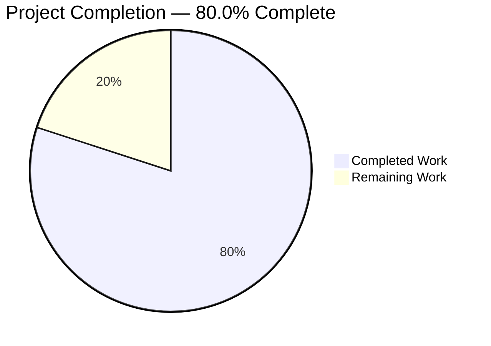
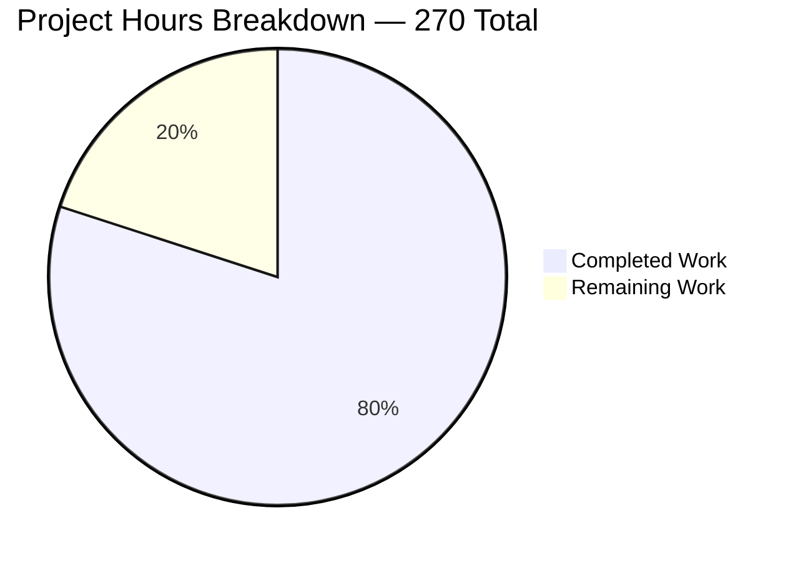
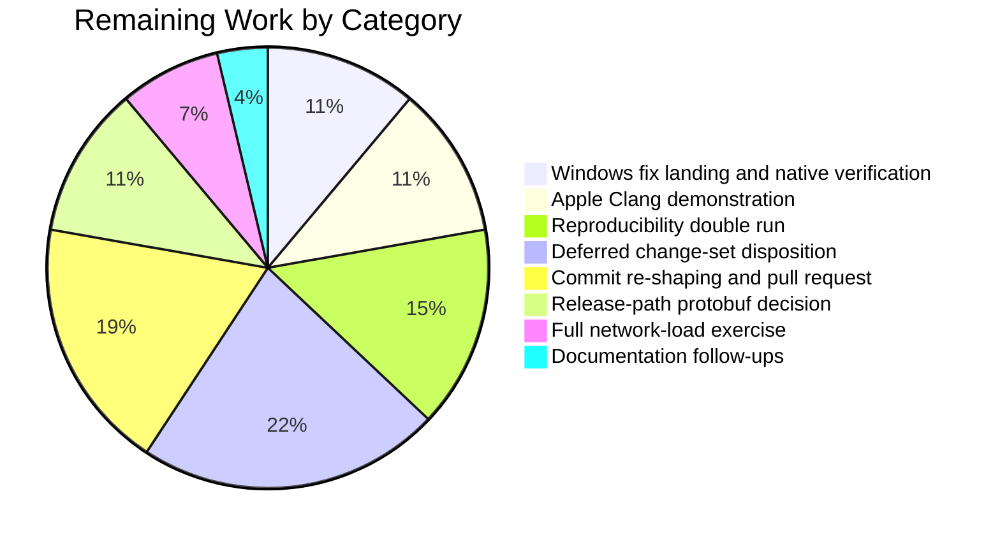
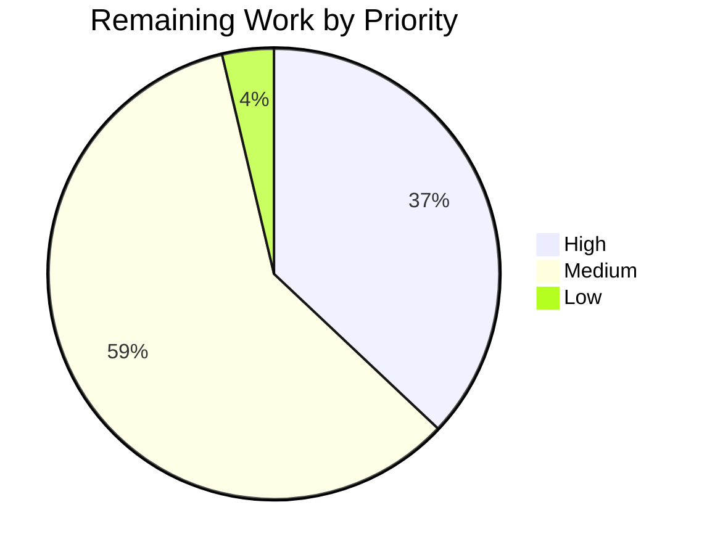

# 1. Executive Summary

## 1.1 Project Overview

Monero's first-party build (`src/`, `contrib/epee/`, `tests/`) moves from C++17 to C++23. The dialect is pinned at its three authoritative sites, and configure enforces the new CMake and compiler floors. Every construct the newer standard deprecates or removes is replaced at source, and the CI images, deterministic cross-build and documentation follow. Consensus, cryptography, serialization, the wire protocol and the database layout are shown byte-for-byte unchanged. At the owner's request, Section 5.3 adds a step-by-step runbook for the one Windows-only compile error still open. The audience is the maintainers and packagers who release the daemon, wallets and RPC servers.

## 1.2 Completion Status



Colour key: Completed = Dark Blue `#5B39F3` · Remaining = White `#FFFFFF`.

| Metric | Value |
|---|---|
| Total Hours | 270 |
| Completed Hours (AI + Manual) | 216 |
| Remaining Hours | 54 |
| Percent Complete | 80.0% |

Calculation: 216 / (216 + 54) = **80.0%**.

## 1.3 Key Accomplishments

- ✅ All 321 C++23-dialect compile-database entries use C++23; vendored C++11 and C11 units untouched
- ✅ 124 of 124 targets build with zero errors and **zero first-party warning origins**
- ✅ Configure refuses under-floor GCC, Clang and Apple Clang, `clang-cl`, and unknown compilers
- ✅ Consensus, wire and storage unchanged: 165 of 165 blockchain scenarios pass; protocol and schema versions frozen
- ✅ Every non-consensus suite passes, including all 19 live RPC scenarios (one needs live DNS, Section 3)
- ✅ TLS fingerprint lookup proven for both the found and the rejected case
- ✅ CI images, the ten-host cross-build and the toolchain documentation state the new floors
- ✅ The Section 5.3 Windows fix is proven by a cross-built `monerod.exe` running under Wine

## 1.4 Critical Unresolved Issues

Eleven items remain open. Nine fall inside 6 of the 16 requirements (the plan's 15 plus the owner's Windows runbook request); the other two are deferred change sets outside the plan's scope. The other ten requirements are closed. Two documentation-only follow-ups that block nothing are tracked in Section 2.2.

| Issue | Impact | Owner | ETA |
|---|---|---|---|
| Windows builds stop at `src/daemon/main.cpp:117`, where C++20 deletes the wide-to-narrow stream insertion. 3 items: land the documented conversion; exercise its error branch on Windows; run the runbook's smoke step under MSYS2. Step-by-step fix: Section 5.3 | `monerod.exe` cannot be produced. `Windows (MSYS2)`, `Win64` and Guix `x86_64-w64-mingw32` fail | Platform maintainer | 1 day |
| The Apple Clang 15 floor is enforced and published but has never been demonstrated | macOS users on Xcode 15 face an unverified pairing | macOS maintainer | 1 day |
| The reproducibility and capacity-bound gates have not been executed. 3 items: the reproducible-build double run; the build script's services-database check (`contrib/guix/guix-build:172-190`) prints `ERR:` but does not stop; the full network-load exercise | Reproducible release builds and sustained-load behaviour are unproven at the new dialect | Release engineer | 2 days |
| The pinned protobuf recipe emits third-party C++23 deprecation diagnostics on the cross hosts | Release logs are noisier, and a future `-Werror` tightening would fail | Build maintainer | 1 day |
| Hardening and RPC-contract improvements to surfaces the plan freezes remain at upstream behaviour. 2 items: the hardening set; the daemon ZMQ JSON contract set | The pre-existing exposure and contract gaps persist unchanged | Security reviewer | 3 days |
| The branch carries 21 commits, where the plan fixes eight by mechanical change type | Traceability only: the delivered tree is identical either way | Repository owner | 1 day |

## 1.5 Access Issues

| System/Resource | Type of Access | Issue Description | Resolution Status | Owner |
|---|---|---|---|---|
| macOS / Xcode 15 host | Build and test environment | No Apple toolchain is reachable, so the Apple Clang floor cannot be demonstrated | Open: needs a macOS runner or a developer machine | macOS maintainer |
| Windows / MSYS2 UCRT64 host | Build and test environment | No Windows toolchain is reachable. The Windows fix is proven only through the MinGW-w64 cross build (Section 5.3) | Open: needs a Windows runner or machine | Platform maintainer |
| Reproducible-build environment | Release build environment | The reproducible release path needs a pinned build environment that is not provisioned | Open: needs the release build host | Release engineer |
| GitHub Actions | Workflow execution | The workflow definitions can be parsed and inventoried, but only GitHub can run them | Open: resolves on the first push | Repository owner |

Building, testing and running need no credentials, secrets or network services.

## 1.6 Recommended Next Steps

1. **[High]** Land the Section 5.3 fix in `src/daemon/main.cpp`, verify it on MSYS2 UCRT64, and confirm the three Windows checks.
2. **[High]** Demonstrate the Apple Clang floor on a pinned Xcode 15, or raise it everywhere it is stated.
3. **[High]** Run the reproducible build twice and diff the hash summaries before tagging.
4. **[Medium]** Settle the cross hosts' protobuf diagnostics by a recipe bump or a per-recipe dialect exception.
5. **[Medium]** Re-shape the branch into the eight prescribed commits, decide whether the guide file goes upstream, and open the pull request.

# 2. Project Hours Breakdown

## 2.1 Completed Work Detail

| Component | Hours | Description |
|---|---|---|
| Dialect pins and build-system floors | 9 | `CMAKE_CXX_STANDARD 23` (`CMakeLists.txt:136`), `CXX_STANDARD ?= c++23` (`contrib/depends/Makefile:12`), the Darwin branch value (`contrib/depends/toolchain.cmake.in:104`), and `cmake_minimum_required(VERSION 3.25)` at both sites. Handles the policy consequence: `LANGUAGE ASM` for `CryptonightR_template.S` (`src/crypto/CMakeLists.txt:104`) |
| Compiler-floor guard and documented floors | 8 | Configure-time guard (`CMakeLists.txt:150-171`). It rejects an under-floor GCC, `clang-cl`, an under-floor Clang, an under-floor Apple Clang and any other compiler, and each message names the version found and the documentation section |
| CI image and workflow migration | 8 | `debian:13` and `ubuntu:24.04` build containers, the real `libunwind-dev` package name, `ubuntu:24.04` as the cross-build default, the `noble` LLVM repository, and a dialect-salted cross-build cache key with the four input patterns |
| Documentation and installer realignment | 12 | A new "Toolchain requirements" section with a 13-row compatibility matrix (`docs/COMPILING_DEBUGGING_TESTING.md:18`). The `README.md` dependency table, with the Rust prerequisite on every platform install line. The `contrib/brew/Brewfile` Rust entry. The Trezor README aligned to C++23 and UCRT64 |
| Compile-correctness substitutions | 12 | 225 UTF-8 literal prefixes removed across four files, keeping the 11 valid array initialisations. `rct::identity()` qualified where opening two namespaces made the call ambiguous |
| New-warning elimination at source | 22 | The POD trait replaced by its normative definition in five headers. `expect<T>` storage rewritten as `alignas(T) unsigned char[sizeof(T)]` with a size assertion. Five lambdas given the explicit `this` capture. The volatile counter rewritten as plain assignment. The `tx_extra` variant predicate rewritten. One explicit lexicographic comparator shared by the fingerprint sort and search |
| Deprecated-construct removal | 4 | Four dynamic exception specifications converted to `noexcept`, a dead trait comment deleted, and the deprecated CMake flag-probe module replaced by `check_cxx_compiler_flag` |
| Boost-to-std evaluation and recorded deferral | 8 | `boost::optional` (99 files, 524 uses) and `boost::string_ref` (53 files, 205 uses) evaluated against their real call sites and deferred with reasons. `boost::filesystem` and `epee::span` retained |
| TLS fingerprint regression test | 6 | New `test_epee_connection.ssl_handshake_fingerprint_lookup`, which drives a real handshake over loopback and proves both the success path and the rejection path of fingerprint lookup |
| Invariance preservation and its proofs | 14 | Literal-equality proof for every edited string table, with a negative control. Serialization and wire round-trips against committed golden blobs. Database round-trip and export comparison. Confirmation that the RPC, wallet-RPC, ZMQ and LMDB version constants and every frozen directory are untouched |
| Acceptance builds across compiler rows and option-gated targets | 22 | Full 124-target builds on GCC 14, GCC 13, Clang 18 and Clang 16. The CMake 3.25 floor configure, the guard rejection path, the Trezor probe at the new dialect, the option-gated debug utilities and the libFuzzer targets |
| Warning-origin census | 10 | Per-origin diagnostic comparison over the identical target graph in each configuration. It establishes zero first-party origins and confirms the predicted drop in variant-comparison diagnostics |
| Residual-construct checks | 3 | Repository-wide checks that no deprecated trait, dynamic exception specification, deprecated CMake module or incompatible literal prefix remains, and that the five explicit captures are in place |
| Test-tier execution | 28 | The full non-consensus tier including the Python RPC scenarios, the unit estate, the consensus regression suite, targeted serialization and behavioural filters, the fuzz corpora and the benchmark warm-up path |
| Release-path exercises delivered | 24 | Ten cross-build hosts, including the three that compile against pre-C++23 standard-library headers. Release artefact inspection and hashing. The container image built and its shipped binary run |
| Commit sequencing and traceability | 2 | A behaviour-preservation justification recorded for every edit that touches serialization, wire, storage, protocol, networking or consensus-adjacent code |
| Windows remediation runbook and verified fix design | 24 | The owner-requested Section 5.3. It covers MSYS2 UCRT64 setup matching CI, reproducing the failure, the `isFat32` conversion with its patch and triage rules, native verification helpers, the Linux-hosted `Win64` cross build, and landing through the pipeline. The fix is proven by a MinGW-w64 compile at both dialects, a fault-injection harness, and a full `x86_64-w64-mingw32` cross build whose `monerod.exe` runs under Wine |
| **Total** | **216** | |

## 2.2 Remaining Work Detail

| Category | Hours | Priority |
|---|---|---|
| Windows: apply the Section 5.3 conversion to `src/daemon/main.cpp`, build and test natively on MSYS2 UCRT64 (including the conversion's error branch and the smoke step), and confirm `Windows (MSYS2)`, `Win64` and Guix `x86_64-w64-mingw32` (runbook: Section 5.3) | 6 | High |
| Apple Clang 15 / Xcode 15 demonstration, or a documented floor revision | 6 | High |
| Guix reproducible-build double run and hash-summary comparison, with the services-database precondition checked by hand | 8 | High |
| Disposition of the deferred hardening and daemon ZMQ contract change sets | 12 | Medium |
| Branch re-shaping into the eight prescribed commits, a decision on whether the guide file goes upstream, and upstream pull-request preparation | 10 | Medium |
| Release-path protobuf diagnostics decision, and a re-run of the affected cross hosts | 6 | Medium |
| Full network-load exercise on a host with descriptor and memory headroom | 4 | Medium |
| Documentation follow-ups inside already-authorized files, and the reference warning baseline recorded | 2 | Low |
| **Total** | **54** | |

Scope is the migration plan, the owner's Windows runbook request, and the path to production for both, and nothing else. Completed rows are sized from the work their evidence demonstrates, not from lines changed: the migration change set is 33 files and +1136/−272 lines, while the effort sits in the compiler-row builds, the cross-build hosts, the per-origin census and the test tiers. The partially satisfied requirements are split as follows:

- compile-correctness is 95% complete: the Windows fix is designed and cross-build-proven, but not applied;
- the build matrix is 90% complete: the Apple row has not been run;
- the warning census is 80% complete;
- the test tiers are 95% complete;
- the release paths are 65% complete.

Confidence is high on the completed rows and medium on the platform-gated remaining rows.

# 3. Test Results

Every figure below comes from running the suites on this tree at commit `8fe8e4965`. The toolchain was GCC 14.3, libstdc++ 14 and Boost 1.88, in the acceptance configuration (`ARCH=default`, `BUILD_TESTS=ON`, `BUILD_GUI_DEPS=ON`, `ENABLE_FUZZ_TEST=ON`, `Release`, mandatory Trezor). The suites ran serially after a clean rebuild, with `DNS_PUBLIC=tcp` exported.

| Area / Category | Framework | Tests | Passed | Failed | Coverage | What This Proves |
|---|---|---|---|---|---|---|
| Full non-consensus tier (`ctest -E core_tests`) | CTest | 23 | 22 | 1 | Every registered suite except consensus, in one 2077 s pass | Every suite passes on the migrated tree. The one failure is a live-DNS scenario that passes on re-run (see the note below) |
| Consensus regression | gtest / `core_tests` | 165 | 165 | 0 | Every registered synthetic-blockchain scenario, in 479 s with reduced hash iterations | Block and transaction validation behave exactly as before the dialect change |
| Unit estate under the CI filter | gtest / `unit_tests` | 1293 run of 1310 registered | 1291 | 0 | 157 suites run; 2 environment probes (`is_hdd.*`) skipped | Library, epee, wallet, RPC and crypto behaviour is intact across the whole unit surface |
| Serialization, wire and RPC round-trips | gtest filter | 122 | 122 | 0 | 17 suites over binary and JSON portable storage, Levin framing, `tx_extra`, the wallet cache, the peer list and ZMQ shapes | Produced bytes still match the committed golden blobs, so no format moved |
| Edited data paths (auth, TLS, storage, scrubbing) | gtest filter | 66 | 66 | 0 | 10 suites over HTTP digest, the HTTP server, fingerprint lookup, `expect<T>` and secret scrubbing | The substituted literals, comparator, storage and traits behave identically at the new dialect |
| Python RPC scenarios | `functional_tests_rpc` | 19 | 19 (18 in the tier run, `address_book` on re-run) | 0 on re-run | Live `monerod` and `monero-wallet-rpc` on a deterministic chain, in 1555 s | The daemon and wallet RPC surfaces answer correctly end to end |
| Parser robustness | 18 libFuzzer-style harnesses | 31 seeds | 31 | 0 | Every committed corpus, all present and non-empty | No parser crashes on any seed for base58, block, RingCT, Levin, JSON, URL, transaction, `tx_extra` or UTF-8 inputs |
| Benchmark warm-up path | `performance_tests` | 7 | 7 | 0 | The edited volatile counter loop | The rewritten warm-up runs on every benchmark instantiation without a change in behaviour |

**Live-DNS dependency.** The tier run's single failure was the `address_book` scenario (`tests/functional_tests/address_book.py:142`). The scenario resolves the OpenAlias address `donate@getmonero.org` over the public DNS, and the resolver answered `Invalid DNSSEC for donate@getmonero.org`. This is a network dependency of the upstream test, not a property of this tree: run alone, the scenario passed 1 of 1. Expect the same intermittency on any runner whose resolver cannot validate that record.

The build itself was also measured:

- 124 of 124 targets built with zero errors.
- The build emitted 16 diagnostics from 5 origins, all in system headers or in the pre-existing C source at `src/crypto/tree-hash.c:89`. That leaves **zero first-party C++ warning origins** and zero first-party trace locations.
- The compile database holds 453 entries:
  - 321 `-std=c++23`;
  - 24 `-std=c++11` (vendored logging, QR and proof-of-work code);
  - 79 `-std=c11`;
  - 29 assembler entries with no dialect flag.
- Configure emits no warning and no policy line, both at CMake 3.31.6 and at the 3.25.3 floor.
- An under-floor compiler is refused with `GCC 12.5.0 is too old; GCC 13 or newer is required for C++23` (`CMakeLists.txt:153`).

**Not Covered.** These capabilities were delivered but no test exercises them. Test each before release as described:

- **Windows / MinGW-w64 builds.** No suite runs on a Windows toolchain, and the unmodified `#ifdef WIN32` start-up diagnostic in `src/daemon/main.cpp` does not compile at C++23. The Section 5.3 fix has been compiled only by the MinGW-w64 13.2 cross compiler; its output was linked and run under Wine. MSYS2's GCC 16 has never compiled it, and it has never run on Windows. Test first, on MSYS2 UCRT64 with the fix applied:
  - build `monerod.exe`;
  - run the reduced tier;
  - run the runbook's smoke step, including the conversion's error branch with an invalid `--data-dir`.
- **Apple Clang / macOS.** The published Apple floor has no build or test behind it. Run the macOS job on a pinned Xcode 15.
- **Reproducibility of release builds.** The reproducible path has never been run twice for a hash comparison at the new dialect.
- **Sustained network load.** Both load-harness binaries build in every configuration, but the 100,000-connection exercise on the two fixed ports has never been run. The edited asynchronous handlers are therefore covered functionally but not under load.
- **The four sanitizer-instrumented fuzz targets.** They compile at the new dialect. Their diagnostic comparison against the previous dialect in the same session has not been made.
- **Workflow definitions.** `.github/workflows/build.yml` and `depends.yml` are checked by parsing, by job and matrix inventory, and by line-level diff. Only the CI service can execute them.
- **Clang with libc++.** This pairing is documented as unverified, and no build or test stands behind it.

# 4. Runtime Validation & UI Verification

This project ships 13 command-line executables (daemons, wallets, RPC servers and blockchain utilities) and has no user interface, so there is no UI to verify. Runtime validation drove the binaries themselves: testnet in offline mode, loopback-only binds and throwaway data directories. No step contacted a public network.

- ✅ **Daemon start-up**: `monerod --testnet --offline` with `--rpc-login` reaches "core RPC server started ok" in about 1 second. It exits 0 through an authenticated `stop_daemon`, and an unauthenticated `stop_daemon` is refused with 401.
- ✅ **Daemon HTTP JSON-RPC and digest authentication**: a request with no credentials gets 401, a wrong password gets 401, and digest credentials get 200. `get_info` returns `status OK`, height 1, `nettype testnet`, offline, synchronized, version `0.18.1.0-8fe8e4965`.
- ✅ **Daemon ZMQ JSON-RPC**: a plain JSON-RPC object on the ZMQ endpoint answers `get_height` with `rpc_version 131072`, which confirms the frozen ZMQ RPC version 2.0 on the wire. The method-name and topic tables whose literals were edited dispatch unchanged.
- ✅ **Wallet RPC server**: `monero-wallet-rpc --testnet` starts against the authenticated local daemon in about a second and refuses unauthenticated calls with 401. It reports version 65569 (wallet RPC 1.33, unchanged), creates a testnet wallet, answers `get_address` and `get_height`, and exits 0 on `stop_wallet`.
- ✅ **Python RPC journeys**: 19 scenarios drive real daemon and wallet processes on a deterministic chain. They cover transfers, mining, multisig, cold signing, integrated addresses, proofs and blockchain manipulation.
- ✅ **Storage round-trip**: the migrated binaries open a database created by the pre-migration build with no migration step and report the same height and block hashes. The export output compares byte for byte.
- ✅ **TLS handshake and fingerprint pinning**: a real handshake over loopback accepts a fingerprint supplied in an unsorted list and rejects one that is absent.
- ✅ **Executable smoke**: all 13 binaries are produced and run. The daemon, both wallets and the two key-generation tools report their version. The eight blockchain utilities decline `--version` and exit non-zero on `--help`; this is upstream behaviour that this work leaves untouched.
- ⚠ **Container image**: the release image builds from the digest-pinned builder, and the shipped binary reports its version. The image has not been rebuilt since the last documentation-only change to the cross-build workflow.
- ❌ **Windows and macOS runtime**: never exercised natively, because no Windows or Apple environment was reachable. Without the Section 5.3 conversion, the `x86_64-w64-mingw32` cross build stops at `src/daemon/main.cpp:117`. With the conversion applied to a working copy, it exits 0 and the cross-built `monerod.exe --version` runs under Wine. Reproducible release builds and the sustained-load exercise were likewise never run.

# 5. Compliance & Quality Review

## 5.1 Compliance Matrix

| Deliverable | Benchmark | Status | Evidence |
|---|---|---|---|
| Dialect pinned at all three authoritative sites | All first-party code compiles as C++23; nothing is left at 17 or 20 | ✅ Pass | All 321 C++23-dialect compile-database entries carry the C++23 flag. The three sites read `3.25` / `23` / `c++23` / `23` |
| Build-system floor and its policy consequence | Configures cleanly at the 3.25 floor, and the assembler source still assembles | ✅ Pass | The floor configure exits 0 with no policy line. `LANGUAGE ASM` at `src/crypto/CMakeLists.txt:104`. The vendored assembler objects are checksum-identical |
| Compiler-floor enforcement | Under-floor and unsupported compilers are refused at configure time | ✅ Pass | Guard at `CMakeLists.txt:150-171`, which refuses under-floor GCC at `:153`. The Apple and `clang-cl` branches cannot run on Linux and are verified by reading |
| Whole-tree build integrity | All targets build with no errors | ✅ Pass | All 124 targets build with zero errors on each of the four supported Linux compiler rows |
| Warning cleanliness | The dialect introduces no first-party diagnostic | ✅ Pass | 16 diagnostics from 5 origins, all in system headers or pre-existing C code. Zero first-party origins and zero first-party trace locations |
| Consensus and cryptography untouched | No logic change; all consensus scenarios pass | ✅ Pass | 165 of 165 scenarios pass. Zero files changed under the consensus, RingCT, hard-fork or proof-of-work trees |
| Serialization, wire and literal-table invariance | Produced bytes unchanged, version constants frozen, and edited string tables differing from base only by the prefix | ✅ Pass | 122 round-trip tests pass against golden blobs. RPC 3.18, wallet RPC 1.33, ZMQ RPC 2.0 and database schema 5 are unchanged. Four exact source comparisons are empty, with a non-empty negative control |
| Storage layout invariance | Databases interchange with the pre-migration build | ✅ Pass | Cross-version open with no migration, identical height and hashes, and a byte-identical export |
| Deprecated-construct removal | Nothing the newer standard removes or deprecates remains | ✅ Pass | Repository-wide checks find no deprecated trait, dynamic exception specification or deprecated CMake module |
| Toolchain, CI and documentation alignment | The images, the cross-build and the docs state and exercise the new floors | ⚠ Partial | The containers, cache identity, README and the 13-row matrix are in place. The Windows and Apple rows are not demonstrated (Windows runbook: Section 5.3) |
| Release-path readiness | Cross hosts, container and reproducibility proven at the new dialect | ⚠ Partial | Ten cross hosts and the container are verified. The Windows host compiles only with the Section 5.3 fix applied, and reproducibility has never been demonstrated |
| Windows remediation runbook (owner request) | A human can follow it from a clean setup to green Windows pipeline checks | ✅ Pass | Section 5.3, from setup to landing. The fix compiles at both dialects under `-Werror` with MinGW-w64 13.2, and the full `x86_64-w64-mingw32` cross build exits 0 with PE32+ artefacts that run under Wine. The native MSYS2 run is still to be done |

## 5.2 AAP & Rule Divergences and Gaps

No user-specified rules were provided for this project, so every divergence below is a departure from the migration plan rather than from a rule. Two are **Sanctioned** by the owner's request for step-by-step Windows instructions.

| What the AAP/Rule Required | What Was Delivered Instead | Why It Diverged | Impact | Remediation |
|---|---|---|---|---|
| Exactly two source-level error classes under the new standard, both fixed | Both are fixed and proven. A third, Windows-only class remains at `src/daemon/main.cpp:117`, with its fix documented and cross-build-proven (steps: Section 5.3) | The error census ran on Linux, where the `#ifdef WIN32` branch never compiles, and the file is outside the authorized 33. **Sanctioned**: the owner asked for steps a human follows, so the fix is documented, not applied | Release-blocking on Windows | Apply the Section 5.3 conversion; confirm the three Windows checks |
| 33 files, all modifications and none created; Windows instructions name only UCRT64 | The branch also adds `blitzy/documentation/Project Guide.md`. Its Section 5.3 includes a labelled MSYS2 MINGW64 alternative | **Sanctioned**: the owner asked for the Windows steps in this guide. UCRT64 stays the primary path, and the three upstream documents stay UCRT64-only | None on the build; one extra file on the branch | Decide at branch re-shaping whether the guide goes upstream |
| A pinned Xcode 15 build and test before the Apple floor is published; two reproducible builds with identical hashes; the full network-load exercise | The Apple floor is enforced and published, labelled not demonstrated. Neither the reproducible double run nor the load run was executed | No Apple toolchain or reproducible-build host was reachable. The load run needs 100,000 connections on two fixed ports | An unverified macOS pairing; reproducibility and load behaviour unproven at the new dialect | Run each gate; raise the Apple floor if Xcode 15 fails |
| No new warning origin in any acceptance configuration | The native rows are clean. The cross hosts each gain about 105 third-party diagnostics from the pinned protobuf | Recipe versions are frozen reproducible-build inputs | Noisier release logs; a future `-Werror` tightening would fail | Bump the recipe, or apply the pre-authorized per-recipe dialect exception |
| Warning acceptance measured against a same-session C++17 build of the pristine tree | Measured against recorded per-environment baselines | The plan itself puts the explicit-`this` captures in the dialect commit, so a C++17 build of this tree is no longer valid | Future regressions need per-environment re-measurement | Record the current origin sets as the reference baseline |
| Eight commits by mechanical change type, in a fixed order | Twenty-one commits, with a tree-identical outcome | The history records the work in the order it was done, and re-shaping published history needs an owner | Traceability only | Re-shape the branch before opening the pull request |
| Consensus, wire, storage and error contracts frozen; exactly 33 files | Exactly that, so hardening and contract improvements to those surfaces are absent | Each one changes a frozen surface or a file outside the authorized set | The pre-existing exposure and contract gaps persist unchanged | Take each as its own authorized change set |
| Only the per-file edits the plan enumerates, and exact source equality for the edited literal tables | Three further edits inside authorized files, and one correction deliberately not made | Two are a dead-link fix and a fail-closed fix; the third records a release-path condition. The stale comment cannot change without breaking the equality gate | Documentation accuracy only | Land the follow-ups as one authorized documentation change |

**Windows compile failure (Sanctioned).** Inside the `#ifdef WIN32` FAT32 start-up diagnostic, `src/daemon/main.cpp:117` streams a `const wchar_t*` volume path into a narrow log stream. C++20 deleted that inserter, so every Windows build fails at this dialect; at C++17 the same expression silently printed a pointer address. The owner asked for steps a human follows, so the file stays byte-identical to the base tree and Section 5.3 carries the fix instead. The fix converts the path with `epee::string_tools::utf16_to_utf8`, captures `GetLastError()` first, escapes control bytes, and catches the exceptions raised while the log entry is built, so `isFat32` still returns `false` on error. With the fix, the log line prints the UTF-8 path. Apply it before any release.

**Runbook placement (Sanctioned).** The plan closes its file set at 33 modifications, and the edited documents must name only the UCRT64 environment. The owner asked for step-by-step Windows instructions in this guide. The branch therefore adds `blitzy/documentation/Project Guide.md`, and its Section 5.3 names MINGW64 and its `mingw-w64-x86_64-` packages as a labelled alternative that CI does not check. All 26 package names it lists exist in the MSYS2 index. `README.md`, `docs/COMPILING_DEBUGGING_TESTING.md` and `src/device_trezor/README.md` remain UCRT64-only, and nothing compiled changes. When re-shaping the branch, decide whether the guide goes with the upstream pull request.

**Environment-gated gates.** Three acceptance gates need hardware that no environment here provides:

- **Apple floor.** The guard refuses Apple Clang below 15 (`CMakeLists.txt:163-168`), and the matrix publishes that floor labelled declared rather than verified. The plan wanted one pinned Xcode 15 configure, build and test first.
- **Reproducible builds.** The reproducible path must build every triple twice with identical hash summaries. Its services-database check (`contrib/guix/guix-build:172-190`) prints `ERR:` without stopping, so confirm `/etc/services` by hand.
- **Network load.** The load exercise opens 100,000 connections on ports 36230 and 36231. Its edited handlers changed only capture spelling.

None of the three needs code work. Run all three before tagging. If Xcode 15 fails, raise the guard, the README and the matrix together.

**Third-party diagnostics on the cross hosts.** Under this dialect the pinned protobuf recipe is compiled as C++23 for the first time. Its generated table header combines two enumeration types with `|`, which C++20 deprecated. That yields roughly 105 diagnostics per cross host from 35 lines of one upstream header, where C++17 emitted none, and a syntax-only compile of the pinned sources reproduces the same split. These diagnostics add no first-party origin, the native rows are unaffected, and nothing was suppressed. `docs/COMPILING_DEBUGGING_TESTING.md` records the condition. Choose between bumping the recipe and the per-recipe, per-host dialect exception that the plan pre-authorizes.

**Comparison baseline.** Acceptance was defined as a same-compiler, same-session diagnostic comparison against a pristine C++17 build of this tree. The plan itself puts the five explicit-`this` captures in the dialect-switch commit, so a C++17 configure of the delivered tree emits extension warnings and is not a valid baseline. The census therefore compares against recorded per-environment origin sets. The result stands: zero first-party origins in every native configuration, and the predicted drop in variant-comparison diagnostics confirmed. The baseline can no longer be re-derived from this tree on demand. Treat the Section 3 origin sets as the reference, or build a pristine checkout of `454075bc6` in the same session.

**Commit shape.** The plan fixes an eight-commit sequence so that each mechanical change type can be reviewed on its own and every intermediate state builds. The branch carries twenty-one commits. Seventeen carry the migration, ordered as the work was done rather than by mechanical change type; the other four add this guide and its Windows runbook. The delivered tree is identical either way, and the history records every serialization-, wire-, storage- and consensus-adjacent justification, so only reviewability is lost. Re-shape the migration into the eight commits before opening the upstream pull request, or accept the current shape and say so in the request.

**Hardening and contract work outside the authorized scope.** These improvements to surfaces the plan freezes are absent from the tree:

- header-log escaping;
- binding digest credentials to the request target;
- portable-storage trailing-byte and 32-bit varint handling;
- wallet RPC error-text redaction;
- frame-length-only ZMQ logging;
- ten daemon ZMQ JSON contract defects;
- command-line path validation;
- blockchain-utility `--version`, `--help` and regtest export;
- a builder-bundle refresh.

Each one changes a surface the plan freezes (response shapes, digest acceptance, parser acceptance, error text, recipe versions) or a file outside the authorized 33. All are pre-existing upstream behaviour, left exactly as found. Each needs its own authorization, compatibility decision and review.

**Edits beyond the enumerated set.** Three changes sit inside authorized files that the per-file plan does not list:

- The Homebrew manifest's documentation link now points at the official page, because the previous link returns 404.
- The cross-build workflow fetches the LLVM signing key with retries and fail-closed handling, so a single transport reset no longer fails the job and no partial key reaches the keyring.
- The toolchain document records the protobuf condition above.

None of these is compiled code. In the other direction, `contrib/epee/src/http_auth.cpp` keeps a header sentence describing a literal convention the file no longer uses, because the equality gate demands exact source equality apart from the removed prefix. Land all four as one documentation change.

## 5.3 Windows Build Remediation Runbook (MSYS2 UCRT64 / MinGW-w64)

This runbook is for the maintainer who makes the Windows pipeline checks pass. It takes one of two machines from a clean setup to the end state 5.3.1 defines: a Windows machine running MSYS2, or a Linux or WSL machine with the MinGW-w64 cross toolchain. Work through the steps in order, with one exception: Step 6.5, the local Guix build, builds a commit, so it runs after Step 7.2 has made that commit (Step 6.5 says when, and when it is required). Each step gives the commands to run, the output to expect, and what to do when the output differs. Commands run from the repository root unless a step says otherwise. Section 5.2 records the Windows failure; this section removes it.

### 5.3.1 Outcome and audience

The work is done when a single revision containing both the migration and the Step 4 fix passes the three Windows checks below, and every other job in the same three workflows stays green on it. A revision with the fix but not the migration builds at C++17 and proves nothing here.

- `Windows (MSYS2)` and `Win64` run on every push and pull request that changes anything outside `docs/**` and `**/README.md` (Step 7.3).
- The Guix check runs only when the change it evaluates touches one of its `paths` (`guix.yml:3-19`, Step 7.3). No workflow here can be started by hand, because none has a `workflow_dispatch` trigger.
  - The migration's pull request touches those paths: against its base `454075bc6` it changes `contrib/depends/Makefile` and `contrib/depends/toolchain.cmake.in` (verified here with `git diff --name-only`).
  - GitHub filters a pull request by its whole diff against the merge base (GitHub documentation; not verified here), so every update of that pull request runs the Guix check.
  - A pull request or push that changes only `src/daemon/main.cpp` never runs it.

The route to three green checks is therefore to make the migration pull request's head carry the fix. Either widen the migration, or merge the fix as a separate change first and then update the migration pull request onto it (Step 7.1). If the fix lands only after the migration has merged, no CI run of the Guix check will ever carry both. In that case the Guix condition is met by a local Guix build of that exact revision (Step 6.5). Report that build as local evidence, and record the Guix check as `not run (path filter, guix.yml:3-19)`, never as a green check. Never add a dummy change to a filtered path, or edit a workflow, to force a run.

| Check (job name in GitHub) | Workflow | Defined at | What it runs |
|---|---|---|---|
| `Windows (MSYS2)` | `ci/gh-actions/cli` | `.github/workflows/build.yml:74-111` | Native build of target `all` in MSYS2 UCRT64 on `windows-latest`, then the reduced test tier |
| `Win64` | `ci/gh-actions/depends` | `.github/workflows/depends.yml:48-51` (matrix entry), `:121-149` (steps) | `make depends target=x86_64-w64-mingw32` in `ubuntu:24.04` with the MinGW-w64 cross compiler, then upload of `monerod.exe` and `monero-wallet-cli.exe` |
| `x86_64-w64-mingw32` | `ci/gh-actions/guix` | `.github/workflows/guix.yml:3-19` (triggers), `:54` (target), `:109` (build) | Reproducible Guix release build of the Windows triple |

All three compile the same first-party sources at C++23 with a MinGW-w64 GCC. Today they stop at `src/daemon/main.cpp:117`. That failure was reproduced here with the MinGW-w64 cross compiler and by a full depends `x86_64-w64-mingw32` build; the Guix job itself was not run here. One edit to that file fixes it (Step 4). The file is outside the migration's 33 authorized files, so it has to be landed deliberately (Step 7).

### 5.3.2 Verification legend

Every claim below is marked **verified here** or **not verified here**.

- **Verified here** means checked on a Linux host by one of these means:
  - reading the workflow, build and source files cited;
  - compiling the real sources with MinGW-w64 GCC 13.2 (`x86_64-w64-mingw32-g++-posix`, Ubuntu cross package) against Linux copies of the third-party headers;
  - running the full depends `x86_64-w64-mingw32` build of Step 6 in `ubuntu:24.04`, and running its `monerod.exe --version` under Wine;
  - compiling reduced test programs with host GCC 13 and 14;
  - linking one small test program into a PE32+ executable;
  - looking up package names, versions and dependencies in the MSYS2 package index (packages.msys2.org);
  - configuring the tree with CMake 4.4.3, the version the UCRT64 `cmake` package carries.
- **Not verified here** means the claim needs Windows, MSYS2, a Guix run or GitHub. That covers:
  - every Windows run;
  - the exact diagnostic wording of MSYS2's current GCC (16.2.0 in the UCRT64 package index);
  - the link of `monerod.exe` with MSYS2's own toolchain, and ctest on Windows;
  - the Guix cross build;
  - the Start-menu name "MSYS2 MINGW64".

### 5.3.3 Issue inventory

| # | Issue | Location | Cause | Symptom | Checks affected | Status |
|---|---|---|---|---|---|---|
| W-1 | Wide string written to a narrow log stream | `src/daemon/main.cpp:117`, inside `isFat32` (`:111-123`), called at `:261` | C++20 deletes `operator<<(basic_ostream<char>&, const wchar_t*)` (P1423R3). At C++17 the same expression silently chose `operator<<(const void*)` | Hard error "use of deleted function". `monerod.exe` is not produced, so the `Win64` upload and the Windows tests cannot run | All three | Open. **Verified here**: MinGW-w64 GCC 13.2 reports exactly this one error for the unmodified file at C++23, and compiles the file at C++17, where the object calls `std::ostream::operator<<(void const*)`. The full depends `x86_64-w64-mingw32` build of the unmodified tree stops with this single error, and with the Step 4 fix it exits 0 |
| W-2 | Further Windows-only C++20/23 errors | The 54 first-party files with Windows conditionals, plus the MinGW-only daemonizer sources (`src/daemonizer/CMakeLists.txt:29-38`) | — | None found | — | **Verified here** at compile level by three means. (1) A static audit of every Windows-only region for the construct classes in Step 4.3. (2) A MinGW-w64 GCC 13.2 syntax-only compile, at C++17 and C++23, of all 300 first-party C++ sources: the 299 in the Linux compile database, including the generated `version.cpp`, plus `src/daemonizer/windows_service.cpp`. (3) A cross build, with the fix, of CI's `BUILD_DEFAULT` graph with tests, fuzz harnesses and mandatory Trezor, which compiles every translation unit. W-1 is the only error that depends on the dialect. **Not verified here**: a Windows build with MSYS2's own headers |
| W-3 | New Windows-only warnings | Same set | — | None. The 8 first-party origins found (Step 5.5) are identical at C++17 and C++23, and the CI-graph cross build shows the same set | — | **Verified here** by the same compiles |
| W-4 | MinGW-w64 GCC floor of 13 never demonstrated on Windows | Guard at `CMakeLists.txt:150-154` | No Windows toolchain has built this tree yet | — | `Windows (MSYS2)`, `Win64` | **Not verified here**. Step 5 records the first Windows result, Step 6 the cross compiler's |
| W-5 | Windows runtime never exercised | `monerod.exe`, `monero-wallet-cli.exe`, the reduced tests | As W-4 | — | `Windows (MSYS2)` | **Not verified here**. Step 5 exercises it |

### 5.3.4 Step 1 — Set up MSYS2 UCRT64 the way CI does

CI prepares Windows with `msys2/setup-msys2@v2` (`build.yml:91-96`):

```yaml
msystem: ucrt64
update: true
cache: false
pacboy: toolchain:p cmake:p ccache:p boost:p openssl:p zeromq:p libsodium:p hidapi:p protobuf:p libusb:p unbound:p rust:p git:p
```

**1.1 Install MSYS2.** Run the installer from https://www.msys2.org on 64-bit Windows 10 (version 1809) or newer, and keep the default location `C:\msys64`. *Not verified here.*

**1.2 Open the UCRT64 shell.** Start **MSYS2 UCRT64** from the Start menu, or run `C:\msys64\ucrt64.exe`. Every Windows command in this runbook runs in that shell.

**1.3 Update the system**, as `update: true` does:

```bash
pacman -Suy
```

If pacman says it must close every MSYS2 process, including this terminal, confirm. Then reopen **MSYS2 UCRT64** and run `pacman -Suy` again. Repeat until it reports nothing to do (https://www.msys2.org/docs/updating/).

**1.4 Install CI's package set.** `pacboy` comes from the `pactoys` package. It expands `name:p` to the shell's `$MINGW_PACKAGE_PREFIX`, which in UCRT64 is `mingw-w64-ucrt-x86_64` (https://www.msys2.org/docs/package-naming/). The second line below is CI's list, verbatim:

```bash
pacman -S --needed pactoys
pacboy -S --needed toolchain:p cmake:p ccache:p boost:p openssl:p zeromq:p libsodium:p hidapi:p protobuf:p libusb:p unbound:p rust:p git:p
```

The same set as plain `pacman` names is below. `toolchain` is a package group, so press Enter at its prompt to take every member. Every name exists in the MSYS2 package index (verified here):

```bash
pacman -S --needed mingw-w64-ucrt-x86_64-toolchain mingw-w64-ucrt-x86_64-cmake \
  mingw-w64-ucrt-x86_64-ccache mingw-w64-ucrt-x86_64-boost mingw-w64-ucrt-x86_64-openssl \
  mingw-w64-ucrt-x86_64-zeromq mingw-w64-ucrt-x86_64-libsodium mingw-w64-ucrt-x86_64-hidapi \
  mingw-w64-ucrt-x86_64-protobuf mingw-w64-ucrt-x86_64-libusb mingw-w64-ucrt-x86_64-unbound \
  mingw-w64-ucrt-x86_64-rust mingw-w64-ucrt-x86_64-git
pacman -S --needed curl    # not in CI's list; used only by the smoke run in Step 5
```

`protobuf` and `libusb` are required, not optional: CI makes Trezor support mandatory (Step 3), and configure fails without them. The package line at `README.md:347` lacks `ccache`, `protobuf`, `libusb` and `git`, so use the lists above instead of that line.

**1.5 Check the environment.**

```bash
echo $MSYSTEM $MINGW_PREFIX     # UCRT64 /ucrt64 (MINGW64 alternative below: MINGW64 /mingw64)
which gcc cmake cargo ninja     # each under $MINGW_PREFIX/bin
gcc --version | head -1         # 13 or newer; CMakeLists.txt:150-154 refuses older GCC
cmake --version | head -1       # 3.25 or newer (CMakeLists.txt:31)
cargo --version                 # Rust is mandatory: src/CMakeLists.txt:91 always adds src/fcmp_pp
```

MSYS2's CMake uses the Ninja generator by default, and CI passes no `-G` (https://www.msys2.org/docs/cmake/).

- **Ninja.** The UCRT64 `cmake` package (4.4.3 in the index) depends on `mingw-w64-ucrt-x86_64-ninja`, so Ninja normally arrives with it (verified here in the package index). If `which` still finds no `ninja`, run `pacboy -S --needed ninja:p`. It installs the Ninja of the shell you are in: `mingw-w64-ucrt-x86_64-ninja` in UCRT64, `mingw-w64-x86_64-ninja` in MINGW64.
- **`$MINGW_PREFIX`.** MSYS2's `/etc/msystem.d/$MSYSTEM` sets it: `/ucrt64` in UCRT64, `/mingw64` in MINGW64, and nothing in the MSYS shell. This was verified here by reading `msystem` and `msystem.d.*` in MSYS2's `filesystem` package (https://github.com/msys2/MSYS2-packages/tree/master/filesystem); https://www.msys2.org/docs/environments/ lists the prefixes.
- **Wrong shell.** You are in the wrong shell (5.3.11) in either of these cases:
  - `$MSYSTEM` is neither `UCRT64` nor, on the labelled MINGW64 alternative, `MINGW64`;
  - a tool resolves outside `$MINGW_PREFIX/bin`: under `/usr/bin`, where MSYS2's own `ninja` lives, or under the other environment's prefix.

> **MINGW64 alternative — not the environment CI checks.** Use it only if UCRT64 is unavailable to you.
>
> - Open **MSYS2 MINGW64**, or run `C:\msys64\mingw64.exe`. The Start-menu name is not verified here.
> - The package prefix is `mingw-w64-x86_64-`. The `pacboy` line in 1.4 works unchanged, because `:p` follows the shell. With plain `pacman`, the names are as follows; each exists in the MSYS2 package index (verified here):
>
> ```bash
> pacman -S --needed mingw-w64-x86_64-toolchain mingw-w64-x86_64-cmake mingw-w64-x86_64-ccache \
>   mingw-w64-x86_64-boost mingw-w64-x86_64-openssl mingw-w64-x86_64-zeromq mingw-w64-x86_64-libsodium \
>   mingw-w64-x86_64-hidapi mingw-w64-x86_64-protobuf mingw-w64-x86_64-libusb mingw-w64-x86_64-unbound \
>   mingw-w64-x86_64-rust mingw-w64-x86_64-git
> ```
>
> - The Step 1.5 check prints `MINGW64 /mingw64`, and `which` finds every tool under `/mingw64/bin`.
> - Outside this box, Steps 1.2 to 5 and 5.3.11 give only the UCRT64 form. Read `UCRT64`, `/ucrt64`, `ucrt64.exe` and `mingw-w64-ucrt-x86_64-` there as `MINGW64`, `/mingw64`, `mingw64.exe` and `mingw-w64-x86_64-`. Alternatively, install with `pacboy -S --needed NAME:p`, which follows the shell; replace `NAME` with the package's base name, such as `cmake`. Never install a package with the other environment's prefix into your build.
> - MINGW64 links against `msvcrt` rather than `ucrt`. MSYS2 deprecated it on 2026-03-15 and may remove packages from it (https://www.msys2.org/docs/environments/).
> - Never share objects, libraries or a `build/` directory between the two environments.
> - A MINGW64 result is not a pipeline result, because `build.yml:93` pins `msystem: ucrt64`. Nor does the Step 6 cross build stand in for UCRT64: it is the separate `Win64` check. Before you land the fix (Step 7), take one of the two routes below, and say in the pull request which one you took:
>   - **Local UCRT64 run.** If you can run UCRT64, repeat Steps 3 to 5 in it, with its own `build/`.
>   - **CI as the UCRT64 run.** If you cannot, push the fix (Step 7.3) and do not merge until the `Windows (MSYS2)` job's `build` and `reduced tests` steps pass on the exact commit you merge, as the Step 7.3 table defines green.

**No Windows machine?** Step 6 reproduces and verifies the `Win64` check with Docker `ubuntu:24.04` or WSL Ubuntu 24.04, and needs no MSYS2.

### 5.3.5 Step 2 — Get the source

Take two values from the pull request page. The line under its title reads "… wants to merge … into `monero-project:master` from `<owner>:<branch>`", and that last label gives the head branch. Clicking the label opens the head repository, whose **Code** button shows its HTTPS clone URL. Replace `OWNER` and `BRANCH` between the quotes:

```bash
REPOSITORY_URL='https://github.com/OWNER/monero.git'
PR_BRANCH='BRANCH'
GIT_TERMINAL_PROMPT=0 git ls-remote --exit-code --heads "$REPOSITORY_URL" "$PR_BRANCH" &&
  mkdir -p /c/src && cd /c/src &&
  git clone --recursive --branch "$PR_BRANCH" "$REPOSITORY_URL" monero &&
  cd monero &&
  git status -sb | head -1 &&
  git submodule update --init --recursive &&
  git submodule status
```

The chain stops at the first failure, so nothing is cloned until both values check out.

- `git ls-remote` prints one line: the branch's commit and `refs/heads/<branch>`.
  - If it prints nothing and `echo $?` then gives `2`, the branch name is wrong.
  - `fatal: could not read Username for 'https://github.com': terminal prompts disabled` means the URL names no public repository. An unreplaced `OWNER` gives this error.
- `git status -sb | head -1` prints `## <branch>...origin/<branch>`. `origin` is the pull request's head repository, where Step 7 pushes the fix.

`git submodule status` prints one line per submodule; the text in parentheses may differ:

```
 52eb8108c5bdec04579160ae17225d66034bd723 external/gtest (…)
 12f2c2ffe2108d6cf54c391fee33c8bc3646cdab external/randomx (v1.2.3)
 24b5e7a8b27f42fa16b96fc70aade9106cf7102f external/rapidjson (…)
 e887b2fb4bfcfcc454b2005472ad1df6f2191f52 external/supercop (…)
```

- Every pin must match before Step 3, for two reasons: missing submodules surface later as confusing compile errors, and Step 4.4 forbids changes under `external/`.
  - A leading `-` means a submodule is not initialised; run `git submodule update --init --recursive`.
  - A leading `+` means its checkout differs from the pin. Recover it without discarding work as follows (each behaviour verified here with Git 2.51 on Linux, in a scratch repository):
    1. Inspect every submodule: `git submodule foreach --recursive 'git status --short; git log --oneline -1'`.
    2. Back up what you want to keep. For uncommitted edits, run `git -C external/NAME stash`, or save `git -C external/NAME diff` to a file outside the checkout. For commits, run `git -C external/NAME switch -c keep-NAME`. In these commands, replace `NAME` with the submodule's directory name: `gtest`, `randomx`, `rapidjson` or `supercop`.
    3. Run `git submodule update --init --recursive`, without `--force`. It checks out the pin and leaves branch commits reachable.
       - An uncommitted edit that conflicts with the pin is refused rather than discarded: the command prints `Your local changes to the following files would be overwritten by checkout`, keeps the edit and exits 1.
       - An uncommitted edit that does not conflict is carried into the pinned checkout unchanged.
    4. Only for a submodule whose local changes you have decided are disposable, run `git submodule update --init --force -- external/NAME`, replacing `NAME` as in item 2. `--force` discards those changes.
    5. Confirm the result. `git submodule status` shows no leading `-` or `+`, and `git status --short -- external` prints nothing. A ` m` or ` ?` line there is an edit or untracked file still inside that submodule; return to item 2 for it.
- Keep the clone root short, such as `C:\src\monero`. The longest tracked path is already 151 characters before the build tree adds its own depth.
- `.gitattributes` marks `tests/data/** -text`, so Git's line-ending conversion cannot alter the test fixtures. No other Git setting is required.

*Verified here:* the pins, the path length and `.gitattributes`. *Not verified here:* Git's behaviour on Windows.

### 5.3.6 Step 3 — Reproduce the failure and collect every error

CI configures and builds with `BUILD_DEFAULT` (`build.yml:17`), shown here verbatim:

```bash
cmake -S . -B build -D ARCH="default" -D BUILD_TESTS=ON -D BUILD_GUI_DEPS=ON -D ENABLE_FUZZ_TEST=ON -D CMAKE_BUILD_TYPE=Release && cmake --build build --target all
```

That command stops at the first failure. Instead, run its configure half unchanged and then a keep-going build, so that one pass lists every error:

```bash
# From now on, a pipeline into tee fails when the command before tee fails.
set -o pipefail
# CI sets this for every job (build.yml:30). cmake/CheckTrezor.cmake:19 and :27 read it
# from the environment, so export it; passing it with -D does not make Trezor mandatory.
export USE_DEVICE_TREZOR_MANDATORY=ON
# CI's job count (.github/actions/set-make-job-count/action.yml:16): one job per core
# and per 2.25 GiB of RAM, at least 1. nproc ignores a container's CPU quota, so on a
# quota-limited host set MAKE_JOB_COUNT to the cores you actually have instead.
export MAKE_JOB_COUNT=$(expr $(printf '%s\n%s' $(( $(grep MemTotal: /proc/meminfo | cut -d: -f2 | cut -dk -f1) * 4 / (1048576 * 9) )) $(nproc) | sort -n | head -n1) '|' 1)
export CMAKE_BUILD_PARALLEL_LEVEL=$MAKE_JOB_COUNT
ccache --max-size=150M
cmake -S . -B build -D ARCH="default" -D BUILD_TESTS=ON -D BUILD_GUI_DEPS=ON -D ENABLE_FUZZ_TEST=ON -D CMAKE_BUILD_TYPE=Release 2>&1 | tee configure.log
configure_status=$?; echo "configure exit status: $configure_status"    # must be 0
grep -n 'Trezor: support enabled' configure.log
grep CMAKE_GENERATOR: build/CMakeCache.txt
if grep -q '^CMAKE_GENERATOR:INTERNAL=Ninja' build/CMakeCache.txt; then kg=(-k 0); else kg=(-k -Otarget); fi
if [ "$configure_status" -eq 0 ]; then
  cmake --build build --target all -- "${kg[@]}" 2>&1 | tee build.log
  build_status=$?; echo "build exit status: $build_status"    # before the fix: non-zero
  grep -n "error:" build.log
fi
```

**Exit status.** Without `set -o pipefail`, a pipeline into `tee` returns `tee`'s own success, so a failed configure or build would look successful. With it, the pipeline returns the status of the command that failed, and the next line records that status. The setting stays on for the rest of the shell session; later steps set it again in case you open a new shell.

**Configure.** Expect `configure exit status: 0`; the build does not start otherwise. `configure.log` must contain `Trezor: support enabled` (`src/device_trezor/CMakeLists.txt:70`). If that line is missing, see 5.3.11.

**Generator.** Expect `CMAKE_GENERATOR:INTERNAL=Ninja`. The `kg` line reads the generator from `build/CMakeCache.txt` and picks the keep-going flags:

- **Ninja** gets `-k 0`, meaning "never stop".
- **A Makefiles generator** gets `-k -Otarget`. GNU make would read `-k 0` as keep-going plus a target named `0`, and fail with `No rule to make target '0'`. `-Otarget` keeps each target's diagnostics together. Both behaviours were verified here with GNU make 4.4.

Every later build sets `kg` the same way from its own build directory.

**Errors.** Before the fix the build is expected to fail: `build exit status` is non-zero, and `grep` prints exactly one diagnostic. In MinGW-w64 GCC 13.2's wording (verified here) it is:

```
…/src/daemon/main.cpp:117: error: use of deleted function 'std::basic_ostream<char, _Traits>& std::operator<<(basic_ostream<char, _Traits>&, const wchar_t*) [with _Traits = char_traits<char>]'
```

- Notes follow the error through `contrib/epee/include/misc_log_ex.h` (`LOG_TO_STRING` up to `MERROR`), ending with `ostream:<line>:5: note: declared here` at the deleted overload.
- The error line itself carries no column number.
- Ninja also prints a `FAILED:` line naming the `main.cpp` object.
- MSYS2's newer GCC may word the error differently or cite another `ostream` line. The stable parts are `main.cpp:117`, `use of deleted function` and `const wchar_t*` (not verified on MSYS2).

**Anything else.**

- **Another `error:` line at a source location** is a finding that the audit here did not catch. Match it against the triage table in Step 4.3 before you fix it.
- **A non-zero status with no `error:` line at a source location** is a different failure, such as a killed compiler (5.3.11). Find the `FAILED:` (Ninja) or `***` (make) line and fix its cause before Step 4.
- **Status 0 on the unmodified tree** means that the checkout already carries the fix or is not the failing revision; recheck Step 2.

### 5.3.7 Step 4 — Fix at source

**4.1 Change `isFat32` in `src/daemon/main.cpp`.** Before (`:111-123`):

```cpp
#ifdef WIN32
bool isFat32(const wchar_t* root_path)
{
  std::vector<wchar_t> fs(MAX_PATH + 1);
  if (!::GetVolumeInformationW(root_path, nullptr, 0, nullptr, 0, nullptr, &fs[0], MAX_PATH))
  {
    MERROR("Failed to get '" << root_path << "' filesystem name. Error code: " << ::GetLastError());
    return false;
  }

  return wcscmp(L"FAT32", &fs[0]) == 0;
}
#endif
```

After:

```cpp
#ifdef WIN32
bool isFat32(const wchar_t* root_path)
{
  std::vector<wchar_t> fs(MAX_PATH + 1);
  if (!::GetVolumeInformationW(root_path, nullptr, 0, nullptr, 0, nullptr, &fs[0], MAX_PATH))
  {
    // Read the error first: utf16_to_utf8 calls WideCharToMultiByte, which may overwrite it.
    const DWORD error_code = ::GetLastError();
    // Logging allocates and can throw. Keep every exception here, so a failed query still returns false.
    try
    {
      // C++20 deleted operator<<(std::ostream&, const wchar_t*) (P1423R3), so log the path as UTF-8.
      std::string root_path_utf8;
      try
      {
        root_path_utf8 = epee::string_tools::utf16_to_utf8(root_path);
      }
      catch (const std::exception &e)
      {
        MERROR("utf16_to_utf8 failed: " << e.what());
      }
      // The path comes from --data-dir: write control bytes as \xNN so they cannot forge log lines.
      std::string printable;
      for (const char c : root_path_utf8)
      {
        const unsigned char octet = static_cast<unsigned char>(c);
        if (octet < 0x20 || octet == 0x7f)
        {
          printable += "\\x";
          printable += "0123456789abcdef"[octet >> 4];
          printable += "0123456789abcdef"[octet & 0xf];
        }
        else
        {
          printable += c;
        }
      }
      MERROR("Failed to get '" << printable << "' filesystem name. Error code: " << error_code);
    }
    catch (...)
    {
      std::fprintf(stderr, "Failed to get the filesystem name. Error code: %lu\n", static_cast<unsigned long>(error_code));
    }
    return false;
  }

  return wcscmp(L"FAT32", &fs[0]) == 0;
}
#endif
```

Also add `#include "string_tools.h"` and `#include <cstdio>` directly after `#include "misc_log_ex.h"` (`:41`). The whole change as a patch follows. Each hunk carries two lines of context, so the patch holds no blank context line for an editor to strip. Save it as `isfat32.patch`, run `git apply --check isfat32.patch`, then `git apply isfat32.patch`:

```diff
--- a/src/daemon/main.cpp
+++ b/src/daemon/main.cpp
@@ -40,4 +40,6 @@
 #include "daemonizer/daemonizer.h"
 #include "misc_log_ex.h"
+#include "string_tools.h"
+#include <cstdio>
 #include "net/parse.h"
 #include "p2p/net_node.h"
@@ -115,5 +117,41 @@
   if (!::GetVolumeInformationW(root_path, nullptr, 0, nullptr, 0, nullptr, &fs[0], MAX_PATH))
   {
-    MERROR("Failed to get '" << root_path << "' filesystem name. Error code: " << ::GetLastError());
+    // Read the error first: utf16_to_utf8 calls WideCharToMultiByte, which may overwrite it.
+    const DWORD error_code = ::GetLastError();
+    // Logging allocates and can throw. Keep every exception here, so a failed query still returns false.
+    try
+    {
+      // C++20 deleted operator<<(std::ostream&, const wchar_t*) (P1423R3), so log the path as UTF-8.
+      std::string root_path_utf8;
+      try
+      {
+        root_path_utf8 = epee::string_tools::utf16_to_utf8(root_path);
+      }
+      catch (const std::exception &e)
+      {
+        MERROR("utf16_to_utf8 failed: " << e.what());
+      }
+      // The path comes from --data-dir: write control bytes as \xNN so they cannot forge log lines.
+      std::string printable;
+      for (const char c : root_path_utf8)
+      {
+        const unsigned char octet = static_cast<unsigned char>(c);
+        if (octet < 0x20 || octet == 0x7f)
+        {
+          printable += "\\x";
+          printable += "0123456789abcdef"[octet >> 4];
+          printable += "0123456789abcdef"[octet & 0xf];
+        }
+        else
+        {
+          printable += c;
+        }
+      }
+      MERROR("Failed to get '" << printable << "' filesystem name. Error code: " << error_code);
+    }
+    catch (...)
+    {
+      std::fprintf(stderr, "Failed to get the filesystem name. Error code: %lu\n", static_cast<unsigned long>(error_code));
+    }
     return false;
   }
```

What the change guarantees:

- **The error code is read first.** `::GetLastError()` is saved in a `DWORD` before any other call, because the conversion calls `WideCharToMultiByte`, which can overwrite the thread's last-error value. *Verified here* with a stand-in converter that overwrites it: the original code was still logged.
- **No exception leaves `isFat32`, so a failed query returns `false`.** Two steps in the branch can throw:
  - **The conversion.** `epee::string_tools::utf16_to_utf8` (`contrib/epee/include/string_tools.h:128`) throws `std::runtime_error` when a path cannot be converted (`contrib/epee/src/string_tools.cpp:216-231`). The inner `try`/`catch` follows the existing Windows code at `src/common/util.cpp:340-347`: it logs the failure and leaves the path empty.
  - **Each `MERROR`.** It allocates before it writes anything: it fills a `std::stringstream` and copies its text (`contrib/epee/include/misc_log_ex.h:44-47`), then checks the category through a temporary `std::string` and constructs the logger's writer (`misc_log_ex.h:49-54`, `external/easylogging++/easylogging++.cc:3369-3375`).

  The outer `catch (...)` takes any exception from those steps, from the conversion's own diagnostic, and from the escaping loop. It reports the saved code with `std::fprintf(stderr, …)`, a C function that throws nothing. `return false;` follows the outer block.
- **One failure that no code here can catch.** The logger formats and writes the entry in the writer's destructor (`el::base::Writer::~Writer` calls `processDispatch`, `external/easylogging++/easylogging++.h:3274-3276`). Destructors are `noexcept`, so an allocation failure at that stage ends the process through `std::terminate`, as it would for every log call in the program. Only not logging would avoid it.
- **Control bytes in the path are escaped.** The root comes from `--data-dir` (`:257-261`). Every byte below `0x20`, and `0x7F`, is written as `\xNN`, so a CR or LF in a malformed UNC root cannot split the entry into a forged second line. This matters because the vendored logger writes file entries unmodified (`easylogging++.cc:2607`) and keeps CR and LF on the console (`easylogging++.cc:2586-2599`). Backslashes and non-ASCII UTF-8 text print unchanged. The existing JSON escaper `epee::misc_utils::parse::transform_to_escape_sequence` is not used, because it doubles every backslash of a Windows path.
- **The includes are explicit.** `main.cpp` already calls `epee::string_tools` at `:86` and `:133` through transitive includes. `"string_tools.h"` documents that dependency, and `<cstdio>` declares `std::fprintf`.
- **Behaviour is unchanged.** `isFat32` still returns `false` when the volume query fails, and `wcscmp(L"FAT32", &fs[0]) == 0` otherwise. Its caller at `:260-265` is untouched. One exceptional path differs: an exception raised while building a log entry used to leave `isFat32` and reach `main`'s catch-all (`:364-372`), which ends start-up with exit code 1. It now ends in `return false`.

*Verified here:*
- MinGW-w64 GCC 13.2 compiles the patched `main.cpp` at C++23 and at C++17 with 0 errors and 0 warnings under the project's warning flags, while the unpatched file fails at C++23 with exactly one error, at `:117`. The patched object defines `isFat32(wchar_t const*)` and imports `GetLastError` and `GetVolumeInformationW`.
- The after-code above, compiled against the real `windows.h`, `misc_log_ex.h` and `string_tools.h`, is clean at `-std=c++23` and `-std=c++17` with `-Wall -Wextra -Werror` on MinGW-w64 GCC 13.2. The after-code with stand-ins is also clean at `-std=c++23 -Wall -Wextra -Werror` on GCC 13, GCC 14 and Clang 18.
- The patch above, extracted from this guide byte for byte, passes `git apply --check` and `git apply`, and the result is identical to the after-code.
- With the patch applied, the full depends `x86_64-w64-mingw32` build of Step 6 exits 0 and produces PE32+ `monerod.exe` and `monero-wallet-cli.exe`, and `monerod.exe --version` runs under Wine.
- A Linux harness runs this exact function at `-std=c++23` with GCC 13 and GCC 14, using the real `misc_log_ex.h` and vendored logger, stand-ins for the two Win32 calls, and a converter that overwrites the last error. Its results:
  - A failed query returns `false` and logs error code 5, not the converter's 1113.
  - A failed conversion logs itself, then an empty path and the code.
  - A root holding CR, LF, ESC and DEL is logged on one line as `\x0d\x0a`, `\x1b` and `\x7f`, with its backslashes and `é` intact.
  - `FAT32` returns `true` and `NTFS` returns `false`, and neither logs.
- Fault injection in the same harness failed each of the 19 allocations the failure branch makes, one per run. No exception left `isFat32`. The 9 runs that finished returned `false`, 4 of them after reporting the code through the `stderr` fallback. The other 10 failures fell inside the logger's destructor and ended in `std::terminate`, as described above.
- The Linux object has no `isFat32` at all, so Linux builds are unaffected. GCC 14 compiles the patched `main.cpp` for Linux with 0 warnings.

*Not verified here:* MSYS2's GCC on this code, a run of the error branch on Windows, and whether Boost keeps a CR or LF in the root of a malformed UNC path. The escaping applies whatever the root holds.

**4.2 Why this is the right fix.**

- **What C++17 did.** `<< root_path` resolved to `basic_ostream::operator<<(const void*)`, because no narrow-stream inserter took a wide string. The log line therefore printed a pointer, such as `Failed to get '0x5ab954c7c004' filesystem name`, never the path. *Verified here:* host GCC 13 and 14 builds of the reduced expression printed that address, and the MinGW-w64 GCC 13.2 object calls the same `const void*` overload.
- **Why C++23 rejects the line.** C++20's P1423R3 deleted the narrow-stream inserters for `wchar_t`, `char8_t`, `char16_t` and `char32_t` pointers, so that this silent conversion becomes an error.
- **Why UTF-8.** Converting to UTF-8 is the codebase's own pattern for wide Windows strings. The message now names the volume that failed, with any control byte written as `\xNN`.
- **What changes, and what does not.** The change is confined to a Windows-only start-up diagnostic. Its log text changes, and an exception raised while a log entry is built now ends in `return false` instead of ending start-up. FAT32 detection, its return value and the caller's warning are unchanged, and no consensus, serialization, wire or storage code is touched. The branch runs only when `GetVolumeInformationW` fails, so a normal start never reaches it.

**4.3 Triage for any other error.** The audit found no other Windows-only error (W-2), so this table is a safety net. If Step 3 shows another `error:` line, find its class below, apply the fix this migration already uses, then rebuild. The wording is GCC 14's at `-std=c++23 -Wall -Wextra` (verified here with one reduced program per class). Every fix below compiles at `-std=c++23 -Wall -Wextra -Werror` with GCC 13, GCC 14, Clang 18 and MinGW-w64 GCC 13 (verified here).

| Diagnostic | Construct | Fix at source | Precedent in this tree |
|---|---|---|---|
| `use of deleted function '…operator<<(basic_ostream<char, _Traits>&, const wchar_t*)…'` | A UTF-16 `wchar_t` string (`WCHAR*`, `LPCWSTR`, `std::wstring::c_str()`, `boost::filesystem::path::c_str()` on Windows) written to a narrow stream or log macro | Capture `GetLastError()` first if it is logged, then convert with `epee::string_tools::utf16_to_utf8` inside `try`/`catch`. It takes only `const std::wstring&` (`contrib/epee/include/string_tools.h:128`, declared under `_WIN32`), which a `const wchar_t*` converts to, so use it for `wchar_t` text only | `src/common/util.cpp:340-347`; Step 4.1 |
| The same with `const char8_t*` | A `u8"…"` literal or another `const char8_t*`, such as `std::u8string::c_str()`, written to a narrow stream | `char8_t` already holds UTF-8 bytes, so do not transcode it and do not pass it to `utf16_to_utf8`, which does not accept it. Drop the `u8` prefix of an ASCII literal (see the `u8"…"` literal row below). Otherwise stream `reinterpret_cast<const char*>(p)`, or build `std::string(reinterpret_cast<const char*>(s.data()), s.size())` from a `std::u8string` or `std::u8string_view` | Prefixes dropped in `contrib/epee/src/http_auth.cpp`; no reinterpreting site exists |
| The same with `const char16_t*` or `const char32_t*` | A `u"…"` or `U"…"` literal or another `const char16_t*` or `const char32_t*`, such as `std::u16string::c_str()` or `std::u32string::c_str()`, written to a narrow stream | Transcode by code-unit type with `boost::locale::conv::utf_to_utf<char>(text)` from `<boost/locale/encoding_utf.hpp>`. It is header-only, accepts a `const char16_t*`, a `const char32_t*` or the matching `std::basic_string`, and skips invalid sequences by default; it can still throw `std::bad_alloc`, so keep a diagnostic's `try`/`catch`. `utf16_to_utf8` does not accept these types: `char16_t` does not convert to `std::wstring`, and `char32_t` is UTF-32. Do not use `std::wstring_convert`, deprecated since C++17 | None: the tree has no `char16_t` or `char32_t` text |
| `invalid conversion from 'const char8_t*' to 'const char*'`, or `conversion from 'const char8_t [N]' to non-scalar type 'std::string' … requested` (the `[-fpermissive]` tag GCC appends is not a remedy; never add that flag) | A `u8"…"` literal used as `const char*` or `std::string` (P0482R6) | Drop the `u8` prefix when the literal is ASCII. An array initialisation `char a[] = u8"…"` stays valid; keep it | All prefixes dropped in `contrib/epee/src/http_auth.cpp`; array kept at `tests/unit_tests/http.cpp:830` |
| `implicit capture of 'this' via '[=]' is deprecated in C++20 [-Wdeprecated]` | A `[=]` lambda that uses members | `[=, this]` | `src/wallet/wallet_rpc_server.cpp:224`, `contrib/epee/include/net/abstract_tcp_server2.inl:2059` |
| `'template<class _Tp> struct std::is_pod' is deprecated: use 'is_standard_layout && is_trivial' instead [-Wdeprecated-declarations]` | `std::is_pod` | `std::is_standard_layout<T>::value && std::is_trivial<T>::value` | `contrib/epee/include/memwipe.h:64`, `src/serialization/json_object.h:119` |
| `'…struct std::aligned_storage' is deprecated [-Wdeprecated-declarations]` | `std::aligned_storage` | For `typename std::aligned_storage<sizeof(T), alignof(T)>::type storage_;` write `alignas(T) unsigned char storage_[sizeof(T)];` followed by `static_assert(sizeof(storage_) == sizeof(T), "storage size must equal sizeof(T)");`. The substitution is not layout-equivalent in general: the standard only promises that `std::aligned_storage<Len, Align>::type` is at least `Len` bytes, and the one-argument form's alignment depends on the implementation (16 on x86-64 with libstdc++, which GCC, MinGW-w64 GCC and Clang use here). For example, a class holding `std::aligned_storage<3, 4>::type` and a `char` is 8 bytes, but 4 bytes with `alignas(4) unsigned char[3]`, and the matching size assertion, `sizeof(s) == 3`, still holds. So for any new site, build a scratch program with the target compiler at `-std=c++17`, where `std::aligned_storage` is not deprecated, that prints `sizeof` and `alignof` of the old and new storage, each wrapped in a one-member struct because `alignof` of the bare array type is 1, and of the containing class, for every `T` the site is instantiated with. Land the edit only if every pair is equal | `src/common/expect.h:145-146` |
| `'++' expression of 'volatile'-qualified type is deprecated [-Wvolatile]`, the same with `'--'`, or `using value of assignment with 'volatile'-qualified left operand is deprecated [-Wvolatile]` | `++` or `--`, prefix or postfix, on a `volatile` object, or using the value of an assignment to one | Make each write to the object its own statement; `T` is the object's type without `volatile`. If the expression's value is unused, `++v;` or `v++;` becomes `v = v + 1;`, and `--v;` or `v--;` becomes `v = v - 1;`. If the value is used, `x = ++v;` becomes `const T n = v + 1; v = n; x = n;` and `x = --v;` the same with `v - 1`; `x = v++;` becomes `const T old = v; v = old + 1; x = old;` and `x = v--;` the same with `old - 1`. Spell `T`, not `auto`, because `v + 1` promotes a narrow type to `int`. Each form keeps one volatile read, one volatile write and the same values. Never write `x = (v = v + 1)`, which draws the third diagnostic. For an existing `x = (v = e);` the compilers disagree on whether `v` is read back after the write: Clang 18 reloads it, while GCC 13, GCC 14 and MinGW-w64 GCC 13 do not (verified here in `-O2` assembly). Keep the accesses the target compiler emitted before: `const T n = e; v = n; x = n;` matches GCC and MinGW-w64 GCC, the Windows compilers, and `v = e; x = v;` matches Clang. If `v` is a hardware register rather than an ordinary variable, confirm the choice in the assembly | `tests/performance_tests/performance_tests.h:186` (an increment whose value is unused; the tree has no decrement or used-value site) |
| `reference to 'identity' is ambiguous` | Unqualified `identity()` under `using namespace std` (C++20 adds `std::identity`) | Qualify the call, for example `rct::identity()` | `tests/unit_tests/ringct.cpp:115`, `:147` |
| None from GCC 14 at C++23, which still accepts it as an extension | A `throw()` exception specification, removed from the language in C++20 | `noexcept`; the migration already replaced every first-party use | `src/blockchain_db/blockchain_db.h:221` |
| `enumeration value '…' not handled in switch [-Werror=switch]`, or `control reaches end of non-void function [-Werror=return-type]` | A missing `case` or `return`; the build makes both hard errors (`CMakeLists.txt:866-869`) | Add the missing `case` or `return` | — |

**4.4 What a fix must never do.** Every error is fixed where it occurs. A change that relies on any of the following has not fixed the issue and must not be landed:

- adding `-fpermissive` or any `-Wno-*` flag, a `#pragma GCC diagnostic` or `#pragma clang diagnostic`, or `[[maybe_unused]]` to silence a diagnostic;
- lowering the dialect, whether by setting `CMAKE_CXX_STANDARD` or `CXX_STANDARD` below 23, passing `-D CMAKE_CXX_STANDARD=17` or `=20`, or turning on GNU extensions;
- editing the compiler-floor guard (`CMakeLists.txt:150-171`) or lowering any compiler floor;
- disabling, skipping or `if:`-gating a Windows job, marking it `continue-on-error`, or dropping its reduced tests;
- setting `USE_DEVICE_TREZOR=OFF` or unsetting `USE_DEVICE_TREZOR_MANDATORY` to get past configure;
- changing consensus, serialization, wire-protocol or LMDB code, or anything under `external/`.

### 5.3.8 Step 5 — Verify on Windows

Run these in the same UCRT64 shell, with the variables from Step 3 still exported.

**5.1 Build everything.**

```bash
set -o pipefail
ccache --max-size=150M
if grep -q '^CMAKE_GENERATOR:INTERNAL=Ninja' build/CMakeCache.txt; then kg=(-k 0); else kg=(-k -Otarget); fi
cmake --build build --target all -- "${kg[@]}" 2>&1 | tee build-fixed.log
build_status=$?; echo "build exit status: $build_status"    # must be 0
grep -c "error:" build-fixed.log                            # 0
[ "$build_status" -eq 0 ] && ls build/bin/monerod.exe build/bin/monero-wallet-cli.exe
```

Expect `build exit status: 0`, a count of `0`, no `FAILED:` line, and both executables listed. `ls` runs only after a passing build, so it cannot list executables left over from an earlier one. If the status is not 0 or an error remains, return to Step 4.3.

**5.2 Run CI's reduced test tier.** The `cd build` and `env … ctest` lines are `CTEST_EXCLUDE_SLOW` (`build.yml:27-29`) verbatim. The lines around them do two more things. They first count the tests that the exclusion selects, because `ctest` exits 0 when no test matches (verified here with CMake 3.31). They also keep `ctest`'s status past `cd ..`:

```bash
cd build
selected=$(ctest -N -E "functional_tests_rpc|core_tests|cnv4-jit|hash-variant2-int-sqrt|wide_difficulty" | sed -n 's/^Total Tests: //p')
env GTEST_FILTER="-DNSResolver.*:AddressFromURL.*:select_outputs.*" ctest --output-on-failure -E "functional_tests_rpc|core_tests|cnv4-jit|hash-variant2-int-sqrt|wide_difficulty"
ctest_status=$?
cd ..
echo "tests selected: ${selected:-0}, ctest exit status: $ctest_status"    # more than 0 tests, and status 0
```

Expect `100% tests passed, 0 tests failed out of <N>`. The number of tests on Windows has not been established, so judge the run by zero failures, not by a count. Never add `-j` to `ctest`, because several tests bind fixed loopback ports. If a test fails, rerun it alone from `build/` with `env GTEST_FILTER="-DNSResolver.*:AddressFromURL.*:select_outputs.*" ctest -R '^unit_tests$' --output-on-failure`, putting the failing test's name, as ctest printed it, between `^` and `$`. Then fix the cause. Never add the test to the exclusion list.

**5.3 Check that the binaries start.**

```bash
build/bin/monerod.exe --version
build/bin/monero-wallet-cli.exe --version
sed -n 's/^VERSIONTAG:STRING=//p' build/CMakeCache.txt    # the tag this build carries
git rev-parse --short=9 HEAD                              # the commit checked out now
```

Each executable prints one line, `Monero 'Fluorine Fermi' (v0.18.1.0-<tag>)`, with the name and version fixed in `src/version.cpp.in:2-3`. Both `<tag>`s must equal the `VERSIONTAG` value.

- **Where the tag comes from.** CMake writes the tag when it configures `build/` in Step 3, not when it builds (`cmake/Version.cmake:29-48`). The tag is one of:
  - the 9-character hash of the commit checked out at that moment (`cmake/GitVersion.cmake:34`);
  - `release`, when a tag points at that commit (`:51-61`);
  - `unknown`, when Git fails or is missing (`:40-45`, `cmake/Version.cmake:44-47`).
- **When it matches.** A hash tag matches the `git rev-parse` line until HEAD moves. After the Step 7.2 commit, an existing build keeps the old tag until CMake configures `build/` again. For example, a Linux build configured at commit `9481c76a2` prints `Monero 'Fluorine Fermi' (v0.18.1.0-9481c76a2)` for both (verified here).
- **Where to run them.** Run them from the UCRT64 shell, which puts the DLLs under `/ucrt64/bin` on `PATH` (not verified here).

**5.4 Run a testnet offline smoke test.** Never point the node at mainnet. The script below runs the node on testnet, offline, and fails closed:

- **Data.** It creates a new, empty directory with `mktemp -d`. It deletes only that directory, and only after the daemon has shut down cleanly on a passing run. It never reuses or deletes existing data.
- **Ports.** It picks a random block of three ports between 40000 and 48992, below Windows' default dynamic range (49152-65535), and uses the block only if all three refuse a connection. After five occupied blocks it stops.
- **Interfaces.** It binds P2P, RPC and ZMQ RPC to `127.0.0.1`. RPC and ZMQ RPC default to loopback (`src/rpc/rpc_args.cpp:92`, `src/daemon/command_line_args.h:112-116`), but P2P defaults to `0.0.0.0` (`src/p2p/net_node.cpp:107`). An offline node returns before it binds P2P (`src/p2p/net_node.inl:1085-1087`), and the flag keeps P2P on loopback in any case.
- **Ownership.** RPC requires a login generated for this run.
  - The script sends nothing else until a request without the login gets HTTP 401.
  - It sends a stop request only after the node has accepted that login. A port answered by another node therefore fails the run, and that node is neither queried nor stopped.
  - On any failure before the login is accepted, the script signals only the process it started.

The block writes the script to a new temporary file outside the checkout, so nothing lands in the working tree and no existing file is overwritten. It runs the script with `bash`, so a failure cannot close your shell, and then deletes that file. To run the test again, paste the whole block again:

```bash
SMOKE_SH=$(mktemp)    # a new, empty file outside the checkout
cat > "$SMOKE_SH" <<'EOF'
# Testnet offline smoke run of monerod. Usage: bash <this file> <path to monerod>
set -euo pipefail
SMOKE_DIR= PID= CRED= RPC= PASSED=0 OWNED=0
fail() { echo "smoke: $*" >&2; exit 1; }
finish() {
  local rc=$?
  if [ -n "$PID" ] && kill -0 "$PID" 2>/dev/null; then    # a failed run: stop this run's node
    if [ "$OWNED" = 1 ]; then    # the RPC port accepted this run's login, so the request reaches only this node
      curl -s -o /dev/null --max-time 10 --digest -u "$CRED" -X POST "http://127.0.0.1:$RPC/stop_daemon" || true
      for _ in $(seq 30); do kill -0 "$PID" 2>/dev/null || break; sleep 1; done
    fi
    if kill -0 "$PID" 2>/dev/null; then kill "$PID" 2>/dev/null || true; fi    # otherwise signal only this PID
    for _ in $(seq 30); do kill -0 "$PID" 2>/dev/null || break; sleep 1; done
    if kill -0 "$PID" 2>/dev/null; then kill -KILL "$PID" 2>/dev/null || true; fi
    wait "$PID" 2>/dev/null || true
  fi
  if [ "$PASSED" = 1 ]; then rm -rf -- "$SMOKE_DIR"; echo "SMOKE PASSED"
  else echo "SMOKE FAILED (exit $rc)${SMOKE_DIR:+; files kept in $SMOKE_DIR}"; fi
}
trap finish EXIT

MONEROD=${1:-}
[ -f "$MONEROD" ] && [ -x "$MONEROD" ] || fail "'$MONEROD' is not an executable file; usage: bash $0 <path to monerod>"

port_free() {    # curl exit 7: connection refused, so nothing listens on 127.0.0.1:$1
  local rc=0
  curl -s -o /dev/null --max-time 5 "http://127.0.0.1:$1/" || rc=$?
  [ "$rc" -eq 7 ]
}
for _ in 1 2 3 4 5; do
  BASE=$((40000 + RANDOM % 900 * 10))
  if port_free "$BASE" && port_free "$((BASE + 1))" && port_free "$((BASE + 2))"; then
    RPC=$((BASE + 1)); break
  fi
done
[ -n "$RPC" ] || fail "five random port blocks were all in use"

SMOKE_DIR=$(mktemp -d "${TMPDIR:-/tmp}/monero-smoke.XXXXXX")    # new and empty: this run's only data
DIR=$SMOKE_DIR LOG=$SMOKE_DIR/monerod.log
if command -v cygpath >/dev/null; then DIR=$(cygpath -m "$SMOKE_DIR"); fi    # C:/... for monerod.exe
CRED="smoke:$(od -An -N12 -tx1 /dev/urandom | tr -d ' \n')"

"$MONEROD" --testnet --offline --no-igd --non-interactive \
  --p2p-bind-ip 127.0.0.1 --p2p-bind-port "$BASE" \
  --rpc-bind-ip 127.0.0.1 --rpc-bind-port "$RPC" --rpc-login "$CRED" \
  --zmq-rpc-bind-ip 127.0.0.1 --zmq-rpc-bind-port "$((BASE + 2))" \
  --data-dir "$DIR/testnet" --log-file "$DIR/monerod.log" --log-level 0 \
  >"$SMOKE_DIR/console.log" 2>&1 &
PID=$!
echo "monerod pid $PID, ports $BASE-$((BASE + 2)), files in $SMOKE_DIR"

for _ in $(seq 90); do
  kill -0 "$PID" 2>/dev/null || fail "monerod exited during start-up; read console.log and monerod.log in $SMOKE_DIR"
  grep -q 'core RPC server started ok' "$LOG" 2>/dev/null && break
  sleep 1
done
grep -q 'core RPC server started ok' "$LOG" 2>/dev/null || fail "RPC not up after 90 s; read console.log and monerod.log in $SMOKE_DIR"

REQ='{"jsonrpc":"2.0","id":"0","method":"get_info"}'
CODE=$(curl -s -o /dev/null -w '%{http_code}' --max-time 10 -X POST "http://127.0.0.1:$RPC/json_rpc" -d "$REQ") || true
[ "$CODE" = 401 ] || fail "port $RPC answered HTTP $CODE without the login, so it is not this run's node"
INFO=$(curl -s --fail --max-time 10 --digest -u "$CRED" -X POST "http://127.0.0.1:$RPC/json_rpc" -d "$REQ") \
  || fail "get_info with this run's login failed"
OWNED=1    # only this run's node knows the login, so from here a stop request reaches only it
for want in '"status": "OK"' '"height": 1,' '"nettype": "testnet"' '"offline": true'; do
  grep -qF -- "$want" <<<"$INFO" || fail "get_info lacks $want"
  echo "get_info: $want"
done

curl -s --fail --max-time 10 --digest -u "$CRED" -X POST "http://127.0.0.1:$RPC/stop_daemon" >/dev/null \
  || fail "stop_daemon failed"    # a plain endpoint, not json_rpc
for _ in $(seq 60); do kill -0 "$PID" 2>/dev/null || break; sleep 1; done
if kill -0 "$PID" 2>/dev/null; then fail "monerod still running 60 s after stop_daemon"; fi
RC=0; wait "$PID" || RC=$?
PID=
[ "$RC" -eq 0 ] || fail "monerod exited with status $RC; see $LOG"
PASSED=1
EOF
SMOKE_RC=0; bash "$SMOKE_SH" build/bin/monerod.exe || SMOKE_RC=$?
rm -f -- "$SMOKE_SH"; (exit "$SMOKE_RC")    # $? is the script's status: 0 only after SMOKE PASSED
```

- **A pass** prints the node's PID, ports and directory, then four `get_info:` lines (`"status": "OK"`, `"height": 1,`, `"nettype": "testnet"` and `"offline": true`). It ends with `SMOKE PASSED`, and the directory is then gone.
- **Any other ending** is a `smoke:` line naming the check that failed, then `SMOKE FAILED (exit <n>)`, with the kept directory's path once one exists. Read `console.log` and `monerod.log` there, fix the cause before landing, then delete that directory.
- **After the block**, `$?` holds the script's status: 0 after `SMOKE PASSED`, non-zero otherwise.
- **The error branch.** The data directory lies under `$TMPDIR`, or `/tmp` when that is unset (`C:\msys64\tmp` with the default install), and `isFat32` examines that directory's drive. On an NTFS drive it returns `false` without entering its error branch. That branch runs only when `GetVolumeInformationW` fails, which a normal start does not cause, so the compile in 5.1 is its evidence.

*Verified here:* the whole block, extracted from this guide and run with the Linux `monerod` in place of `monerod.exe`.

- A run passed in about 2 seconds. It removed both its directory and the temporary script file, and left a directory already named `$TMPDIR/monero-smoke` untouched.
- While it ran, the node listened only on the RPC port at `127.0.0.1` and on the ZMQ RPC port at `::ffff:127.0.0.1`, the IPv4 loopback address in IPv6 form. Nothing listened on the P2P port.
- Requests without the login, or with a wrong one, got HTTP 401.
- Two concurrent runs passed on separate port blocks, and `$?` after the block was 0.
- Six failure cases, some simulated with a stand-in `curl` or `monerod`, each ended `SMOKE FAILED (exit 1)` and left `$?` non-zero after the block:
  - With no executable, or with every port block occupied, the script stopped before creating a directory.
  - With a node that exits at start-up, one that never starts, or a port answered without the login, it left no node running and kept the directory. The stand-in answering without the login received one unauthenticated `get_info` and no stop request.
  - When a `get_info` check failed after the node had accepted the login, the script stopped that node through RPC. The node shut down cleanly, and the directory was kept.

*Not verified here:* the Windows run, `cygpath`, MSYS2's `/tmp` location, and how Windows reports a free or occupied loopback port to `curl`.

**5.5 Check for warnings.** This is the migration plan's warning criterion. Build the pristine C++17 base commit `454075bc6` and the candidate in the same session, with the same compiler and options, and compare every warning. The candidate passes when all of the following hold:

- every warning it prints at a `file:line` appears in the baseline at least as many times;
- every first-party location that its notes and inlining traces name appears in the baseline too;
- every warning without a `file:line` keeps its count per flag;
- no warning comes from `src/daemon/main.cpp`.

Rebuild from clean so that every warning prints again, because ccache replays the warnings it cached. First define the two functions:

```bash
# census <build log> <tree root as the compiler prints it, ending in />
# Prints one tab-separated record per line: type, count, key.
#   W  a warning at file:line, with or without a column; key: file:line, message and flag
#   F  a warning with no file:line, with or without a program-name prefix;
#      key: its [-W...] flag, or the whole line if it has none
#   T  a first-party file:line named by a "required from", "note:" or "inlined from ... at"
#      line; a set, count 1
census() {
  tr -d '\r' < "$1" | sed "s|$2||g" | awk '
    /^([A-Za-z]:)?[^:]+:[0-9]+:[0-9]+: warning: / { sub(/:[0-9]+: warning: /, ": warning: "); n["W\t" $0]++; next }
    /^([A-Za-z]:)?[^:]+:[0-9]+: warning: /        { n["W\t" $0]++; next }
    /^(([A-Za-z]:)?[^:]+: )?warning: /            { k = $0; if (match(k, /\[-W[^]]+\]$/)) k = substr(k, RSTART + 1, RLENGTH - 2); n["F\t" k]++; next }
    /^(src|contrib|tests)\/[^:]+:[0-9]+(:[0-9]+)?:.*(required from|note:)/ { match($0, /^[^:]+:[0-9]+/); n["T\t" substr($0, 1, RLENGTH)] = 1; next }
    /^ +inlined from .* at (src|contrib|tests)\/[^:]+:[0-9]+/ { match($0, / at (src|contrib|tests)\/[^:]+:[0-9]+/); n["T\t" substr($0, RSTART + 4, RLENGTH - 4)] = 1 }
    END { for (k in n) print substr(k, 1, 1) "\t" n[k] "\t" substr(k, 3) }' | LC_ALL=C sort
}
# compare_census <baseline census> <candidate census>, run from the head checkout.
# Maps each first-party candidate line to its line at 454075bc6 through the hunks of
# git diff, prints every candidate record that fails, and returns 1 if any does.
compare_census() {
  local hunks status
  git rev-parse -q --verify '454075bc6^{commit}' > /dev/null || { echo "454075bc6 is not in this repository" >&2; return 2; }
  hunks=$(mktemp) || return 2
  cut -f3 "$2" | sed -nE 's/^((src|contrib|tests)\/[^:]+):[0-9]+.*/\1/p' | sort -u | while read -r f; do
    git diff --no-color --no-ext-diff -U0 454075bc6 -- "$f" | sed -nE "s|^@@ (-[0-9,]+) (\+[0-9,]+) @@.*|$f \1 \2|p"
  done > "$hunks"
  awk -F '\t' -v hunks="$hunks" '
    BEGIN {
      while ((getline h < hunks) > 0) {
        split(h, p, " "); f = p[1]; i = ++nh[f]
        c = split(substr(p[2], 2), o, ","); oc[f, i] = (c > 1 ? o[2] : 1) + 0
        c = split(substr(p[3], 2), o, ","); ns[f, i] = o[1] + 0; nc[f, i] = (c > 1 ? o[2] : 1) + 0
      }
    }
    FILENAME == ARGV[1] { base[$1 "\t" $3] = $2 + 0; next }
    {
      key = $3; note = ""; added = 0
      if (match(key, /^(src|contrib|tests)\/[^:]+:[0-9]+/)) {
        loc = substr(key, 1, RLENGTH); rest = substr(key, RLENGTH + 1)
        match(loc, /:[0-9]+$/); f = substr(loc, 1, RSTART - 1); l = substr(loc, RSTART + 1) + 0
        d = 0
        for (i = 1; i <= nh[f]; i++) {
          if (nc[f, i] > 0 && l >= ns[f, i] && l < ns[f, i] + nc[f, i]) { added = 1; break }
          if ((nc[f, i] > 0 ? ns[f, i] + nc[f, i] - 1 : ns[f, i]) < l) d += oc[f, i] - nc[f, i]
        }
        if (added) note = "  [line added or changed since 454075bc6]"
        else { key = f ":" (l + d) rest; if (d != 0) note = "  [line " (l + d) " at 454075bc6]" }
      }
      k = $1 "\t" key; b = (!added && (k in base)) ? base[k] : 0; seen[k] = 1
      if ($1 == "F" ? $2 + 0 != b : $2 + 0 > b) { print $1 "  count " $2 ", baseline " b ":  " $3 note; bad = 1 }
    }
    END {
      for (k in base) if (substr(k, 1, 1) == "F" && !(k in seen)) { print "F  count 0, baseline " base[k] ":  " substr(k, 3); bad = 1 }
      exit bad
    }' "$1" "$2"
  status=$?
  rm -f "$hunks"
  return "$status"
}
```

`census` writes one record per line: its type, its count and its key, separated by tabs.

- **`W` record:** a warning at a `file:line`, with or without a column, keyed by file, line, message and `[-W…]` flag. The column is dropped.
- **`F` record:** a count of the warnings without a `file:line`, whether a program name such as `cc1plus.exe:` or `ld.exe:` precedes them or, as with cargo's, nothing does. It counts them per flag, or per whole line when the warning names no flag.
- **`T` record:** a first-party location named by a `required from` or `note:` line, or by an `inlined from '…' at` line, kept as a set. The `inlined from` line is how GCC traces a warning raised inside a system header back to first-party code; the GCC 14 `-Wstring-compare` at `typeinfo:205` is one example.

`census` strips carriage returns and the tree root, which GCC prints in Windows form such as `C:/src/monero/`. System-header paths such as `C:/msys64/…` stay whole.

`compare_census` looks up each candidate record in the baseline. It reads the baseline by file name, so an empty baseline fails every record rather than passing them. It stops with status 2 when `454075bc6` or either census file is missing.

Both functions are POSIX awk, which MSYS2's gawk runs. *Verified here:* both functions, on Linux with mawk and gawk, against synthetic logs in the Windows form and against GCC 14 output from the Ninja and Makefiles generators. *Not verified here:* MSYS2's actual output.

Now rebuild the candidate from clean and take its census:

```bash
set -o pipefail
rm -f census-head.txt census-base.txt
if grep -q '^CMAKE_GENERATOR:INTERNAL=Ninja' build/CMakeCache.txt; then kg=(-k 0); else kg=(-k -Otarget); fi
cmake --build build --target clean && cmake --build build --target all -- "${kg[@]}" 2>&1 | tee build-clean.log
head_status=$?; echo "clean rebuild exit status: $head_status"    # must be 0
[ "$head_status" -eq 0 ] && census build-clean.log "$(cygpath -m "$PWD")/" > census-head.txt
awk -F '\t' '$3 ~ /^(src|contrib|tests)\// { n++ } END { print n + 0, "first-party records" }' census-head.txt
awk -F '\t' '$1 == "W" && index($3, "src/daemon/main.cpp:") == 1' census-head.txt    # must print nothing
cat census-head.txt
```

- The block deletes both census files first, so that a census from an earlier session is never compared.
- A failed rebuild skips the census, because its log lacks the warnings of every object that did not compile. Fix the build (5.1) and run the block again.
- If the block reports `0 first-party records` while `grep -cE '(src|contrib|tests)/[^:]+:[0-9]+(:[0-9]+)?: warning: ' build-clean.log` does not print `0`, the root did not match. Read one of those lines and pass its real prefix as the second argument, here and in the baseline block.

The table below is for orientation only; the verdict comes from the comparison with the baseline. The MinGW-w64 compile here found these 8 first-party origins, identical at C++17 and C++23. It used Linux third-party headers, so MSYS2's may add or remove a few:

| Origin | Flag | Diagnostics | Cause |
|---|---|---|---|
| `contrib/epee/src/mlocker.cpp:62`, `:74`, `:88` | `-Wcpp` | 1 each | `#warning`: no page-size or memory-locking implementation for this platform |
| `src/common/timings.cc:106` (two messages) | `-Wformat=` | 2 each | `%F` and `%T` in a `strftime` format |
| `src/common/utf8.h:91`, `:93` | `-Wtype-limits` | 11 each | Range checks that are always true with a 16-bit `wchar_t` |
| `src/common/util.cpp:164` | `-Wignored-qualifiers` | 1 | Qualifier on a cast result type |

The check requires a baseline. Build the pre-migration base commit `454075bc6`, which is C++17, in this same shell, so that it uses the same compiler, options and exported variables:

```bash
set -o pipefail
head_dir=$PWD
base_commit=454075bc611f469ad6cf0ba816565df8ec43b62c
rm -f census-base.txt
base_dir=$(mktemp -d ../monero-base.XXXXXX)
if [ -n "$base_dir" ] && git worktree add --detach "$base_dir" "$base_commit"; then
  (
    cd "$base_dir" &&
    git submodule update --init --recursive &&
    cmake -S . -B build -D ARCH="default" -D BUILD_TESTS=ON -D BUILD_GUI_DEPS=ON -D ENABLE_FUZZ_TEST=ON -D CMAKE_BUILD_TYPE=Release 2>&1 | tee "$head_dir/build/base-configure.log" &&
    if grep -q '^CMAKE_GENERATOR:INTERNAL=Ninja' build/CMakeCache.txt; then kg=(-k 0); else kg=(-k -Otarget); fi &&
    cmake --build build --target all -- "${kg[@]}" 2>&1 | tee "$head_dir/build/base-build.log" &&
    census "$head_dir/build/base-build.log" "$(cygpath -m "$PWD")/" > "$head_dir/census-base.txt"
  )
  echo "baseline exit status: $?"    # must be 0
  if [ "$(git -C "$base_dir" rev-parse HEAD)" = "$base_commit" ] &&
     [ "$(git -C "$base_dir" rev-parse --path-format=absolute --git-common-dir)" = "$(git rev-parse --path-format=absolute --git-common-dir)" ] &&
     [ -z "$(git -C "$base_dir" status --porcelain --ignore-submodules=none)" ]; then
    git worktree remove --force "$base_dir"    # a plain remove refuses a worktree with initialised submodules
  else
    echo "kept $base_dir: not a clean worktree of $base_commit; inspect it before deleting anything"
  fi
else
  echo "git worktree add failed: nothing was built or removed"
  [ -n "$base_dir" ] && rmdir "$base_dir"
fi
```

- **Safety.** The block builds in a new directory with a unique name, and continues only when `git worktree add` succeeds there, so it never builds in, or removes, a worktree that already existed. `--force` is confined by the checks before it: the directory must be a worktree of this repository, at `454075bc6`, with no change in it or in its submodules. Otherwise the block keeps the directory and says so.
- **Logs.** The logs go to the head checkout's ignored `build/`, so they survive the removal and never dirty the worktree.
- **Status.** The baseline status must be 0. The base commit compiles `main.cpp:117`, because it is C++17, so a baseline failure comes from the environment. Fix it, then run the block again.

*Verified here:* the block's Git behaviour, with Git 2.51 on Linux. Then compare:

```bash
compare_census census-base.txt census-head.txt; echo "comparison exit status: $?"    # must be 0, with no record printed above it
```

The check passes when `compare_census` prints no record and returns status 0, and the `main.cpp` query in the head block printed nothing. Every printed record is a regression:

- A `W` record is a warning that is new, or more frequent than in the baseline.
- A `T` record is a first-party location, named by a note or an inlining trace, that the baseline never names.
- An `F` record is a warning without a `file:line` whose count changed.

Lines that moved or changed are handled as follows:

- A first-party line that only moved since `454075bc6` is compared at its base line, shown as `[line N at 454075bc6]`, and its count must not rise.
- A record on a line added or changed since `454075bc6` has no counterpart, so it always fails, shown as `[line added or changed since 454075bc6]`.

No record is waived because its file was edited. Fix each one at source (Steps 4.3 and 4.4), then run this step again from the clean rebuild, baseline included. Record `gcc --version` and the outcome in the pull request: it is the first Windows demonstration of the MinGW-w64 toolchain row (W-4, W-5).

### 5.3.9 Step 6 — Cross-build on Linux or WSL (the `Win64` check)

This step mirrors the `Win64` entry of `depends.yml`, and it is also the route for anyone without a Windows machine. It needs an x86_64 Linux host with Docker, or WSL running Ubuntu 24.04. A cold run first builds every depends package from source. In `ubuntu:24.04` at `-j2` the whole run took about 22 minutes, about half of it for the depends packages (measured here).

**6.1 Choose a route and prepare the shell.** Either route ends by setting two variables that the rest of Step 6 uses:

- `SUDO`, the prefix that gives `apt` and `update-alternatives` root rights;
- `SRC`, the directory the checkout goes into.

*Docker route*, on an x86_64 Linux host. Start the job's container (`depends.yml:27-30`); its shell runs as root:

```bash
docker run -it --name monero-win64 ubuntu:24.04 bash
```

Then, in the container's shell:

```bash
SUDO=''
SRC=/monero
```

*WSL route*, in WSL Ubuntu 24.04 as your ordinary user, not root. Skip Docker and set:

```bash
SUDO=sudo
SRC="$HOME/monero"
```

An ordinary user cannot create `/monero`: `git clone` there stops with `fatal: could not create work tree dir '/monero': Permission denied`. `/monero` is kept for the root container, where the `docker cp` in 6.4 looks for it. `sudo` runs only where `$SUDO` appears; rustup, the clone and the build run as your user.

The variables, and the `PATH` that 6.2 sets, last only as long as the shell.

- `docker start -ai monero-win64` re-enters a container you left.
- After re-entering the container, or in a new WSL terminal, set the two variables again, then run `export PATH="$HOME/.cargo/bin:$PATH"` and `cd "$SRC"`.
- `docker run` refuses a second container with the same name. To start fresh, run `docker rm monero-win64` on the host first.

**6.2 Install the job's toolchain.** These are the workflow's install commands (`depends.yml:79-98`), with the `Win64` matrix values from `:48-51` substituted, chained so that a failure stops them:

```bash
$SUDO env DEBIAN_FRONTEND=noninteractive apt update --error-on=any &&
  $SUDO env DEBIAN_FRONTEND=noninteractive apt -y install ca-certificates curl
$SUDO env DEBIAN_FRONTEND=noninteractive apt update --error-on=any &&
  $SUDO env DEBIAN_FRONTEND=noninteractive apt -y install build-essential cmake pkg-config git ccache g++-mingw-w64-x86-64
curl --fail -O https://static.rust-lang.org/rustup/archive/1.29.0/x86_64-unknown-linux-gnu/rustup-init &&
  echo "4acc9acc76d5079515b46346a485974457b5a79893cfb01112423c89aeb5aa10 rustup-init" | sha256sum -c &&
  chmod +x rustup-init &&
  ./rustup-init -y --default-toolchain 1.93 --target x86_64-pc-windows-gnu
export PATH="$HOME/.cargo/bin:$PATH"
cargo --version                  # cargo 1.93.x
rustup target list --installed   # includes x86_64-pc-windows-gnu
```

- **Fail-closed installer.** `rustup-init` runs only after `curl` succeeded and `sha256sum -c` printed `rustup-init: OK`.
  - On a mismatch, `sha256sum` prints `rustup-init: FAILED` and `sha256sum: WARNING: 1 computed checksum did NOT match`, and the chain stops before `chmod`. Delete the file with `rm -f rustup-init` and download it again. Never skip or edit the check.
  - A successful install ends with `Rust is installed now. Great!`. The `warn: It looks like you have an existing rustup settings file` lines that come first appear on a fresh install too, and are harmless.
- **`env DEBIAN_FRONTEND=noninteractive` after `$SUDO`.** It stands in for the job's container environment (`depends.yml:29-30`). `sudo` does not pass on variables exported in your shell, so an `export` before `sudo apt` would still let debconf stop at a question. In the root container `$SUDO` is empty and the same lines apply.
- **`apt update --error-on=any &&`.** A failed update never goes on to install from stale package lists.
  - Plain `apt update` exits 0 when an index fails to download; it only prints `W: Some index files failed to download. They have been ignored, or old ones used instead.` `--error-on=any` turns that into an exit status of 100, which stops the `&&`.
  - The job's other failures stop at the first failing line under GitHub's default `bash -e` shell. An interactive shell does not stop, so if any line reports an error, fix it before you run the next.
- **`export PATH`** stands in for the workflow's `echo "$HOME/.cargo/bin" >> $GITHUB_PATH`.
- **No `safe.directory '*'`.** The job also runs `git config --global --add safe.directory '*'` (`depends.yml:99-100`), because the workspace the runner mounts into its container belongs to another user. `'*'` turns off Git's ownership check for every repository on the machine: acceptable in a throwaway CI container, not on a machine you keep. The 6.3 clone belongs to the user who builds it, so it needs no exception.
  - If Git reports `fatal: detected dubious ownership in repository at '…'`, trust that one path with `git config --global --add safe.directory "$SRC"`. That is the fix for a host directory mounted into the container, whose ownership must stay as it is on the host.
  - In WSL, if the checkout belongs to root only because it was cloned with `sudo`, give it back instead with `sudo chown -R "$(id -u):$(id -g)" "$SRC"`.

**6.3 Get the source and select the POSIX-threads compiler.** Set the two values from the pull request as Step 2 describes. The clone goes into `$SRC` from 6.1, the chain stops before cloning if either value is wrong, and `git ls-remote` and `git status -sb` print what Step 2 describes. The two `update-alternatives --set` lines are the workflow's "prepare w64-mingw32" step (`depends.yml:121-125`):

```bash
REPOSITORY_URL='https://github.com/OWNER/monero.git'
PR_BRANCH='BRANCH'
GIT_TERMINAL_PROMPT=0 git ls-remote --exit-code --heads "$REPOSITORY_URL" "$PR_BRANCH" &&
  git clone --recursive --branch "$PR_BRANCH" "$REPOSITORY_URL" "$SRC" &&
  cd "$SRC" &&
  git status -sb | head -1 &&
  git submodule update --init --recursive
$SUDO update-alternatives --set x86_64-w64-mingw32-g++ $(which x86_64-w64-mingw32-g++-posix)
$SUDO update-alternatives --set x86_64-w64-mingw32-gcc $(which x86_64-w64-mingw32-gcc-posix)
update-alternatives --display x86_64-w64-mingw32-g++ | head -3    # "manual mode", "link currently points to …-g++-posix"
```

These two lines are required: in auto mode, Ubuntu's MinGW-w64 package selects the `-win32` variants (verified here; `--display` then reports `auto mode` and `link currently points to /usr/bin/x86_64-w64-mingw32-g++-win32`).

**6.4 Reproduce, then build.** The build command is `depends.yml:127-130`, and the job count comes from the Linux branch of the job-count action (`action.yml:21`):

```bash
set -o pipefail
# nproc ignores a container's CPU quota: on a quota-limited host, set MAKE_JOB_COUNT by hand.
export MAKE_JOB_COUNT=$(expr $(printf '%s\n%s' $(( $(grep MemTotal: /proc/meminfo | cut -d: -f2 | cut -dk -f1) * 4 / (1048576 * 9) )) $(nproc) | sort -n | head -n1) '|' 1)
ccache --max-size=150M
make depends target=x86_64-w64-mingw32 -j$MAKE_JOB_COUNT 2>&1 | tee win64.log
echo "make depends exit status: $?"    # before the fix: non-zero; after it: 0
grep -n "error:" win64.log
```

The root `Makefile:47-49` builds the depends packages, configures `build/x86_64-w64-mingw32/release` against the generated toolchain file with `USE_DEVICE_TREZOR_MANDATORY=1`, and runs `make` there. `set -o pipefail` makes the echoed status that of `make`, not of `tee` (Step 3).

Before the fix, a non-zero status is expected only because Monero's own build stops at `src/daemon/main.cpp:117` with the Step 3 error. In that case `build/x86_64-w64-mingw32/release/CMakeCache.txt` exists, and `grep` names only that line. Any other failure, such as a depends package that did not build, must be fixed first. Once the packages exist, one pass lists every error:

```bash
make -C build/x86_64-w64-mingw32/release -k -j$MAKE_JOB_COUNT 2>&1 | tee win64-k.log
echo "keep-going build exit status: $?"    # before the fix: non-zero
grep -n "error:" win64-k.log
```

That directory uses CMake's default Unix Makefiles generator, so the flag is `-k`. Apply the Step 4 fix in this checkout, then run the first block again. It reuses the packages, and it must now print `make depends exit status: 0` with no `error:` line. Only then check the artefacts, because the `make -k` pass can already have linked `monero-wallet-cli.exe` from the unfixed tree:

```bash
ls -l build/x86_64-w64-mingw32/release/bin/monerod.exe build/x86_64-w64-mingw32/release/bin/monero-wallet-cli.exe
$SUDO env DEBIAN_FRONTEND=noninteractive apt -y install file
file build/x86_64-w64-mingw32/release/bin/monerod.exe    # PE32+ … x86-64 … MS Windows (wording varies by file version)
```

These are the files the job uploads (`depends.yml:143-149`, patterns `monerod*` and `monero-wallet-cli*`).

As an optional runtime check, run `monerod.exe` under Wine. On Ubuntu 24.04 the `wine64` package puts its loader at `/usr/lib/wine/wine64` and no `wine64` command on `PATH`; the launcher is `wine`, from the `wine` package. Install both and run the binary in a throwaway Wine prefix:

```bash
$SUDO env DEBIAN_FRONTEND=noninteractive apt -y install wine64 wine
command -v wine    # /usr/bin/wine
wineprefix="$(mktemp -d)" && {
  WINEPREFIX="$wineprefix" WINEDEBUG=-all wine build/x86_64-w64-mingw32/release/bin/monerod.exe --version
  wine_status=$?
  WINEPREFIX="$wineprefix" wineserver -w
  rm -rf "$wineprefix"
  echo "wine exit status: $wine_status"
  test "$wine_status" -eq 0
}
```

- **Pass.** The check passes when the version line described in Step 5.3 is printed and followed by `wine exit status: 0`.
- **Failure.** Any other status means Wine could not run the binary, for example because a DLL is missing. The block then fails, but the prefix is still cleaned up.
- **Harmless first-run lines.** Creating the new prefix first prints two harmless lines, `wine: failed to open L"C:\\windows\\syswow64\\rundll32.exe": c0000135` and `wine: configuration in L"/tmp/tmp.…" has been updated.`
- **Cleanup order.** `wineserver -w` waits until Wine has finished, so the prefix is removed only after Wine is done with it.

To copy the binaries out of the container, run `docker cp` on the host, because the container has no Docker CLI: use a second host terminal, or `exit` the container first. It works whether the container is running or stopped:

```bash
docker cp monero-win64:/monero/build/x86_64-w64-mingw32/release/bin ./win64-bin
```

To go back in, run `docker start -ai monero-win64` and restore the shell as 6.1 describes. On the WSL route there is no container, and the files are already under `$SRC/build/x86_64-w64-mingw32/release/bin`.

*Verified here:*
- the commands match the workflow text;
- the `-posix` MinGW-w64 GCC 13.2 reproduces the error and compiles the fix;
- `file` 5.46 reports `PE32+ executable for MS Windows 5.02 (console), x86-64` for a test program linked with it;
- 6.1 to 6.3 as written, in `ubuntu:24.04`, both as root and as an ordinary user with `sudo`, with upstream `master` standing in for the pull request:
  - plain `sudo` drops an exported `DEBIAN_FRONTEND`, and the `env` form keeps it;
  - the ordinary user's clone into `/monero` fails as quoted in 6.1;
  - a wrong checksum stops the 6.2 chain before `chmod`;
  - an unreachable package source stops the `apt` chain before it installs anything;
  - no `safe.directory` entry is needed;
- the full run, in `ubuntu:24.04` on a copy of this branch:
  - Without the fix, `make depends` exits 2 with the single `main.cpp:117` error line, and the keep-going pass builds 12 of the 13 executables, all but `monerod.exe`.
  - With the Step 4 patch applied verbatim, it exits 0 with no `error:` line. `file` reports `PE32+ executable (console) x86-64, for MS Windows` for both artefacts, and Wine prints `Monero 'Fluorine Fermi' (v0.18.1.0-<tag>)` followed by `wine exit status: 0`.
  - `docker cp` from the host works out of both a stopped and a running container.
- CI's `BUILD_DEFAULT` graph with tests, fuzz harnesses and mandatory Trezor, cross-compiled with the fix:
  - every translation unit compiles, and all 13 production and 18 fuzz executables link;
  - the one test source that includes `boost/beast`, a header set the depends Boost omits, compiles against the full Boost 1.91.0 headers instead.

*Not verified here:* WSL itself.

**6.5 Build the Guix triple — after Step 7.2.** The `x86_64-w64-mingw32` Guix check builds the same triple reproducibly.

- **When to run it.** `guix-build` builds a commit, so this step needs the one Step 7.2 makes. If you are working in order, do Steps 7.1 and 7.2 now and return here before Step 7.3. For a separate pull request (Step 7.1), the commit Step 7.3 pushes is a cherry-pick with its own ID, so run this step after Step 7.3 has pushed it.
- **When it is required.** It is required when 5.3.1 needs local Guix evidence: when the fix lands after the migration has merged, so that no CI run of the Guix check will carry both. Otherwise it is optional, because the Guix check on the migration pull request is the evidence.

The Guix build itself is **not verified here**: no Guix host was available. *Verified here:* the script behaviour cited below, by reading it; the git commands and the cleanup guards, on scratch repositories; and `guix-clean`'s deletion list, by running it in a scratch clone of this repository and declining the prompt.

**Host.** An x86_64 Linux machine, never the Windows machine of Steps 1 to 5, with:

- Guix installed per `contrib/guix/INSTALL.md`, and a running `guix-daemon`. Otherwise `guix-build` stops with `ERR: Failed to connect to the guix-daemon` (`contrib/guix/guix-build:153-160`).
- A services database, so that `getent services http https ftp` succeeds. On Debian or Ubuntu install `netbase`. The script prints `ERR:` when the database is missing but does not stop (`guix-build:172-190`), so run the `getent` line yourself first.
- 16 GB free for `/gnu/store` and 8 GB per triple (`contrib/guix/README.md:16-17`).

**Check out the commit in a fresh, disposable clone.** Set `SOURCE_REPO` to the checkout that made the commit, if it is on this host, or else to the pull request's head repository once Step 7.3 has pushed the commit. `FIX_COMMIT` keeps the value Step 7.2 or 7.3 recorded in this shell; in a new shell, paste the full commit ID:

```bash
set -o pipefail
FIX_COMMIT=${FIX_COMMIT:-PASTE-THE-COMMIT-ID-FROM-STEP-7.2-OR-7.3}
SOURCE_REPO='PASTE-THE-CHECKOUT-PATH-OR-HEAD-REPOSITORY-URL'
GUIX_SRC=$(mktemp -d "$HOME/monero-guix.XXXXXX") &&
  git clone "$SOURCE_REPO" "$GUIX_SRC" &&
  cd "$GUIX_SRC" &&
  git checkout --detach "$FIX_COMMIT" &&
  test "$(git rev-parse HEAD)" = "$(git rev-parse --verify "$FIX_COMMIT^{commit}")" &&
  git diff-index --quiet HEAD -- &&
  test -z "$(git status --porcelain --untracked-files=all)" &&
  echo "tracked files clean at $(git rev-parse HEAD)" ||
  { echo "STOPPED: fix the value that failed above; do not run the build"; false; }
```

- The chain stops at the first failed command, prints `STOPPED` and leaves a non-zero status, so a placeholder left in place fails the clone or the checkout.
- A fresh clone has no untracked files, so the `git status` test passes there. Expect `tracked files clean at` followed by `FIX_COMMIT` in full.
- A failed checkout can leave the clone on its default branch, so the build block below repeats the identity check and refuses to build any other commit.
- This must be the same commit whose `Windows (MSYS2)` and `Win64` results Step 7.3 records, so that the native, depends and Guix evidence all describe one revision.

**What "clean" means here.** `git diff-index --quiet HEAD --` is the test `guix-build` itself applies (`contrib/guix/guix-build:69-82`).

- It fails only when a tracked file differs from `HEAD`, and `guix-build` then stops with `ERR: The current git worktree is dirty, which may lead to broken builds.`
- Untracked files neither trip it nor reach the build, which archives tracked files only (`git ls-files --recurse-submodules`, `contrib/guix/libexec/build.sh:273-283`). `guix-clean` does delete them, though (below).
- The scratch files of Steps 4 and 5 (`isfat32.patch`, `census-head.txt`, `census-base.txt`) stay in the Windows checkout, which never hosts Guix.

**Reusing the Step 6 checkout instead.**

1. If `git diff HEAD` there still shows the uncommitted Step 6.4 edit, set it aside with `git stash push -m step-6.4-fix -- src/daemon/main.cpp`, which keeps it recoverable with `git stash list`. The commit carries the change.
2. Check out `FIX_COMMIT` with `git checkout --detach "$FIX_COMMIT"`. Run `git fetch "$SOURCE_REPO"` first if the commit was made elsewhere.
3. Run the `test` and `git diff-index` lines above; the build block repeats them before it builds.
4. `git clean -n` lists the untracked files that are not ignored. Move any you want to keep out of the checkout, and delete the rest with `git clean -f`. Without `-x` or `-d`, it leaves ignored files such as `build/` and untracked directories alone.

Never run `guix-clean` there: it would delete `build/` as well.

**Build with channel authentication on.** Run this from the top of the clone, where the previous block left you, or from the top of the reused checkout; `guix-build` refuses to run anywhere else (`contrib/guix/libexec/prelude.bash:34-43`). The block builds only if `HEAD` is `FIX_COMMIT` and no tracked file differs from it, and it writes the log beside the checkout, not inside it:

```bash
set -o pipefail
GUIX_LOG="${GUIX_SRC:-$PWD}.log"
if test "$(git rev-parse HEAD)" = "$(git rev-parse --verify "$FIX_COMMIT^{commit}")" &&
   git diff-index --quiet HEAD --; then
  env HOSTS='x86_64-w64-mingw32' ./contrib/guix/guix-build 2>&1 | tee "$GUIX_LOG"
  echo "guix-build exit status: $?"    # must be 0; with pipefail this is guix-build's own status
else
  echo "STOPPED: HEAD is not FIX_COMMIT, or a tracked file differs from it; guix-build was not run"
fi
```

- **Channel.** With `GUIX_REPO` unset, Guix comes from the official channel `https://codeberg.org/guix/guix.git` (`prelude.bash:60`) at the pinned commit `0c2eff26bdf0cb9b3300c7b4883a2e471757940d` (`:61`), and `guix time-machine` authenticates it: every fetched commit must be signed by an authorized Guix developer (Guix manual, "Channel Authentication"). Leave `ADDITIONAL_GUIX_TIMEMACHINE_FLAGS` (`:66`) unset, and never pass `--disable-authentication` locally.
- **Substitutes.** Pre-built packages are optional and signature-checked: a server is used only if its signing key is authorized in `/etc/guix/acl` (`contrib/guix/README.md:227-231`, `:256-316`). Without an authorized key everything builds from source, which is slower. `export ADDITIONAL_GUIX_COMMON_FLAGS='--no-substitutes'` forces that (`README.md:331`).

CI's invocation (`guix.yml:109`, with the matrix value substituted) is shown **for reference only — do not run it**. It fetches Guix from Monero's GitHub copy with channel authentication turned off, a choice CI makes on a throwaway runner. The commit comes from `prelude.bash:61` either way, so the authenticated local build uses the same Guix revision:

```text
ADDITIONAL_GUIX_TIMEMACHINE_FLAGS="--disable-authentication" SUBSTITUTE_URLS='https://bordeaux.guix.gnu.org' GUIX_REPO='https://github.com/monero-project/guix.git' HOSTS="x86_64-w64-mingw32" ./contrib/guix/guix-build
```

**Expected output.** `guix-build` exits 0. `VERSION` below is the commit's exact tag, or else its 12-character short ID (`prelude.bash:75`, `contrib/shell/git-utils.bash:7-14`). The build leaves:

- the deterministic archive `guix/guix-build-VERSION/output/x86_64-w64-mingw32/monero-x86_64-w64-mingw32-VERSION.zip` (`contrib/guix/libexec/build.sh:47`, `:418-424`);
- `guix/guix-build-VERSION/logs/x86_64-w64-mingw32/`, holding the build logs and `SHA256SUMS.part`, which lists the zip's SHA-256 (`build.sh:443-451`).

These are the paths the workflow uploads (`guix.yml:110-115`). Check them from the top of the clone:

```bash
VERSION=$(git describe --exact-match HEAD 2>/dev/null || git rev-parse --short=12 HEAD)
ls -l "guix/guix-build-$VERSION/output/x86_64-w64-mingw32/monero-x86_64-w64-mingw32-$VERSION.zip"
cat "guix/guix-build-$VERSION/logs/x86_64-w64-mingw32/SHA256SUMS.part"
```

**Rebuilding the same commit.** A second run stops with `ERR: Build directories for this commit already exist …` (`guix-build:116-137`). Remove only that triple's work directory, then run the build block again:

```bash
test -d "$GUIX_SRC/.git" && cd "$GUIX_SRC" &&
  VERSION=$(git describe --exact-match HEAD 2>/dev/null || git rev-parse --short=12 HEAD) &&
  rm -rf -- "guix/guix-build-$VERSION/build/distsrc-$VERSION-x86_64-w64-mingw32"
```

**`guix-clean` is not a work-directory cleaner.** The error's hint suggests `./contrib/guix/guix-clean`, but that script runs `git clean -xdff` over the whole repository.

- **What it spares.** Only the precious directories `guix-build` recorded: the depends source and built-package caches, the output and log directories, and the Guix profiles (`guix-build:217-265`, `contrib/guix/guix-clean:57-98`).
- **What it deletes.** Every other untracked or ignored file in the checkout: `build/`, logs, patches, and anything else kept there.
- **The prompt.** It prints that list and asks `Confirm deletion [y/N]:` first, unless `NO_CONFIRM` is set.

Run it only in the disposable clone this step created, read the whole list before you answer, and never set `NO_CONFIRM`.

**Keep the evidence, then delete the clone.** Copy the output and the logs out of the clone first:

```bash
test -d "$GUIX_SRC/.git" && cd "$GUIX_SRC" &&
  VERSION=$(git describe --exact-match HEAD 2>/dev/null || git rev-parse --short=12 HEAD) &&
  mkdir "$GUIX_SRC.evidence" &&
  cp -a "guix/guix-build-$VERSION/output/x86_64-w64-mingw32" "$GUIX_SRC.evidence/output" &&
  cp -a "guix/guix-build-$VERSION/logs/x86_64-w64-mingw32" "$GUIX_SRC.evidence/logs" &&
  echo "evidence: $GUIX_SRC.evidence and $GUIX_LOG"
```

Once it prints `evidence:`, or when a failed build leaves nothing to keep, delete the directory this step created. The guard refuses any path outside `$HOME/monero-guix.*`, the pattern the first block's `mktemp` uses. It also removes a directory a failed first block left behind:

```bash
cd "$HOME" &&
  case "$GUIX_SRC" in
    "$HOME"/monero-guix.*) rm -rf -- "$GUIX_SRC" && echo "deleted $GUIX_SRC" ;;
    *) echo "refusing to delete: '$GUIX_SRC'" ;;
  esac
```

For Step 7.3, keep `FIX_COMMIT`, the zip's line from `SHA256SUMS.part` and the last lines of `$GUIX_LOG`, under the heading "local Guix build — not a CI check".

### 5.3.10 Step 7 — Land the fix and confirm the pipeline

**7.1 Decide the change set.** `src/daemon/main.cpp` is not one of the migration's 33 authorized files. Choose one of the options below, and state the choice in the pull request:

| Option | What it means | Consequence |
|---|---|---|
| Separate change | One commit touching only `src/daemon/main.cpp`, in its own pull request. It is merged before the migration, which is then updated onto it, or after the migration as a follow-up merged before any release | The migration's file set stays exactly as authorized, but the migration alone still leaves the Windows checks red. The fix's own pull request runs `Windows (MSYS2)` and `Win64` but not the Guix check (path filter, Step 7.3). The 5.3.1 criterion is met on the migration pull request once its head carries the fix. If the fix lands after the migration has merged, it is met instead by the Step 6.5 local Guix build of the follow-up's commit |
| Widen the migration | Add the commit to the migration's pull request, and record that the authorized set grows from 33 to 34 files, and why | All three checks run on the migration pull request, on a revision that carries both, so one pull request turns every check green. Its scope record has to be updated |

**7.2 Commit.** The message ends with the one-line behaviour-preservation justification (`J:`) that the migration's commits carry:

```bash
git add src/daemon/main.cpp
git commit -F- <<'EOF'
daemon: log the FAT32-probe volume path as UTF-8 on Windows

C++20 (P1423R3) deletes operator<<(std::ostream&, const wchar_t*), so the
Windows-only isFat32 diagnostic in src/daemon/main.cpp no longer compiles
with MinGW-w64 at C++23. Read GetLastError() first, convert the root path
with epee::string_tools::utf16_to_utf8 inside try/catch, write its control
bytes as \xNN, and log the UTF-8 text instead of the pointer value that
C++17 printed. An exception thrown while a log entry is built is caught
and the saved error code goes to stderr, so a failed volume query still
returns false.

J: Windows-only start-up diagnostic; its log text changes and logging exceptions stay inside isFat32; FAT32 detection and its return value unchanged
EOF
git show --stat HEAD    # exactly one file: src/daemon/main.cpp
```

Record the commit's ID. Step 7.3 pushes it and Step 6.5 builds it, and every check must report this one revision:

```bash
FIX_COMMIT=$(git rev-parse HEAD) && echo "FIX_COMMIT=$FIX_COMMIT"
```

- **Widen option.** Step 6.5 is optional. Go back to it now if you want local Guix evidence early, or after Step 7.3's push if this commit was made on a machine that does not host Guix.
- **Separate pull request.** Step 7.3 replaces `FIX_COMMIT` with the cherry-picked commit it pushes. Step 6.5 follows that push, and is required if the migration has already merged.

**7.3 Push and watch the checks.** Push `FIX_COMMIT` to the pull request's branch, or to a new pull request for the Separate-change option. Then watch and record the checks.

**Find where to push.** On the pull request's GitHub page, the line under the title reads "… wants to merge N commits into monero-project:master from OWNER:BRANCH". The head repository is `https://github.com/OWNER/monero`, or whatever repository name the page links, and the head branch is `BRANCH`. You can push there in two cases:

- you have write access to that repository;
- you maintain the base repository, and the pull request has "Allow edits by maintainers" enabled.

Otherwise, ask the pull request's author to push `FIX_COMMIT`.

**Existing pull request** (the Widen option, or an update of the migration pull request). The push updates the pull request. Each gate must pass before the next command runs, and the real push comes only after the dry run:

```bash
set -o pipefail
REPOSITORY_URL='PASTE-THE-HEAD-REPOSITORY-URL'    # for example https://github.com/OWNER/monero.git
PR_BRANCH='PASTE-THE-HEAD-BRANCH'
FIX_COMMIT=${FIX_COMMIT:-PASTE-THE-STEP-7.2-COMMIT-ID}
git rev-parse --verify "$FIX_COMMIT^{commit}" &&
  git ls-remote --exit-code --heads "$REPOSITORY_URL" "refs/heads/$PR_BRANCH" &&
  git fetch "$REPOSITORY_URL" "refs/heads/$PR_BRANCH" &&
  git merge-base --is-ancestor FETCH_HEAD "$FIX_COMMIT" &&
  git push --dry-run "$REPOSITORY_URL" "$FIX_COMMIT:refs/heads/$PR_BRANCH" &&
  git push "$REPOSITORY_URL" "$FIX_COMMIT:refs/heads/$PR_BRANCH" &&
  test "$(git ls-remote --heads "$REPOSITORY_URL" "refs/heads/$PR_BRANCH" | cut -f1)" = "$(git rev-parse "$FIX_COMMIT^{commit}")" &&
  echo "pushed: $PR_BRANCH is at $(git rev-parse "$FIX_COMMIT^{commit}")" ||
  echo "STOPPED at the first failing command above; nothing after it ran"
```

- **`rev-parse` fails:** `FIX_COMMIT` is unset or not in this checkout.
- **`ls-remote` exits 2:** the branch does not exist there, so check both values. On GitHub the dry run already needs push access (not verified here).
- **`merge-base --is-ancestor` fails:** someone moved the branch. Never force-push. Instead:
  1. Rebase the fix onto the fetched tip with `git rebase FETCH_HEAD`, from the branch that holds it.
  2. Re-run the Step 5 build and tests on the result.
  3. Set `FIX_COMMIT=$(git rev-parse HEAD)` and run the block again.

  A Step 6.5 build of the old commit no longer counts.
- **Success** ends with `pushed:` and the full commit ID, read back from the remote.

**New pull request** (the Separate-change option). Branch from the upstream branch the migration targets, cherry-pick the fix and push to your fork. The cherry-pick is a new commit, so `FIX_COMMIT` becomes its ID:

```bash
set -o pipefail
UPSTREAM_URL='https://github.com/monero-project/monero.git'
BASE_BRANCH='PASTE-THE-BRANCH-THE-MIGRATION-TARGETS'    # for example master
FORK_URL='PASTE-YOUR-FORK-URL'                          # for example https://github.com/YOU/monero.git
NEW_BRANCH='PASTE-A-NEW-BRANCH-NAME'
FIX_COMMIT=${FIX_COMMIT:-PASTE-THE-STEP-7.2-COMMIT-ID}
git rev-parse --verify "$FIX_COMMIT^{commit}" &&
  git fetch "$UPSTREAM_URL" "refs/heads/$BASE_BRANCH" &&
  git switch -c "$NEW_BRANCH" FETCH_HEAD &&
  git cherry-pick "$FIX_COMMIT" &&
  test "$(git diff --name-only FETCH_HEAD HEAD)" = "src/daemon/main.cpp" &&
  FIX_COMMIT=$(git rev-parse HEAD) &&
  git push --dry-run "$FORK_URL" "$FIX_COMMIT:refs/heads/$NEW_BRANCH" &&
  git push "$FORK_URL" "$FIX_COMMIT:refs/heads/$NEW_BRANCH" &&
  test "$(git ls-remote --heads "$FORK_URL" "refs/heads/$NEW_BRANCH" | cut -f1)" = "$FIX_COMMIT" &&
  echo "pushed: $NEW_BRANCH is at $FIX_COMMIT" ||
  echo "STOPPED at the first failing command above; nothing after it ran"
```

- **If the cherry-pick stops on a conflict,** run `git cherry-pick --abort`, apply Step 4 by hand on the new branch, and commit it as Step 7.2 does.
- **Open the pull request** from `NEW_BRANCH` into `BASE_BRANCH`, through the link `git push` prints or **Compare & pull request** on your fork's page, and state the Step 7.1 option in its description. The GitHub CLI equivalent is `gh pr create --repo monero-project/monero --base "$BASE_BRANCH" --head "YOUR-GITHUB-USER:$NEW_BRANCH"` (not verified here).
- **If this fix merges before the migration,** bring it into the migration pull request without rewriting history, in either of two ways:
  - use that pull request's **Update branch** button, which merges the base branch into it;
  - on the migration branch, run `git fetch "$UPSTREAM_URL" "refs/heads/$BASE_BRANCH" && git merge --no-edit FETCH_HEAD && FIX_COMMIT=$(git rev-parse HEAD)`, and push with the existing-pull-request block.

  The new head carries both, and every check below runs on it.

Either route gives the migration pull request a new head commit. That head, not the fix's own commit, is the revision that the three checks, the Step 7.3 record and any Step 6.5 build must name. The `git merge` route sets `FIX_COMMIT` to it. After the **Update branch** button, read the head back and check that it carries the fix; at that point `FIX_COMMIT` still holds the fix commit the new-pull-request block pushed:

```bash
set -o pipefail
REPOSITORY_URL='PASTE-THE-MIGRATION-HEAD-REPOSITORY-URL'
PR_BRANCH='PASTE-THE-MIGRATION-HEAD-BRANCH'
FIX_COMMIT=${FIX_COMMIT:-PASTE-THE-FIX-COMMIT-ID}
git rev-parse --verify "$FIX_COMMIT^{commit}" &&
  git fetch "$REPOSITORY_URL" "refs/heads/$PR_BRANCH" &&
  git diff --quiet "$FIX_COMMIT" FETCH_HEAD -- src/daemon/main.cpp &&
  FIX_COMMIT=$(git rev-parse FETCH_HEAD) &&
  echo "FIX_COMMIT=$FIX_COMMIT (migration pull request head, carries the fix)" ||
  { echo "STOPPED: the head is not updated yet, or its src/daemon/main.cpp differs from the fix"; false; }
```

- The `git diff --quiet` test compares file content, so it does not depend on how the fix was merged (merge, squash or rebase). The migration itself does not touch `src/daemon/main.cpp`.
- If another upstream change to that file landed in between, the test stops. `git diff "$FIX_COMMIT" FETCH_HEAD -- src/daemon/main.cpp` then shows whether the fix is still present.
- The pull request page shows the same head ID, abbreviated, as its latest commit.
- A Step 6.5 build, or a check run, of any earlier commit no longer counts.

*Verified here,* on scratch repositories standing in for GitHub:

- Both blocks push the commit and read it back.
- A placeholder left in place, or a missing branch, stops the chain.
- A moved branch stops the chain with the remote unchanged, and the rebase recovery then pushes.
- A conflicting cherry-pick stops the chain before any push.
- The merge update pushes a head that carries both changes.
- The head read-back records a merged head, and stops on one that does not carry the fix yet.

*Not verified here:* GitHub's access checks, the **Update branch** button, the Checks tab and the GitHub CLI.

**Watch.** Open the pull request's **Checks** tab. Each check is listed as workflow / job: `ci/gh-actions/cli / Windows (MSYS2)`, `ci/gh-actions/depends / Win64` and `ci/gh-actions/guix / x86_64-w64-mingw32`. Open each run and confirm that the commit it names is `FIX_COMMIT`. A first-time contributor's pull-request runs wait for a maintainer's approval before they start.

With the GitHub CLI and `PR_NUMBER` set to the pull request's number:

- `gh pr checks "$PR_NUMBER" --repo monero-project/monero --watch` follows the checks;
- `gh run list --repo monero-project/monero --commit "$FIX_COMMIT" --json workflowName,event,conclusion,url` lists the commit's runs.

Neither CLI command, nor the approval rule, is verified here. The jobs to watch:

| Check | Runs on this change? | Green looks like |
|---|---|---|
| `Windows (MSYS2)` (`build.yml`) | Yes. Only `docs/**` and `**/README.md` are ignored (`build.yml:3-11`) | Steps `build` and `reduced tests` pass, and the test log ends with `100% tests passed, 0 tests failed` |
| `Win64` (`depends.yml`) | Yes. The ignore list is the same (`depends.yml:3-11`) | Step `build` passes, and the run carries an artifact named `Win64` (`depends.yml:146`) holding `monerod.exe` and `monero-wallet-cli.exe` |
| `x86_64-w64-mingw32` (`guix.yml`) | Only when a changed file matches its `paths` (`guix.yml:3-19`), read in order. `contrib/depends/**` and `contrib/guix/**` match. `!contrib/**.md` (`:8`, `:16`) then excludes Markdown under `contrib/`, so a change to only `contrib/guix/README.md` does not trigger it. `external/**`, `.github/workflows/guix.yml` and `**/Cargo.lock` add further paths. A pull request is filtered by its whole diff against the merge base, a push by the commits it pushes (GitHub documentation; not verified here). On the migration pull request: yes, because its diff changes `contrib/depends/Makefile` and `contrib/depends/toolchain.cmake.in`. On a pull request or push that changes only `src/daemon/main.cpp`: no. No workflow has a manual `workflow_dispatch` trigger | The job passes and uploads `guix/guix-build-*/output/x86_64-w64-mingw32/*` and `guix/guix-build-*/logs/x86_64-w64-mingw32/*` (`guix.yml:110-115`). If it did not run, record `not run (path filter)` and, where 5.3.1 requires it, the Step 6.5 local evidence |
| Every other job in the three workflows | Whenever its workflow runs | Stays green. Linux and macOS never compile the `#ifdef WIN32` branch. On Linux, `make -C build daemon` rebuilds `main.cpp` with no new warning, because the Linux object contains no `isFat32` (verified here) |

The `paths-ignore` rule cuts both ways:

- A commit that changes only `docs/**` or a `README.md` does not run `build.yml` or `depends.yml`, so it proves nothing about Windows.
- This guide lies outside those paths, so a commit that changes only this file still runs both workflows. Their Windows jobs fail at `main.cpp:117` until the fix lands; that is the documented starting state, not a regression.
- Caches are saved only by runs that are not pull requests (`build.yml:107-108`, `depends.yml:132-139`), so the first pull-request run after the fix may build without a warm cache.

**Record.** When every check has finished, post a pull request comment with:

- the head commit, `FIX_COMMIT` in full;
- `Windows (MSYS2)`: the run URL, its conclusion, and the `100% tests passed, 0 tests failed out of N` line of step `reduced tests`;
- `Win64`: the run URL, its conclusion, and the artifact name `Win64`;
- Guix `x86_64-w64-mingw32`: the run URL, its conclusion, and the SHA-256 summary that the `bundle-logs` job prints (`guix.yml:117-128`). If the check did not run, write `not run (path filter, guix.yml:3-19)`, followed by the Step 6.5 evidence under the heading "local Guix build — not a CI check" where 5.3.1 requires it;
- a statement that every other job of the three workflows passed on the same commit.

**7.4 Once the 5.3.1 criterion is met,** update this guide's Windows status. Cite the head commit and link the passing run; for a Guix result met locally, link the pull request comment of Step 7.3 instead. The places to update:

- Section 1.4: the Windows issue row, and the counts in the lead sentence ("Eleven items remain open …").
- Section 1.5: the Windows / MSYS2 UCRT64 host row.
- Section 1.6: step 1.
- Section 2.2: the note under the table that puts compile-correctness at 95% because the Windows fix is not yet applied.
- Section 3: the Windows / MinGW-w64 bullet under "Not Covered".
- Section 4: the Windows half of the ❌ "Windows and macOS runtime" bullet.
- Section 5.1: the "Toolchain, CI and documentation alignment", "Release-path readiness" and "Windows remediation runbook" rows.
- Section 5.2: the first table row and the "Windows compile failure (Sanctioned)" paragraph.
- Section 5.3.1: the paragraph under the check table ("Today they stop at …").
- Section 5.3.3:
  - W-1: closed, with the commit and run links;
  - W-2: replaced by the error list of the real Windows keep-going build (Step 3), in place of its compile-level-only status;
  - W-3: the Step 5.5 census verdict from MSYS2's GCC;
  - W-4: the `gcc --version` recorded in Step 5, and the cross compiler of Step 6;
  - W-5: the reduced-tier and smoke results of Step 5.
- Section 6: the Windows risk row.
- Section 8: the third paragraph ("Windows is the blocker … It is a small fix inside one Windows-only function …") and the production-readiness paragraph ("Land the Windows conversion and rebuild the Win64 artefact …").
- Section 9: the MinGW-w64 prerequisite row ("not demonstrated") and the Windows troubleshooting entry.
- Appendix A: the cross-build row.
- Appendix C: the `src/daemon/main.cpp:117` row.
- The hours, last. Move the 6-hour Windows row from Section 2.2 to Section 2.1, then recompute:
  - Section 1.2: the pie, the metrics table and the calculation line;
  - the Section 2.2 total;
  - Section 7: the hours pie, the category pie, the priority pie and the view table;
  - the percentage and hour figures in Section 8.

  With no other change, that gives 222 completed, 48 remaining and 270 total hours: 222 / 270 = 82.2% complete, with 14 High-priority hours. Leave the "Guix reproducible-build double run" row where it is, because one build of one triple is not that double run. Until the criterion is met, every number stays as it is.

If the Guix condition was met by local evidence, every updated statement says so, for example "Guix `x86_64-w64-mingw32`: local build, not run in CI (path filter)", and none claims three green checks.

### 5.3.11 Troubleshooting

| Symptom | Cause | Fix |
|---|---|---|
| `echo $MSYSTEM` is neither `UCRT64` nor, if you chose the MINGW64 alternative (Step 1), `MINGW64`; or `which gcc` does not resolve under `$MINGW_PREFIX/bin` | Wrong shell: MSYS, a non-MSYS2 terminal, or the other environment's shell rather than the one you installed the packages into | Open **MSYS2 UCRT64** (`C:\msys64\ucrt64.exe`), or **MSYS2 MINGW64** (`C:\msys64\mingw64.exe`) on the alternative. Delete `build/` and configure again, because the CMake cache keeps the compiler it first found |
| Link errors or crashes after switching between MINGW64 and UCRT64 | Mixed environments: `msvcrt` and `ucrt` objects in one build, or a package installed with the other environment's prefix | Use one environment for the compiler, the libraries and the build directory, and install every package with that shell's own prefix. `pacboy -S --needed NAME:p`, with `NAME` the package's base name, follows the shell. Delete `build/` when switching |
| The terminal closes during `pacman -Suy` | A core-package update | Reopen **MSYS2 UCRT64** and run `pacman -Suy` again until nothing is left |
| Configure fails with `Trezor: protobuf library not found` (`cmake/CheckTrezor.cmake:63`), or another `Trezor: Protobuf …` or `Trezor: protobuf messages …` error (`:87`, `:115`, `:143`) | protobuf is missing or broken. The failure is fatal because Trezor is mandatory (`:26-27`) | Install `mingw-w64-ucrt-x86_64-protobuf`, delete `build/`, and configure again. Never switch Trezor off: CI builds with it |
| Configure fails with `Trezor: LibUSB not found or test failed, please install libusb-1.0.26` (`:213`) | libusb is missing | Install `mingw-w64-ucrt-x86_64-libusb` and configure again |
| `configure.log` shows `[WARNING] Trezor support cannot be compiled! Skipping Trezor compilation.` and no `Trezor: support enabled` | `USE_DEVICE_TREZOR_MANDATORY` was not exported, so a Trezor failure became a warning (`:36-40`) | `export USE_DEVICE_TREZOR_MANDATORY=ON`, delete `build/`, and configure again. Then fix the Trezor error it now reports |
| `GCC <version> is too old; GCC 13 or newer is required for C++23` (`CMakeLists.txt:153`) | Outdated toolchain | `pacman -Suy`. Never edit the guard |
| Configure, or the `fcmp_pp` Rust build, cannot find `cargo` | Rust is missing | Install `mingw-w64-ucrt-x86_64-rust` in UCRT64 (Step 6 installs Rust through rustup). `which cargo` must resolve under `/ucrt64/bin` |
| Configure finds no Ninja build program | `ninja` is missing, and MSYS2's CMake defaults to the Ninja generator | Run `pacboy -S --needed ninja:p`, which installs `mingw-w64-ucrt-x86_64-ninja` in UCRT64 and `mingw-w64-x86_64-ninja` in MINGW64 |
| `make: *** No rule to make target '0'.` | `-k 0` was passed to a Makefiles generator | Use the `kg` line that each build step carries. It reads the generator from that build directory's `CMakeCache.txt`, and selects `-k -Otarget` for Makefiles and `-k 0` for Ninja (verified here) |
| Compiler processes are killed, or the machine stalls mid-build | More parallel jobs than memory allows | Use `MAKE_JOB_COUNT` from Step 3, which allows 2.25 GiB per job (`action.yml:6-7`); in a CPU-quota-limited container, set it by hand. A killed or memory-starved compiler makes the build's exit status non-zero. Its log shows `FAILED:` (Ninja) or `***` (make) and a line such as `fatal error: Killed signal terminated program cc1plus` or `virtual memory exhausted: Cannot allocate memory`, but no diagnostic at a source location (verified here with GCC 14 on Linux). The status reaches you only while `set -o pipefail` is on, so set it again in a new shell |
| File-not-found errors for deep paths under `build/` | A path longer than Windows allows (not verified here) | Clone into a short root such as `C:\src\monero` |
| Rebuilds do not get faster | ccache is not in use, or points at another cache directory | Configure must print `Using ccache` (`CMakeLists.txt:74`, reached through `COMPILER_CACHE` `auto` at `:61`). `ccache -s` shows hits, and `ccache --get-config cache_dir` names the cache. CI's cache is `C:\Users\runneradmin\AppData\Local\ccache` (`build.yml:88`) |
| Cross build: `update-alternatives --display x86_64-w64-mingw32-g++` shows `-win32` | Ubuntu's default thread model | Run the two `$SUDO update-alternatives --set … -posix` lines (Step 6.3) |
| `sha256sum` reports `rustup-init: FAILED` | A corrupt or substituted download. The Step 6.2 chain stopped before `chmod`, so nothing ran | `rm -f rustup-init`, then run the Step 6.2 `curl` chain again. Never skip or edit the check |
| WSL: `fatal: could not create work tree dir '/monero': Permission denied` | An ordinary user cannot create a directory in `/` | Take the WSL route of Step 6.1, which sets `SRC="$HOME/monero"`. `/monero` is for the root container only |
| `git ls-remote` prints nothing and exits with `2`, or reports `fatal: could not read Username for 'https://github.com': terminal prompts disabled` | A wrong branch name, or a URL that names no public repository, such as one with `OWNER` left in | Copy both values from the pull request page again (Step 2) |
| `fatal: detected dubious ownership in repository at '…'` | The checkout belongs to another user, such as a host directory mounted into the container | Trust that checkout only, with `git config --global --add safe.directory "$SRC"`. For a WSL checkout cloned with `sudo`, give it back instead with `sudo chown -R "$(id -u):$(id -g)" "$SRC"` (Step 6.2). Never add `'*'` |
| `apt` stops at a debconf question under `sudo` | `sudo` dropped the exported `DEBIAN_FRONTEND` | Use the `$SUDO env DEBIAN_FRONTEND=noninteractive apt …` form of Step 6.2 |
| `wine64: command not found` | Ubuntu 24.04's `wine64` package puts no `wine64` command on `PATH` | Install `wine64 wine` and run `wine` (Step 6.4) |
| `docker: command not found` when running `docker cp` | The command ran inside the container, which has no Docker CLI | Run `docker cp` on the host (Step 6.4) |
| `ERR: The current git worktree is dirty, which may lead to broken builds.` | A tracked file differs from `HEAD`: `guix-build` checks with `git diff-index --quiet HEAD --` (`contrib/guix/guix-build:69-82`). Untracked files do not trigger it | Commit the fix (Step 7.2), or review `git diff HEAD` and stash or discard the stray edit. Do not set `FORCE_DIRTY_WORKTREE` |
| The Guix `x86_64-w64-mingw32` check is missing from the pull request | Its path filter (`guix.yml:3-19`, including `!contrib/**.md`) matched none of the changed files. This is expected for a pull request or push that changes only `src/daemon/main.cpp` | For the Separate-change pull request, record `not run (path filter)`. The check runs on the migration pull request once its head carries the fix. If the fix lands after the migration has merged, attach the Step 6.5 local build, labelled as local evidence. Never add a dummy change to a filtered path, or edit `guix.yml`, to force a run |
| A hand-rolled syntax-only probe, using flags copied from a Linux `compile_commands.json`, reports `definition is marked dllimport` inside Boost.Serialization, or errors in `src/daemonizer/posix_fork.cpp` | Probe artefacts: the Linux `*_DYN_LINK` defines, and a file that MinGW builds never compile (`src/daemonizer/CMakeLists.txt:29-38`) | Drop the `*_DYN_LINK` defines and skip `posix_fork.cpp`. Neither error appears in a real MinGW build (verified here with the probe) |

# 6. Risk Assessment

These are forward-looking exposures for whoever takes this branch to production. Nothing the migration itself changed appears here: consensus, serialization, wire and storage behaviour were exercised and shown to be byte-invariant, so they carry no residual risk.

| Risk | Category | Severity | Probability | Mitigation | Status |
|---|---|---|---|---|---|
| Windows binaries cannot be built at this dialect until the narrow-stream conversion lands (`src/daemon/main.cpp:117`). The documented fix has been proven only with the MinGW-w64 13.2 cross compiler, never with MSYS2's GCC 16 or on Windows | Technical | High | Certain | Apply the `utf16_to_utf8` conversion per the Section 5.3 runbook, run its native verification steps, and confirm the three Windows checks | Open |
| The Apple Clang floor is enforced and published without a build behind it, so macOS users may meet an unverified pairing | Technical | Medium | Medium | Run one pinned Xcode 15 configure, build and test. Then confirm the floor, or raise it in the guard, README and matrix together | Open |
| Reproducible release builds are unproven at the new dialect. The reproducible path has never been run twice for a hash comparison, and its services-database check (`contrib/guix/guix-build:172-190`) warns without stopping | Integration | Medium | Medium | Run the reproducible workflow twice, or once on two machines, and diff the SHA-256 summaries before tagging. Confirm `getent services http https ftp` succeeds first | Open |
| The pinned protobuf recipe emits about 105 third-party deprecation diagnostics per cross host. Release logs are noisy, and a future `-Werror` tightening would fail | Integration | Medium | High | Bump the recipe, or apply the per-recipe, per-host dialect exception the plan pre-authorizes | Documented |
| The Darwin and FreeBSD cross hosts compile against standard-library headers that predate every C++23 library addition. A later use of `std::expected`, `std::format`, ranges or `std::byteswap` would break them | Integration | Medium | Medium | Standing policy: include `<version>` and gate on the feature-test macro, with the existing implementation as the fallback. Enforce in review | Mitigated by policy |
| Test-environment dependencies: the 100,000-connection load exercise has never been run. The Python `address_book` scenario depends on a live DNSSEC lookup of `donate@getmonero.org` and fails whenever the runner's resolver cannot validate it | Operational | Low | Medium | Run the load harness on a host with descriptor and memory headroom and the two fixed ports free. Re-run `address_book` alone before treating a functional-tier failure as a regression | Open |
| Hardening opportunities on surfaces the plan freezes remain at upstream behaviour: header logging that includes credentials, digest credentials not bound to the request target, parser acceptance on 32-bit targets, wallet error text, and advisory-affected build-stage components in the pinned builder bundle | Security | Medium | Medium | Take each as its own authorized change set, with the compatibility decision its frozen surface needs | Deferred by scope |
| Future warning regressions are harder to judge, because a same-session pristine C++17 baseline can no longer be produced from this tree | Technical | Low | Medium | Treat the recorded per-environment origin sets as the reference baseline, and re-measure per environment | Accepted |

# 7. Visual Project Status

Progress against the migration scope, the owner's Windows runbook request, and the path to production for both. Completed = Dark Blue `#5B39F3`; Remaining = White `#FFFFFF`.



Remaining work by category, in hours (sums to 54):



Remaining work by priority, in hours:



| View | Completed | Remaining | Total |
|---|---|---|---|
| Hours | 216 | 54 | 270 |
| Share | 80.0% | 20.0% | 100% |

# 8. Summary & Recommendations

The migration itself is complete and demonstrated. Thirty-three files changed, every one a modification, for a net of +1136/−272 lines; nothing was created, deleted, moved or renamed. All 321 C++23-dialect compile-database entries use the new standard, all 124 targets build with zero errors, and the unchanged warning set reports zero first-party warning origins. The dialect is pinned at its three authoritative sites, the build-system floor moves to CMake 3.25 with its one policy consequence handled, and a configure-time guard refuses under-floor GCC, Clang and Apple Clang, the `clang-cl` frontend and any unrecognised compiler, naming the version found and the toolchain documentation. Against the plan's scope, the owner's Windows runbook request and the path to production, the project is **80.0% complete**: 216 of 270 hours.

For a consensus-bearing codebase, what matters most is that nothing moved, and that was demonstrated rather than assumed:

- all 165 synthetic-blockchain scenarios pass, and the 122 serialization, wire and RPC round-trip tests still match their committed golden blobs;
- the RPC, wallet-RPC and ZMQ protocol versions and the database schema version are unchanged, and a running daemon and wallet server report exactly those versions over authenticated RPC;
- a database written by the pre-migration build opens with no migration step, reports the same height and hashes, and exports byte for byte;
- each edited literal table differs from its predecessor only by the removed prefix, and the one consensus-adjacent edit, the variant predicate that orders transaction-extra fields, carries a permanent comment explaining why it is unchanged.

Three gaps stand between this branch and a release, none of them in the migrated code. With the cross hosts' third-party protobuf noise and the unrun load exercise, they make the remaining 54 hours almost entirely environment-gated verification rather than development:

- **Windows is the blocker.** A start-up diagnostic that only Windows compiles streams a wide volume path into a narrow log stream, an overload the newer standard deletes, so `monerod.exe` cannot be produced. It is a small fix inside one Windows-only function: convert the path to UTF-8, escape its control bytes, and catch the exceptions raised while its log entries are built. At the owner's direction, Section 5.3 documents the fix step by step instead of applying it. It is proven by a MinGW-w64 compile at both dialects and by a full Win64 cross build whose `monerod.exe` runs under Wine; what remains is to land it and confirm the three Windows checks.
- **The Apple Clang floor** has never been demonstrated on a pinned Xcode 15.
- **Reproducible release builds** have never been run twice at this dialect for a hash comparison.

One decision waiting for a human is not about the migration at all. Hardening and RPC-contract improvements to surfaces the plan freezes remain open: log escaping, binding digest credentials to the request target, parser acceptance on 32-bit targets, wallet error-text handling, and a set of daemon ZMQ JSON contract defects. Each changes a frozen surface or a file outside the authorized set, so the tree behaves exactly as the pre-migration tree did on each of them; nothing was introduced and nothing regressed. Each deserves its own authorization, compatibility judgement and review.

**Production readiness: not yet, for a short and specific list.** (1) Land the Windows conversion and rebuild the Win64 artefact, following Section 5.3 through to three green Windows checks; (2) demonstrate the Apple floor, or revise it; (3) run the reproducible build twice and compare hashes. Those three close the release-blocking set; then settle the cross hosts' protobuf diagnostics, run the load exercise, re-shape the branch into the eight prescribed commits, and open the pull request. Hold the release to these success metrics: all 13 binaries produced on every supported platform, Windows included; 165 of 165 consensus scenarios and all 23 non-consensus suites green; zero first-party warning origins on every acceptance compiler; identical hashes from two reproducible builds; and the protocol, wallet-RPC, ZMQ and schema versions exactly where they are today.

# 9. Development Guide

Every command below was run against this tree from the repository root. Nothing here needs credentials, secrets, environment variables, a VPN, a database or a message broker to build, test or run. If something appears to need one, that is a wrong turn. The Windows build has its own step-by-step runbook in Section 5.3.

### System prerequisites

C++23 raises the floors, and configure refuses anything below them.

| Tool | Floor | Verified here |
|---|---|---|
| GCC | 13 | 14.3.0 and 13.4.0 |
| Clang | 16 | 18.1.8 and 16.0.4 |
| Apple Clang | 15 (Xcode 15) | not demonstrated |
| MinGW-w64 GCC (MSYS2 UCRT64) | 13 | not demonstrated natively. The cross build is proven with the Section 5.3 fix applied (setup and verification: Section 5.3) |
| CMake | 3.25 | 3.31.6 and 3.25.3 |
| Boost | 1.69 declared | 1.88.0 |
| OpenSSL | 1.1.1 declared | 3.5.3 |
| Rust / cargo | any stable that builds the FCMP++ crate | 1.93.1 |
| Python 3 | 3.x with `requests`, `pyzmq`, `deepdiff` | 3.13.7 |

Budget roughly 2 GB of RAM per parallel compile job and about 10 GB of disk. A cold full build takes 30–90 minutes; with a warm compiler cache it takes minutes.

### Environment setup

```bash
# Debian/Ubuntu dependencies
sudo apt update && sudo apt install -y build-essential cmake pkg-config \
  libssl-dev libzmq3-dev libunbound-dev libsodium-dev libunwind-dev \
  libreadline-dev libhidapi-dev libusb-1.0-0-dev libprotobuf-dev \
  protobuf-compiler libboost-all-dev python3 python3-pip ccache doxygen graphviz git curl

# Rust is mandatory on this branch: src/fcmp_pp/fcmp_pp_rust is built unconditionally
curl --proto '=https' --tlsv1.2 -sSf https://sh.rustup.rs | sh -s -- -y
. "$HOME/.cargo/env"

# Python modules the functional tests need. Without them CMake only warns and
# silently drops two tests, so `ctest -N` reports 22 instead of 24.
pip install --break-system-packages requests pyzmq deepdiff

# Submodules are mandatory, not optional
git submodule update --init --recursive
git submodule status   # gtest 52eb8108, randomx 12f2c2ff, rapidjson 24b5e7a8, supercop e887b2fb
```

A leading `+` in `git submodule status` means a submodule's checkout differs from its pin. Recover it without discarding work as Section 5.3.5 describes; only then consider `--force`, which throws away local submodule changes.

### Configure and build

```bash
# Primary (acceptance) configuration
CC=gcc-14 CXX=g++-14 cmake -S . -B build \
  -D ARCH=default -D BUILD_TESTS=ON -D BUILD_GUI_DEPS=ON -D ENABLE_FUZZ_TEST=ON \
  -D CMAKE_BUILD_TYPE=Release -D USE_DEVICE_TREZOR=ON -D USE_DEVICE_TREZOR_MANDATORY=ON \
  -D CMAKE_EXPORT_COMPILE_COMMANDS=ON

# Set -j to min(CPU cores you actually have, RAM GiB * 4 / 9), or the OOM killer will
# stop the build partway through with a misleading error. In a container, nproc may
# report the host's cores rather than your CPU quota.
make -C build -j4 -k

# Iterating? Build only what you need.
make -C build -j4 unit_tests
```

Expect all of the following, and **no** `CMake Error`, `CMake Warning` or `CMP####` line:

- `-- CMake version 3.31.6`;
- three submodules up to date;
- `Found Boost Version: 1.88.0`;
- `Trezor: support enabled`;
- `Using Rust target x86_64-unknown-linux-gnu`;
- `AES support enabled`.

`Could NOT find Protobuf (missing: Protobuf_DIR)` immediately followed by `Found Protobuf` is the config-then-module fallback, not a warning. The build ends with 124 `Built target` lines, 13 binaries in `build/bin` and 18 fuzz harnesses in `build/tests/fuzz`.

The compilation database matters more here than in most projects, because much of the code is macro-generated or lives in `.inl` files included from headers:

```bash
python3 -c "
import json, collections
e = json.load(open('build/compile_commands.json'))
print(len(e), collections.Counter(next((a for a in x['command'].split() if a.startswith('-std=')), 'none') for x in e))"
# 453 Counter({'-std=c++23': 321, '-std=c11': 79, 'none': 29, '-std=c++11': 24})
```

### Other compiler rows

```bash
# Two locations differ from machine to machine; set them before running the rows that use them.
CLANG16_BIN=/path/to/llvm-16/bin            # the bin directory of a Clang 16 install
CMAKE_325=/path/to/cmake-3.25.3/bin/cmake   # any CMake 3.25.x executable

# GCC 13 / libstdc++ 13 (Clang 16 below reuses LINK). A distribution Boost built by a newer
# GCC needs a libstdc++ symbol that GCC 13's own library lacks, so link against the system one.
mkdir -p build/libstdcxx-link
ln -sf "$(g++ -print-file-name=libstdc++.so.6)" build/libstdcxx-link/libstdc++.so
LINK="-L$PWD/build/libstdcxx-link"
CC=gcc-13 CXX=g++-13 cmake -S . -B build-gcc13 <same -D options> \
  -D CMAKE_EXE_LINKER_FLAGS="$LINK" -D CMAKE_SHARED_LINKER_FLAGS="$LINK"

# Clang 18
CC=clang-18 CXX=clang++-18 cmake -S . -B build-clang18 <same -D options>

# Clang 16 must be pinned to the libstdc++ 13 headers; with 14 it fails in <utility>
CC="$CLANG16_BIN/clang" CXX="$CLANG16_BIN/clang++" cmake -S . -B build-clang16 <same -D options> \
  -D CMAKE_C_FLAGS=--gcc-install-dir=/usr/lib/gcc/x86_64-linux-gnu/13 \
  -D CMAKE_CXX_FLAGS=--gcc-install-dir=/usr/lib/gcc/x86_64-linux-gnu/13 \
  -D CMAKE_EXE_LINKER_FLAGS="$LINK" -D CMAKE_SHARED_LINKER_FLAGS="$LINK"

# The build-system floor, and the guard refusing an under-floor compiler
CC=gcc-14 CXX=g++-14 "$CMAKE_325" -S . -B build-cmake325 <same -D options>   # rc 0, no policy lines
CC=gcc-12 CXX=g++-12 cmake -S . -B build-guard -D ARCH=default              # rc 1, "GCC 12.5.0 is too old"
rm -rf build-cmake325 build-guard
```

- Clang 16 receives `-std=c++2b`, while GCC and Clang 18 receive `-std=c++23`; both spell C++23.
- Each row needs its own build directory inside the checkout. `build/libstdcxx-link` sits inside the ignored `build/`.
- `.gitignore` covers only `/build`, so delete any other build directory before committing.

### Running the tests

```bash
export DNS_PUBLIC=tcp        # required by suites that resolve names
ctest --test-dir build -N    # 24 registered tests

# Reduced tier, as the macOS and Windows jobs run it — a few minutes
cd build && GTEST_FILTER="-DNSResolver.*:AddressFromURL.*:select_outputs.*" \
  ctest --output-on-failure -E "functional_tests_rpc|core_tests|cnv4-jit|hash-variant2-int-sqrt|wide_difficulty"; cd ..

# Full non-consensus tier — 23 suites in about 2100 s here, the Python RPC suite about 1550 s of it
ctest --test-dir build --output-on-failure -E core_tests

# One Python RPC scenario on its own, e.g. after a live-DNS failure in address_book
python3 tests/functional_tests/functional_tests_rpc.py python3 tests/functional_tests build address_book

# Unit tests directly. ALWAYS --data-dir build/tests/data: the source path makes
# the wallet suites write stray files into the tracked tests/data directory.
build/tests/unit_tests/unit_tests --data-dir build/tests/data --gtest_filter='Expect.*'

# Benchmarks (warm-up path) and fuzz corpora
build/tests/performance_tests/performance_tests --filter='test_check_hash*'
for f in build/tests/fuzz/*_fuzz_tests; do n=$(basename "$f" _fuzz_tests); \
  for s in tests/data/fuzz/$n/*; do timeout 60 "$f" "$s" || echo "crash $n $s"; done; done

# Consensus regression, in its own build directory with reduced hash iterations
CFLAGS=-DMONERO_CRYPTO_SLOW_HASH_ITER=20 CC=gcc-14 CXX=g++-14 \
  cmake -S . -B build-core -D ARCH=default -D BUILD_TESTS=ON -D CMAKE_BUILD_TYPE=Release
cmake --build build-core --target core_tests -j4
build-core/tests/core_tests/core_tests --list_tests | wc -l        # 165
ctest --test-dir build-core --output-on-failure -R core_tests      # about 480 s
rm -rf build-core
```

Never pass `-j` to ctest. `unit_tests`, `functional_tests_rpc`, the load harness and `libwallet_api_tests` bind fixed loopback ports or use fixed temporary names, so only one of them may run on a host at a time. Run two concurrently and you get spurious socket failures. `functional_tests_rpc` also leaves a large `build/bin/monero-wallet-rpc.log`; delete it after the run.

### Running the software

Never point a node at mainnet: that means hundreds of gigabytes and days of sync, and no verification task needs it. The session below uses testnet in offline mode, binds only to loopback, requires digest credentials, and keeps its data in a throwaway directory:

```bash
P=22630   # base of a five-port block: P, P+1, P+2 and P+4 must each print 111 (nothing listening)
for p in $P $((P+1)) $((P+2)) $((P+4)); do
  python3 -c "import socket; print($p, socket.socket().connect_ex(('127.0.0.1', $p)))"; done
D=$(mktemp -d)

build/bin/monerod --testnet --offline --no-igd --non-interactive --data-dir "$D/node" \
  --p2p-bind-ip 127.0.0.1 --p2p-bind-port $P \
  --rpc-bind-ip 127.0.0.1 --rpc-bind-port $((P+1)) \
  --zmq-rpc-bind-ip 127.0.0.1 --zmq-rpc-bind-port $((P+2)) \
  --rpc-login user:pass --log-level 0 --log-file "$D/monerod.log" > /dev/null 2>&1 &
MPID=$!
until grep -q "core RPC server started ok" "$D/monerod.log" 2>/dev/null; do sleep 1; done   # about 1 s

curl -s -o /dev/null -w '%{http_code}\n' -X POST http://127.0.0.1:$((P+1))/json_rpc \
  -d '{"jsonrpc":"2.0","id":"0","method":"get_info"}'                     # 401 without credentials
curl -s --digest -u user:pass -X POST http://127.0.0.1:$((P+1))/json_rpc \
  -d '{"jsonrpc":"2.0","id":"0","method":"get_info"}'                     # status OK, height 1, testnet, offline

python3 -c "
import zmq, json
s = zmq.Context().socket(zmq.REQ); s.connect('tcp://127.0.0.1:$((P+2))')
s.send_string(json.dumps({'jsonrpc':'2.0','id':0,'method':'get_height','params':{}}))
print(s.recv_string())"
# {"jsonrpc":"2.0","id":0,"result":{"rpc_version":131072,"height":1}}

mkdir -p "$D/wallets"
build/bin/monero-wallet-rpc --testnet --wallet-dir "$D/wallets" \
  --rpc-bind-ip 127.0.0.1 --rpc-bind-port $((P+4)) --rpc-login wuser:wpass \
  --daemon-address 127.0.0.1:$((P+1)) --daemon-login user:pass \
  --log-level 0 --log-file "$D/wallet-rpc.log" > /dev/null 2>&1 &
WPID=$!
sleep 3
W="curl -s --digest -u wuser:wpass http://127.0.0.1:$((P+4))/json_rpc"
$W -d '{"jsonrpc":"2.0","id":"0","method":"get_version"}'               # result.version 65569 = wallet RPC 1.33
$W -d '{"jsonrpc":"2.0","id":"0","method":"create_wallet","params":{"filename":"smoke","password":"","language":"English"}}'
$W -d '{"jsonrpc":"2.0","id":"0","method":"stop_wallet"}'               # needs an open wallet

curl -s --digest -u user:pass -X POST http://127.0.0.1:$((P+1))/stop_daemon   # plain endpoint, not json_rpc
wait "$WPID" "$MPID"; rm -rf "$D"
```

Both processes exit 0. `stop_wallet` without an open wallet answers error `-13` ("No wallet file") and leaves the server running; stop it with `kill "$WPID"` instead.

### Troubleshooting

- **`GCC 12.5.0 is too old`** at configure time: the floor guard fired. Use GCC 13+, Clang 16+ or Apple Clang 15+, or read `docs/COMPILING_DEBUGGING_TESTING.md`, "Toolchain requirements".
- **Confusing mid-build failures**: check `git submodule status` first, because missing submodules look like code errors. The build fails outright without rapidjson, randomx or supercop.
- **`cargo` or `rustc` not found**: Rust is mandatory on this branch. Install it and re-configure.
- **`ctest -N` reports 22, not 24**: `requests`, `pyzmq` or `deepdiff` is missing, so the two Python-driven tests were silently dropped at configure time.
- **`functional_tests_rpc` fails in `address_book` with `Invalid DNSSEC for donate@getmonero.org`**: the scenario resolves that address over the public DNS, and the resolver could not validate it. Re-run the scenario alone (see above) before treating it as a regression.
- **Build killed partway through**: the job count exceeded the memory budget. Rebuild with a lower `-j`, or configure with `USE_SINGLE_BUILDDIR=1` if disk is tight.
- **`undefined reference to __cxa_call_terminate`** with GCC 13 or Clang 16: the distribution Boost was built by a newer GCC. Link through the `build/libstdcxx-link` directory, as shown under "Other compiler rows".
- **Clang 16 failing inside `<utility>`**: it is being fed libstdc++ 14 headers. Pin it with `--gcc-install-dir=.../13`; Clang 16 with libstdc++ 14 is a documented unsupported pairing.
- **Spurious socket or `node_server` failures**: two port-binding suites ran at once. Run them serially.
- **A stray `monero-wallet-rpc.log` beside the binaries**: the wallet server logs next to itself unless `--log-file` is passed.
- **`monerod: unrecognised option '--disable-rpc-login'`**: that is a wallet-RPC flag. For an unauthenticated daemon, omit `--rpc-login`.
- **Windows builds fail to compile at `src/daemon/main.cpp:117`**: expected on this branch until the fix lands. Follow the Section 5.3 runbook.
- **API documentation**: `HAVE_DOT=YES doxygen Doxyfile` is the fastest way to trace call graphs through the template-heavy P2P and protocol code. Drop the variable if graphviz is unavailable.

# 10. Appendices

## A. Command Reference

| Purpose | Command |
|---|---|
| Configure (acceptance) | `CC=gcc-14 CXX=g++-14 cmake -S . -B build -D ARCH=default -D BUILD_TESTS=ON -D BUILD_GUI_DEPS=ON -D ENABLE_FUZZ_TEST=ON -D CMAKE_BUILD_TYPE=Release -D USE_DEVICE_TREZOR=ON -D USE_DEVICE_TREZOR_MANDATORY=ON -D CMAKE_EXPORT_COMPILE_COMMANDS=ON` |
| Build everything | `make -C build -j4 -k` (set `-j` to min(cores, RAM GiB × 4 / 9)) |
| Build one target | `make -C build -j4 unit_tests` |
| List registered tests | `ctest --test-dir build -N` |
| Full non-consensus tier | `DNS_PUBLIC=tcp ctest --test-dir build --output-on-failure -E core_tests` |
| Reduced tier | `GTEST_FILTER="-DNSResolver.*:AddressFromURL.*:select_outputs.*" ctest --test-dir build --output-on-failure -E "functional_tests_rpc\|core_tests\|cnv4-jit\|hash-variant2-int-sqrt\|wide_difficulty"` |
| One Python RPC scenario | `python3 tests/functional_tests/functional_tests_rpc.py python3 tests/functional_tests build address_book` |
| Unit tests, filtered | `build/tests/unit_tests/unit_tests --data-dir build/tests/data --gtest_filter='<suite>.*'` |
| Consensus scenarios | `ctest --test-dir build-core --output-on-failure -R core_tests` |
| Benchmark warm-up | `build/tests/performance_tests/performance_tests --filter='test_check_hash*'` |
| Compile-database census | `python3 -c "import json,collections;e=json.load(open('build/compile_commands.json'));print(len(e),collections.Counter(next((a for a in x['command'].split() if a.startswith('-std=')),'none') for x in e))"` |
| Deprecated-construct check | `git grep -nE 'std::is_pod\|std::aligned_storage\|std::result_of\|\bthrow\(\)' -- src contrib/epee tests` |
| Cross-build one host (from the repository root) | `make depends target=x86_64-w64-mingw32` |
| Windows fix and pipeline confirmation | Section 5.3, Steps 1–7 |
| Container image | `docker build -t monero .` then `docker run --rm monero --version` |
| API documentation | `HAVE_DOT=YES doxygen Doxyfile` |

## B. Port Reference

| Port | Service | Notes |
|---|---|---|
| 18080 / 18081 / 18082 | Mainnet P2P / RPC / ZMQ | Defaults; never used for verification |
| 28080–28082 | Testnet defaults | Displaced by the explicit flags in Section 9 |
| 38080–38082 | Stagenet defaults | Unused here |
| 18090–18484 | Python RPC scenarios | Fixed; the suite must run alone on a host |
| 8080, 5262, 5263, 5626, 19080–19083 | Port-binding unit suites (`http_server`, `boosted_tcp_server`, `test_epee_connection`, `node_server`) | Fixed; `unit_tests` must run alone |
| 36230 / 36231 | Network-load harness | Fixed; the harness must run alone |
| 22630–22634 | Example verification block in Section 9 | P2P, RPC, ZMQ-RPC, spare, wallet RPC; check each port is free first |
| 40000–48992 | Section 5.3 Windows smoke test | A random three-port block, used only if all three are free |

## C. Key File Locations

| Path | Role |
|---|---|
| `CMakeLists.txt:136` | `CMAKE_CXX_STANDARD 23`, with `STANDARD_REQUIRED ON` and extensions off |
| `CMakeLists.txt:31`, `:279` | `cmake_minimum_required(VERSION 3.25)`, in the root build and in its embedded probe project |
| `CMakeLists.txt:150-171` | Compiler-floor guard: GCC, `clang-cl`, Clang, Apple Clang, and the terminal rejection |
| `contrib/depends/Makefile:12` | `CXX_STANDARD ?= c++23` for every cross host |
| `contrib/depends/toolchain.cmake.in:104` | Dialect for the Darwin cross builds |
| `src/crypto/CMakeLists.txt:104` | `LANGUAGE ASM` for the assembler template, the build-policy consequence |
| `src/common/expect.h:145` | `alignas(T) unsigned char storage_[sizeof(T)]` plus its size assertion |
| `contrib/epee/src/net_ssl.cpp:103` | Explicit lexicographic fingerprint comparator, shared by the sort at `:210` and the search at `:393` |
| `src/cryptonote_basic/cryptonote_format_utils.cpp:589` | The `tx_extra` variant predicate and its permanent justification comment |
| `docs/COMPILING_DEBUGGING_TESTING.md:18` | "Toolchain requirements", the authoritative compatibility matrix |
| `.github/workflows/build.yml:153-159` | `debian:13` and `ubuntu:24.04` build containers |
| `.github/workflows/depends.yml:119` | Dialect-salted cross-build cache key |
| `src/daemon/main.cpp:117` | The Windows-only narrow-stream diagnostic that still needs conversion (fix: Section 5.3) |
| `blitzy/documentation/Project Guide.md` | The repository copy of this guide, including the Section 5.3 runbook |

## D. Technology Versions

| Component | Version verified here | Notes |
|---|---|---|
| GCC | 14.3.0, 13.4.0 | Floor 13; the guard refuses 12.5.0 |
| Clang | 18.1.8, 16.0.4 | Floor 16; Clang 16 must be pinned to the libstdc++ 13 headers |
| MinGW-w64 GCC (cross) | 13.2 | Compiles the tree with the Section 5.3 fix; the unfixed tree stops at `src/daemon/main.cpp:117` |
| MSYS2 UCRT64 (package index) | GCC 16.2.0, CMake 4.4.3 | Not run natively; CMake 4.4.3 configures the tree |
| CMake | 3.31.6, 3.25.3 | Floor 3.25 |
| Boost | 1.88.0 | Floor 1.69 declared; 1.84 or later avoids a third-party deprecation with Clang 18 or later |
| OpenSSL | 3.5.3 | Floor 1.1.1 declared; a C API, unaffected by the dialect |
| libzmq / libsodium / libunbound | 4.3.5 / 1.0.18 / 1.22.0 | |
| protobuf / protoc | 3.21.12 | Trezor support; the pinned cross recipe is the source of the release-path diagnostics |
| Rust / cargo | 1.93.1 | Mandatory; the FCMP++ crate declares no minimum |
| Python | 3.13.7 with requests 2.33.1, pyzmq 27.2.0, deepdiff 9.1.0 | Gates two registered tests |
| ccache / doxygen / graphviz | 4.11.2 / 1.9.8 / 2.42.4 | |
| Vendored, pinned to C++11 | logging, QR code, proof-of-work | Unchanged by the migration |

## E. Environment Variable Reference

| Variable | Purpose |
|---|---|
| `CC` / `CXX` | Select the compiler row. Always set them explicitly rather than relying on the system default |
| `CFLAGS` | `-DMONERO_CRYPTO_SLOW_HASH_ITER=20`, for the consensus build directory only |
| `DNS_PUBLIC=tcp` | Required for test runs that resolve names |
| `GTEST_FILTER` | Applies the reduced-tier exclusions through CTest |
| `USE_DEVICE_TREZOR_MANDATORY=ON` | Makes a Trezor configure failure fatal. `cmake/CheckTrezor.cmake` reads it from the environment, so export it (Section 5.3, Step 3) |
| `MAKE_JOB_COUNT` / `CMAKE_BUILD_PARALLEL_LEVEL` | Job count for the Section 5.3 builds; set it by hand in CPU-quota-limited containers |
| `TMPDIR` | Where `mktemp` creates the throwaway data directories of Sections 5.3 and 9 |
| `USE_SINGLE_BUILDDIR=1` | Makefile wrapper: one build directory instead of per-configuration directories |
| `USE_DEVICE_TREZOR=OFF` | Skip hardware-wallet support and its dependencies (never for acceptance or CI parity) |
| `CARGO_HOME` / `RUSTUP_HOME` | Standard Rust locations; needed only if Rust is installed outside the default paths |

No secret, token or credential is used anywhere in the build or the tests. The only logins are the throwaway RPC credentials that local runs choose for themselves.

## F. Developer Tools Guide

- **Compilation database.** `build/compile_commands.json` is the reliable way to see what the macro-generated serialization code and the `.inl` template bodies actually expand to. The dialect census in Section 3 is taken from it.
- **Compiler cache.** Keep `ccache` enabled, because rebuilds here are expensive without it. The assembler template deliberately bypasses the cache launcher, as a consequence of the build-policy change.
- **Doxygen.** `HAVE_DOT=YES doxygen Doxyfile` produces cross-referenced call graphs, the fastest way through the template-heavy P2P and protocol code.
- **Cross-build interrogation.** `make -C contrib/depends print-host_CXXFLAGS HOST=x86_64-unknown-linux-gnu` prints `-pipe -std=c++23`, which shows the dialect reaching a target host. `print-build_CXXFLAGS` is empty by design, because native code-generator packages keep the build compiler's default dialect.
- **Guard behaviour.** Configure with an under-floor compiler to see the exact rejection a user would get. The message names the version, the floor and the documentation section.
- **Warning census.** The `census` and `compare_census` functions in Section 5.3, Step 5.5, compare a candidate build log against a same-session baseline per origin, first-party trace and flag-only count. They work on Linux logs as well as MSYS2 logs.

## G. Glossary

| Term | Meaning |
|---|---|
| Dialect pin | One of the three sites where the C++ standard is stated: the root build, the cross-build makefile, and the generated Darwin toolchain file |
| Compiler-floor guard | The configure-time check that refuses compilers below the documented floors, plus the `clang-cl` frontend and unknown compilers |
| Warning origin | The (flag, file, line) of a diagnostic. Acceptance is "no new origin and no increased multiplicity", not a total count |
| Trace location | A first-party line named beneath a diagnostic as the instantiation that caused it |
| Depends | The deterministic cross-build system under `contrib/depends`, which builds pinned dependencies from source per host |
| UCRT64 | The MSYS2 environment that CI's Windows job uses (`msystem: ucrt64`), whose packages carry the `mingw-w64-ucrt-x86_64-` prefix |
| Reduced tier | The CTest subset the macOS and Windows jobs run, which excludes the long consensus and Python suites |
| Non-consensus tier | Every registered CTest suite except the consensus regression |
| Sanctioned divergence | A departure from the plan that the owner explicitly asked for |
| `tx_extra` | The transaction-extra field list whose canonical ordering the edited variant predicate determines |
| Portable storage | The epee binary and JSON serialization format that carries P2P and RPC payloads |
| Golden blob | A committed literal byte sequence that a serialization test asserts against |
| FCMP++ | The Rust library under `src/fcmp_pp/fcmp_pp_rust`. It is built unconditionally, which makes Rust a mandatory prerequisite |
