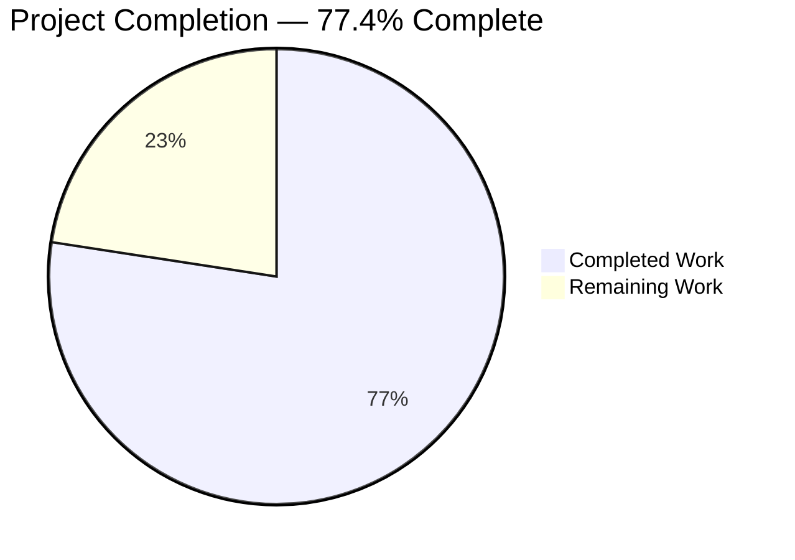
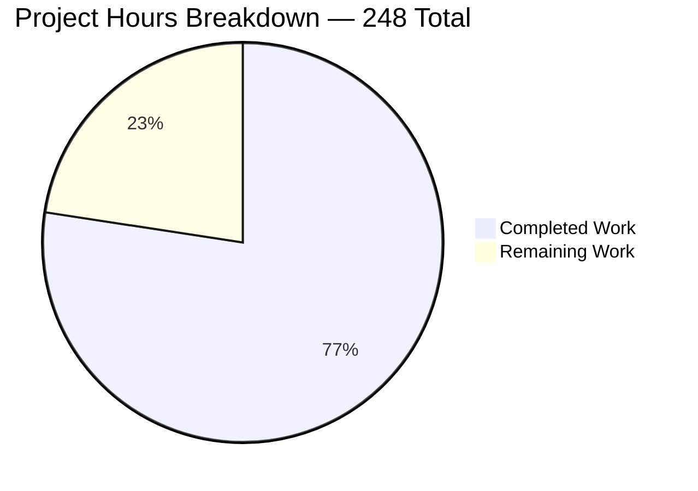
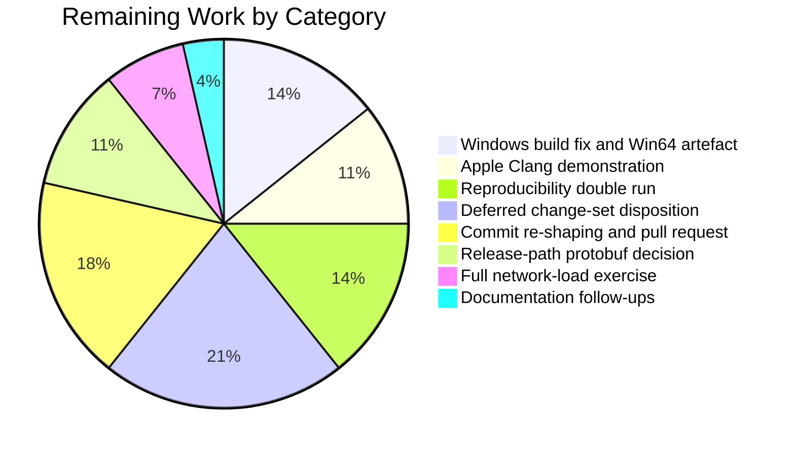
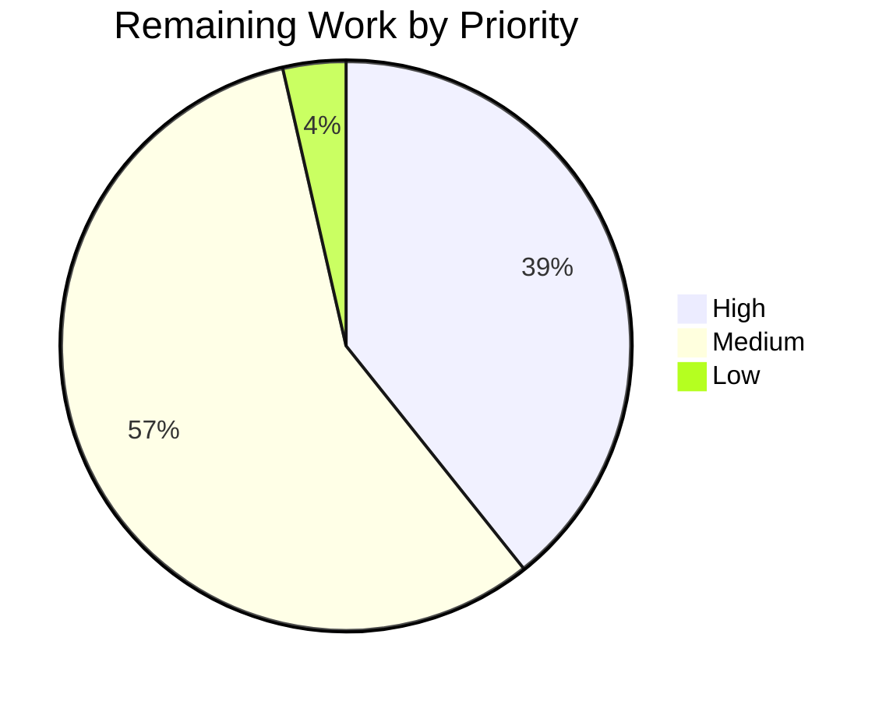

# 1. Executive Summary

## 1.1 Project Overview

Monero's first-party build — `src/`, `contrib/epee/` and `tests/` — has been moved from the C++17 language standard to C++23. The dialect is pinned at its three authoritative sites, the build-system and compiler floors are raised and enforced at configure time, every construct the newer standard deprecates or removes is replaced at source, and the toolchain change is carried through the CI images, the deterministic cross-build and the published documentation. The audience is the maintainers and packagers who build and release the daemon, the wallets and the RPC servers. Runtime behaviour is unchanged by design: consensus validation, cryptography, serialization, the wire protocol and the database layout are byte-for-byte identical to the pre-migration tree, and that identity is demonstrated rather than asserted.

## 1.2 Completion Status



Colour key: Completed = Dark Blue `#5B39F3` · Remaining = White `#FFFFFF`.

| Metric | Value |
|---|---|
| Total Hours | 248 |
| Completed Hours (AI + Manual) | 192 |
| Remaining Hours | 56 |
| Percent Complete | 77.4% |

Calculation: 192 / (192 + 56) = **77.4%**.

## 1.3 Key Accomplishments

- ✅ Every first-party translation unit compiles as C++23 — 321 of 321, vendored C++11 and C11 units untouched
- ✅ 124 of 124 targets build with zero errors and **zero first-party warning origins**
- ✅ Configure-time guard refuses under-floor GCC, Clang and Apple Clang, `clang-cl`, and unknown compilers
- ✅ Consensus unchanged: all 165 blockchain scenarios pass; transaction and block bytes identical
- ✅ Wire and storage unchanged: RPC, wallet-RPC and ZMQ versions and the database schema verified frozen
- ✅ Full non-consensus tier green — 23 of 23 suites, including 19 live RPC scenarios
- ✅ TLS fingerprint pinning now covered: unsorted-list lookup succeeds, absent fingerprint rejected
- ✅ CI images, the ten-host cross-build and the toolchain documentation state the new floors

## 1.4 Critical Unresolved Issues

Eight items remain open, spanning 5 of the 15 requirements the plan defines; the other ten are closed.

| Issue | Impact | Owner | ETA |
|---|---|---|---|
| Windows builds do not compile at C++23: a wide volume path reaches a narrow log stream at `src/daemon/main.cpp:117`, an overload C++20 deletes. Step-by-step fix: Section 5.3 | `monerod.exe` cannot be produced; the MSYS2 UCRT64 job and the Win64 release artefact fail | Platform maintainer | 1 day |
| Apple Clang 15 floor is enforced and published but never demonstrated | macOS users on Xcode 15 face an unverified pairing | macOS maintainer | 1 day |
| Reproducibility and capacity-bound gates not executed (2 items: reproducible-build double run; full network-load exercise) | Reproducible release builds and sustained-load behaviour unproven at the new dialect | Release engineer | 2 days |
| Third-party C++23 deprecation diagnostics on the cross hosts, from the pinned protobuf recipe | Noisier release logs; a future `-Werror` tightening would fail | Build maintainer | 1 day |
| Hardening and RPC-contract improvements identified during delivery remain at upstream behaviour (2 items: hardening set; daemon ZMQ JSON contract set) | Pre-existing exposure and contract gaps persist unchanged | Security reviewer | 3 days |
| Branch carries 17 commits where the plan fixes eight by mechanical change type | Traceability only — the delivered tree is identical either way | Repository owner | 1 day |

## 1.5 Access Issues

| System/Resource | Type of Access | Issue Description | Resolution Status | Owner |
|---|---|---|---|---|
| macOS / Xcode 15 host | Build and test environment | No Apple toolchain is reachable, so the Apple Clang floor cannot be demonstrated | Open — needs a macOS runner or developer machine | macOS maintainer |
| Windows / MSYS2 UCRT64 host | Build and test environment | No Windows toolchain is reachable, so the MinGW-w64 floor is enforced by CI alone. Section 5.3 gives the steps to demonstrate it | Open — needs a Windows runner | Platform maintainer |
| Reproducible-build environment | Release build environment | The reproducible release path needs a pinned build environment that is not provisioned | Open — needs the release build host | Release engineer |
| GitHub Actions | Workflow execution | Workflow definitions can be parsed and inventoried but only GitHub can run them | Open — resolves on the first push | Repository owner |

No credentials, secrets or network services are required to build, test or run this project.

## 1.6 Recommended Next Steps

1. **[High]** Convert the wide volume path before it reaches the narrow log stream in `src/daemon/main.cpp`, then rebuild the Win64 artefact, following the runbook in Section 5.3.
2. **[High]** Demonstrate the Apple Clang floor on a pinned Xcode 15, or raise it in the guard, `README.md` and the matrix together.
3. **[High]** Run the reproducible build twice and diff the hash summaries before tagging a release.
4. **[Medium]** Settle the cross hosts' third-party protobuf diagnostics — recipe bump or per-recipe dialect exception — and re-run them.
5. **[Medium]** Re-shape the branch into the eight prescribed commits and open the upstream pull request.

# 2. Project Hours Breakdown

## 2.1 Completed Work Detail

| Component | Hours | Description |
|---|---|---|
| Dialect pins and build-system floors | 9 | `CMAKE_CXX_STANDARD 23` (`CMakeLists.txt:136`), `CXX_STANDARD ?= c++23` (`contrib/depends/Makefile:12`), the Darwin branch value (`contrib/depends/toolchain.cmake.in:104`), `cmake_minimum_required(VERSION 3.25)` at both sites, and the policy consequence: `LANGUAGE ASM` for `CryptonightR_template.S` (`src/crypto/CMakeLists.txt:104`) |
| Compiler-floor guard and documented floors | 8 | Four-branch configure-time guard (`CMakeLists.txt:150-173`) rejecting under-floor GCC, `clang-cl`, under-floor Clang, under-floor Apple Clang and any other compiler, each naming the version found and the documentation section |
| CI image and workflow migration | 8 | `debian:13` and `ubuntu:24.04` build containers, real `libunwind-dev` package name, `ubuntu:24.04` cross-build default, `noble` LLVM repository, dialect-salted cross-build cache key with the four input patterns |
| Documentation and installer realignment | 12 | New "Toolchain requirements" section with a 13-row compatibility matrix (`docs/COMPILING_DEBUGGING_TESTING.md:18`), `README.md` dependency table and Rust prerequisite across every platform install line, `contrib/brew/Brewfile` Rust entry, Trezor README C++23 and UCRT64 alignment |
| Compile-correctness substitutions | 12 | 225 UTF-8 literal prefixes removed across four files with the 11 valid array initialisations kept, and `rct::identity()` qualified where opening two namespaces made the call ambiguous |
| New-warning elimination at source | 22 | POD trait replaced by its normative definition in five headers, `expect<T>` storage rewritten as `alignas(T) unsigned char[sizeof(T)]` with a size assertion, five lambdas given the explicit `this` capture, the volatile counter rewritten as compound assignment, the `tx_extra` variant predicate rewritten, and one explicit lexicographic comparator shared by the fingerprint sort and search |
| Deprecated-construct removal | 4 | Four dynamic exception specifications converted to `noexcept`, a dead trait comment deleted, and the deprecated CMake flag-probe module replaced by `check_cxx_compiler_flag` |
| Boost-to-std evaluation and recorded deferral | 8 | `boost::optional` (99 files, 524 uses) and `boost::string_ref` (53 files, 205 uses) evaluated against their real call sites and deferred with reasons; `boost::filesystem` and `epee::span` retained |
| TLS fingerprint regression test | 6 | New `test_epee_connection.ssl_handshake_fingerprint_lookup` driving a real handshake over loopback, proving both the success and the rejection path of fingerprint lookup |
| Invariance preservation and its proofs | 14 | Literal-equality proof for every edited string table with a negative control, serialization and wire round-trips against committed golden blobs, database round-trip and export comparison, and confirmation that the RPC, wallet-RPC, ZMQ and LMDB version constants and every frozen directory are untouched |
| Acceptance builds across compiler rows and option-gated targets | 22 | Full 124-target builds on GCC 14, GCC 13, Clang 18 and Clang 16, the CMake 3.25 floor configure, the guard rejection path, the Trezor probe at the new dialect, the option-gated debug utilities and the libFuzzer targets |
| Warning-origin census | 10 | Per-origin diagnostic comparison over the identical target graph in each configuration, establishing zero first-party origins and the predicted drop in variant-comparison diagnostics |
| Residual-construct checks | 3 | Repository-wide checks that no deprecated trait, dynamic exception specification, deprecated CMake module or incompatible literal prefix remains, and that the five explicit captures are in place |
| Test-tier execution | 28 | Full non-consensus tier including the Python RPC scenarios, the unit estate, the consensus regression suite, targeted serialization and behavioural filters, the fuzz corpora and the benchmark warm-up path |
| Release-path exercises delivered | 24 | Ten cross-build hosts including the three that compile against pre-C++23 standard-library headers, release artefact inspection and hashing, and the container image built and its shipped binary run |
| Commit sequencing and traceability | 2 | Behaviour-preservation justifications recorded for every edit touching serialization, wire, storage, protocol, networking or consensus-adjacent code |
| **Total** | **192** | |

## 2.2 Remaining Work Detail

| Category | Hours | Priority |
|---|---|---|
| Windows narrow-stream conversion in `src/daemon/main.cpp` and Win64 artefact re-verification (runbook: Section 5.3) | 8 | High |
| Apple Clang 15 / Xcode 15 demonstration, or a documented floor revision | 6 | High |
| Guix reproducible-build double run and hash-summary comparison | 8 | High |
| Disposition of the deferred hardening and daemon ZMQ contract change sets | 12 | Medium |
| Branch re-shaping into the eight prescribed commits and upstream pull-request preparation | 10 | Medium |
| Release-path protobuf diagnostics decision and re-run of the affected cross hosts | 6 | Medium |
| Full network-load exercise on a host with descriptor and memory headroom | 4 | Medium |
| Documentation follow-ups inside already-authorized files | 2 | Low |
| **Total** | **56** | |

## 2.3 Hours Methodology

Scope is the migration plan and the path to production for it, and nothing else. Each completed row is an authorized deliverable or an acceptance activity the plan defines, sized from the work its evidence demonstrates rather than from lines changed — the change set is 33 files and +1136/−272, while the effort sits in the four compiler-row builds, the ten cross-build hosts, the per-origin diagnostic census and the test tiers. Each remaining row is a plan requirement not yet satisfied or a gate that needs an environment this work could not reach. Partially satisfied requirements are split: compile-correctness is 90% complete because a third, Windows-only error class remains; the build matrix 90% because the Apple row was never run; the warning census 80%; the test tier 95%; the release paths 65%. Confidence is high on the completed rows, which rest on observed results, and medium on the platform-gated remaining rows, whose cost depends on how the first run behaves on hardware nobody has exercised yet.

# 3. Test Results

Every figure below was produced by running the suite on this tree with GCC 14.3 / libstdc++ 14 / Boost 1.88 in the acceptance configuration (`ARCH=default`, `BUILD_TESTS=ON`, `BUILD_GUI_DEPS=ON`, `ENABLE_FUZZ_TEST=ON`, `Release`, mandatory Trezor), serially, with `DNS_PUBLIC=tcp` exported.

| Area / Category | Framework | Tests | Passed | Failed | Coverage | What This Proves |
|---|---|---|---|---|---|---|
| Full non-consensus tier (`ctest -E core_tests`) | CTest | 23 | 23 | 0 | Every registered suite except consensus | The whole test estate is green on the migrated tree, in 1406 s |
| Consensus regression | gtest / `core_tests` | 165 | 165 | 0 | All registered synthetic-blockchain scenarios | Block and transaction validation behave exactly as before the dialect change |
| Unit estate under the CI filter | gtest / `unit_tests` | 1293 run of 1310 registered | 1291 | 0 | 159 suites; 2 environment probes skipped | Library, epee, wallet, RPC and crypto behaviour is intact across the whole unit surface |
| Serialization, wire and RPC round-trips | gtest filter | 122 | 122 | 0 | 17 suites over binary and JSON portable storage, Levin framing, wallet cache, peer list, ZMQ shapes | Produced bytes still match the committed golden blobs — no format moved |
| Edited data paths (auth, TLS, storage, scrubbing) | gtest filter | 66 | 66 | 0 | 10 suites over HTTP digest, the HTTP server, fingerprint lookup, `expect<T>`, secret scrubbing | The substituted literals, comparator, storage and traits behave identically at the new dialect |
| Python RPC scenarios | `functional_tests_rpc` | 19 | 19 | 0 | Live `monerod` + `monero-wallet-rpc` on a deterministic chain | The daemon and wallet RPC surfaces answer correctly end to end, in 999 s |
| Parser robustness | 18 libFuzzer-style harnesses | 31 seeds | 31 | 0 | Every committed corpus, all present and non-empty | No parser crashes on any seed for base58, block, RingCT, Levin, JSON, URL, transaction, `tx_extra` or UTF-8 inputs |
| Benchmark warm-up path | `performance_tests` | 7 | 7 | 0 | The edited volatile counter loop | The rewritten warm-up executes on every benchmark instantiation without behaviour change |

Alongside the suites, the build itself was measured: 124 of 124 targets with zero errors; 16 diagnostics from 5 origins, all in system headers or the pre-existing C source at `src/crypto/tree-hash.c:89`, giving **zero first-party C++ warning origins** and zero first-party trace locations; a compile database of 453 entries split 321 `-std=c++23`, 24 `-std=c++11` (vendored logging, QR and proof-of-work code), 79 `-std=c11` and 29 assembler entries with no dialect flag. Configure emits no warning and no policy line at CMake 3.31.6 and again at the 3.25 floor, and an under-floor compiler is refused with `GCC 12.5.0 is too old; GCC 13 or newer is required for C++23` (`CMakeLists.txt:153`).

**Not Covered** — delivered behaviour that no test exercises, and what to test before release:

- **Windows / MinGW-w64 builds.** No suite runs on a Windows toolchain. Test first: the `#ifdef WIN32` startup diagnostic in `src/daemon/main.cpp` does not compile at C++23 (see Section 5.2), so build `monerod.exe` before anything else. Section 5.3 gives the fix and the verification steps.
- **Apple Clang / macOS.** The published Apple floor has no build or test behind it. Run the macOS job on a pinned Xcode 15.
- **Reproducibility of release builds.** The reproducible path was never run twice for a hash comparison at the new dialect.
- **Sustained network load.** Both load-harness binaries build in every configuration, but the 100,000-connection exercise on the two fixed ports was never run; the edited asynchronous handlers are therefore covered functionally but not under load.
- **The four sanitizer-instrumented fuzz targets.** They compile at the new dialect; their diagnostic comparison against the previous dialect in the same session has not been made.
- **Workflow definitions.** `.github/workflows/build.yml` and `depends.yml` are checked by parsing, job and matrix inventory, and line-level diff; only the CI service can execute them.
- **Clang with libc++.** Documented as an unverified pairing; no build or test stands behind it.

# 4. Runtime Validation & UI Verification

This project ships 13 command-line executables — daemons, wallets, RPC servers and blockchain utilities — and has no user interface, so there is no UI to verify. Runtime validation was performed by driving the binaries themselves on testnet in offline mode with throwaway data directories; no step contacted a public network.

- ✅ **Daemon start-up** — `monerod --testnet --offline` reaches "core RPC server started ok" in about 12 seconds and shuts down cleanly through its own `stop_daemon` endpoint.
- ✅ **Daemon HTTP JSON-RPC** — `get_info` returns `status OK`, height 1, `nettype testnet`, `offline true`, `synchronized true`, version `0.18.1.0-aff728179`.
- ✅ **Daemon ZMQ JSON-RPC** — a plain JSON-RPC object on the ZMQ endpoint answers `get_height` with `rpc_version 131072`, confirming the frozen ZMQ RPC version 2.0 on the wire; the method-name and topic tables whose literals were edited dispatch unchanged.
- ✅ **Wallet RPC server** — `monero-wallet-rpc --testnet` starts against the local daemon in about a second and answers `get_version`, confirming the frozen wallet RPC version.
- ✅ **Python RPC journeys** — 19 scenarios drive real daemon and wallet processes on a deterministic chain: transfers, mining, multisig, cold signing, integrated addresses, proofs and blockchain manipulation.
- ✅ **Storage round-trip** — the migrated binaries open a database created by the pre-migration build with no migration step and report the same height and block hashes; export output compares byte for byte.
- ✅ **TLS handshake and fingerprint pinning** — a real handshake over loopback accepts a fingerprint supplied in an unsorted list and rejects one that is absent.
- ✅ **Executable smoke** — all 13 binaries are produced and run; the daemon, both wallets and the two key-generation tools report their version. The eight blockchain utilities decline `--version` and exit non-zero on `--help`, which is upstream behaviour this work leaves untouched.
- ⚠ **Container image** — the release image builds from the digest-pinned builder and the shipped binary reports its version; the image has not been re-built since the last documentation-only change to the cross-build workflow.
- ❌ **Windows and macOS runtime** — never exercised. No Windows or Apple environment was reachable, and Windows binaries cannot currently be produced at this dialect (Section 5.2; remediation runbook in Section 5.3). Reproducible release builds and the sustained-load exercise were likewise never run.

# 5. Compliance & Quality Review

## 5.1 Compliance Matrix

| Deliverable | Benchmark | Status | Evidence |
|---|---|---|---|
| Dialect pinned at all three authoritative sites | Every first-party unit compiles as C++23; nothing left at 17 or 20 | ✅ Pass | 321 of 321 first-party entries carry the C++23 flag; the three sites read `3.25` / `23` / `c++23` / `23` |
| Build-system floor and its policy consequence | Configures cleanly at the 3.25 floor; the assembler source still assembles | ✅ Pass | Floor configure exits 0 with no policy line; `LANGUAGE ASM` at `src/crypto/CMakeLists.txt:104`; vendored assembler objects checksum-identical |
| Compiler-floor enforcement | Under-floor and unsupported compilers refused at configure time | ✅ Pass | Four branches at `CMakeLists.txt:150-173`; under-floor GCC refused at `:153`; the Apple and `clang-cl` branches are unexercisable on Linux and verified by reading |
| Whole-tree build integrity | All targets build with no errors | ✅ Pass | 124 of 124 targets, zero errors, on each of the four supported Linux compiler rows |
| Warning cleanliness | No first-party diagnostic introduced by the dialect | ✅ Pass | 16 diagnostics from 5 origins, all system or pre-existing C; zero first-party origins and zero first-party trace locations |
| Consensus and cryptography untouched | No logic change; all consensus scenarios pass | ✅ Pass | 165 of 165 scenarios; zero files changed under the consensus, RingCT, hard-fork or proof-of-work trees |
| Serialization and wire invariance | Produced bytes unchanged; version constants frozen | ✅ Pass | 122 round-trip tests against golden blobs; RPC 3.18, wallet RPC 1.33, ZMQ RPC 2.0, database schema 5 all unchanged |
| Storage layout invariance | Databases interchange with the pre-migration build | ✅ Pass | Cross-version open with no migration, identical height and hashes, byte-identical export |
| Literal-table equality | Edited string tables differ from base only by the prefix | ✅ Pass | Four exact source comparisons empty, with a non-empty negative control |
| Deprecated-construct removal | Nothing removed or deprecated by the newer standard remains | ✅ Pass | Repository-wide checks find no deprecated trait, dynamic exception specification or deprecated CMake module |
| Toolchain, CI and documentation alignment | Images, cross-build and docs state and exercise the new floors | ⚠ Partial | Containers, cache identity, README and the 13-row matrix in place; the Windows and Apple rows are not demonstrated |
| Release-path readiness | Cross hosts, container and reproducibility proven at the new dialect | ⚠ Partial | Ten cross hosts and the container verified; the Windows host fails to compile and reproducibility was never demonstrated |

## 5.2 AAP & Rule Divergences and Gaps

No user-specified rules were provided for this project, so every divergence below is a departure from the migration plan rather than from a rule.

| What the AAP/Rule Required | What Was Delivered Instead | Why It Diverged | Impact | Remediation |
|---|---|---|---|---|
| Exactly two source-level error classes exist under the new standard, both fixed | Two are fixed and proven; a third, Windows-only, remains at `src/daemon/main.cpp:117` | The error census was taken on Linux, where the `#ifdef WIN32` branch never compiles; the file is not in the authorized 33-file set | Release-blocking on Windows | Convert the wide path with `utf16_to_utf8`; rebuild the Win64 artefact (steps: Section 5.3) |
| One pinned Xcode 15 build and test before the Apple floor is published | Floor enforced and published, documented as not demonstrated | No Apple toolchain was reachable in any environment used | Unverified pairing published to macOS users | Run the macOS job on a pinned Xcode 15, then confirm or raise the floor |
| Reproducible release builds twice with identical hashes; the full network-load exercise | Neither was run | No Guix build environment was provisioned; the load run needs 100,000 connections on two fixed ports | Reproducibility and load behaviour unproven at the new dialect | Run the reproducible workflow twice and diff summaries; run the load exercise on a capacity host |
| No new warning origin in any acceptance configuration | Native rows are clean; cross hosts gain about 105 third-party diagnostics each from the pinned protobuf | Recipe versions are frozen reproducible-build inputs, so the recipe could not be bumped here | Noisier release logs; a future `-Werror` tightening would fail | Bump the recipe or apply the per-recipe dialect exception the plan pre-authorizes |
| Warning acceptance measured against a same-session C++17 build of the pristine tree | Measured against recorded per-environment baselines | The plan itself places the five explicit-`this` captures in the dialect commit, so a C++17 build of this tree is no longer valid | Future regressions need per-environment re-measurement | Record the current origin sets as the reference baseline |
| Eight commits by mechanical change type, in a fixed order | Seventeen commits, tree-identical outcome | The change set was restored to the authorized files after work beyond that scope had landed, and reshaping published history needs an owner | Traceability only | Re-shape the branch before opening the pull request |
| Consensus, wire, storage and error contracts frozen; exactly 33 files, all modifications | Exactly that — so hardening and contract improvements identified during delivery are absent | Every one of them changes a frozen surface or a file outside the authorized set | Pre-existing exposure and contract gaps persist unchanged | Take each as its own authorized change set with its compatibility decision |
| Only the per-file edits the plan enumerates, and exact source equality for the edited literal tables | Three further edits inside authorized files; one correction deliberately not made | Two were dead-link and fail-closed fixes worth more than strict enumeration; the third records a release-path condition. The stale comment cannot be touched without breaking the equality gate | Documentation accuracy only | Land the follow-ups in one authorized documentation change |

**Windows compile failure.** `src/daemon/main.cpp:117` streams a `const wchar_t*` volume path into the narrow string stream that the logging macro builds, inside the `#ifdef WIN32` FAT32 start-up diagnostic. C++20 deleted that inserter, so the translation unit is a hard error on every Windows build at this dialect — reproduced directly: the same expression compiles at `-std=c++17` and fails with "use of deleted function" at `-std=c++23`. The file is byte-identical to the pre-migration tree because it is not one of the 33 files the plan authorizes. Consequence: neither the MSYS2 UCRT64 job nor the Win64 cross artefact can be produced. The fix converts the path with `epee::string_tools::utf16_to_utf8`, declared for Windows in `contrib/epee/include/string_tools.h`. Decide whether to widen the change set or land it separately, but land it before any release. Section 5.3 gives the exact change and the steps to reproduce, fix, verify and land it.

**Apple Clang floor.** The guard refuses Apple Clang below 15 at `CMakeLists.txt:167-170`, and `README.md` and the toolchain matrix publish that floor. The plan requires one pinned Xcode 15 configure, build and test *before* publication, and that run never happened because no Apple environment was reachable. The documentation is honest about it — the matrix labels the row declared and guard-enforced rather than verified — so nobody is misled, but macOS users on Xcode 15 are relying on an untested pairing, and the macOS CI job only ever exercises whatever compiler the current image ships. Run the job once on a pinned Xcode 15.4 or the oldest 15.x available; if it fails, raise the guard, the README sentence and the matrix row together.

**Reproducibility and load gates.** Two acceptance gates were never executed. The reproducible release path must build every triple twice and produce identical hash summaries; nothing in this work demonstrates that at C++23, and it is the one gate that speaks to whether released binaries can still be independently reproduced. The network-load exercise opens 100,000 connections against fixed ports 36230 and 36231; both harness binaries build in every configuration and their edited handlers changed only capture spelling, so the risk is low, but sustained-load behaviour is unproven. Neither gate needs code work — only a Guix build host and a machine with descriptor and memory headroom. Run both before tagging.

**Third-party diagnostics on the cross hosts.** Under this dialect the pinned protobuf recipe is compiled as C++23 for the first time, and its own generated table header combines two enumeration types with `|` — something C++20 deprecated. That yields roughly 105 diagnostics per cross host from 35 lines of one upstream header, where C++17 emitted none. A syntax-only compile of the pinned sources reproduces exactly that split. The diagnostics are third-party by origin, so they add no first-party origin and the native acceptance rows are unaffected; nothing was suppressed, and no dialect-silencing flag or pragma exists anywhere in the change set. The condition is recorded in `docs/COMPILING_DEBUGGING_TESTING.md`. Choose between bumping the recipe and the per-recipe, per-host dialect exception the plan pre-authorizes.

**Comparison baseline.** Acceptance was defined as a same-compiler, same-session diagnostic comparison against a pristine C++17 build of this tree. That comparison is no longer reproducible here, because the plan itself places the five explicit-`this` captures in the dialect-switch commit: a C++17 configure of the delivered tree emits extension warnings and is not a valid baseline. The census was therefore made against recorded per-environment origin sets, and the substantive result stands — zero first-party origins in every native configuration, with the predicted drop in variant-comparison diagnostics confirmed. What a maintainer loses is the ability to re-derive that baseline on demand, so treat the origin sets in Section 3 as the reference and re-measure per environment.

**Commit shape.** The plan fixes an eight-commit sequence with prescribed row counts, so that each mechanical change type is reviewable on its own and every intermediate state builds. The branch carries seventeen commits, because the change set was restored to the authorized file set after work beyond that scope had landed. The delivered tree is identical either way, and the behaviour-preservation justification for every serialization-, wire-, storage- and consensus-adjacent edit is recorded in the history, so nothing is lost but reviewability. Re-shape the branch into the eight commits before opening the upstream pull request, or accept the current shape and say so in the request.

**Hardening and contract work outside the authorized scope.** Improvements identified during delivery are absent from the tree: header-log escaping, binding digest credentials to the request target, portable-storage trailing-byte and 32-bit varint handling, wallet RPC error-text redaction, frame-length-only ZMQ logging, ten daemon ZMQ JSON contract defects, command-line path validation, blockchain-utility `--version`/`--help` and regtest export, and a builder-bundle refresh. Each changes a surface the plan freezes — response shapes, digest acceptance, parser acceptance, error text, recipe versions — or a file outside the authorized 33. All are pre-existing upstream behaviour that this work leaves exactly as it found it; none is introduced here. Each needs its own authorization, its own compatibility decision and its own review.

**Edits beyond the enumerated set.** Three changes sit inside authorized files that the per-file plan does not list: the Homebrew manifest's documentation link now points at the official page because the previous one returns 404; the cross-build workflow fetches the LLVM signing key with retries and fail-closed output handling, so one transport reset no longer fails the job and no partial key lands in the trusted keyring; and the toolchain document records the release-path protobuf condition above. None is compiled. Conversely, the edited HTTP-auth source keeps a header sentence describing a literal convention the file no longer uses, because the plan's equality gate demands exact source equality modulo the prefix. Land all four as one documentation change.

## 5.3 Windows Build Remediation Runbook (MSYS2 UCRT64 / MinGW-w64)

This runbook is for the maintainer who makes the Windows pipeline checks pass. It takes either a Windows machine running MSYS2, or a Linux or WSL machine with the MinGW-w64 cross toolchain, from a clean setup to green checks. Work through the steps in order. Each step gives the commands to run, the output to expect and what to do when the output differs. Commands run from the repository root unless a step says otherwise. Section 5.2 records how the Windows failure was found; this section removes it.

### 5.3.1 Outcome and audience

The work is done when the three Windows checks below pass on the change that carries the fix, and every other job in the same three workflows stays green.

| Check (job name in GitHub) | Workflow | Defined at | What it runs |
|---|---|---|---|
| `Windows (MSYS2)` | `ci/gh-actions/cli` | `.github/workflows/build.yml:74-111` | Native build of target `all` in MSYS2 UCRT64 on `windows-latest`, then the reduced test tier |
| `Win64` | `ci/gh-actions/depends` | `.github/workflows/depends.yml:48-51` (matrix entry), `:121-149` (steps) | `make depends target=x86_64-w64-mingw32` in `ubuntu:24.04` with the MinGW-w64 cross compiler, then upload of `monerod.exe` and `monero-wallet-cli.exe` |
| `x86_64-w64-mingw32` | `ci/gh-actions/guix` | `.github/workflows/guix.yml:54` (target), `:109` (build) | Reproducible Guix release build of the Windows triple |

All three compile the same first-party sources at C++23 with a MinGW-w64 GCC. Today they stop at `src/daemon/main.cpp:117`, a failure reproduced here with the MinGW-w64 cross compiler (the Guix job itself was not run here). One edit to that file fixes it (Step 4). The file is outside the migration's 33 authorized files, so it has to be landed deliberately (Step 7).

### 5.3.2 Verification legend

Every claim below is marked **verified here** or **not verified here**.

- **Verified here** means checked on the Linux delivery host by one of these means:
  - reading the workflow, build and source files cited;
  - compiling the real sources with MinGW-w64 GCC 13.2 (`x86_64-w64-mingw32-g++-posix`, Ubuntu cross package) against Linux copies of the third-party headers;
  - compiling reduced test programs with host GCC 13 and 14;
  - linking one small test program into a PE32+ executable.
- **Not verified here** means it needs Windows, MSYS2, a depends or Guix run, or GitHub. That covers:
  - every Windows run;
  - MSYS2's current GCC (16.x, per msys2.org) and its exact diagnostic wording;
  - the Windows link of `monerod.exe`, and ctest on Windows;
  - the full depends and Guix cross builds, skipped for time;
  - whether MSYS2's CMake package installs Ninja;
  - the Start-menu name "MSYS2 MINGW64" and the MINGW64 package names.

### 5.3.3 Issue inventory

| # | Issue | Location | Cause | Symptom | Checks affected | Status |
|---|---|---|---|---|---|---|
| W-1 | Wide string written to a narrow log stream | `src/daemon/main.cpp:117`, inside `isFat32` (`:111-123`), called at `:261` | C++20 deletes `operator<<(basic_ostream<char>&, const wchar_t*)` (P1423R3). At C++17 the same expression silently chose `operator<<(const void*)` | Hard error "use of deleted function". `monerod.exe` is not produced, so the `Win64` upload and the Windows tests cannot run | All three | Open. **Verified here**: MinGW-w64 GCC 13.2 reports exactly this one error for the unmodified file at C++23 and compiles it at C++17, where the object calls `std::ostream::operator<<(void const*)` |
| W-2 | Further Windows-only C++20/23 errors | The 54 first-party files with Windows conditionals, plus the MinGW-only daemonizer sources (`src/daemonizer/CMakeLists.txt:29-38`) | — | None found | — | **Verified here** at compile level: a static audit of every Windows-only region for the construct classes in Step 4.3, and a MinGW-w64 GCC 13.2 syntax-only compile of all 322 first-party translation units at C++17 and C++23. W-1 is the only error that depends on the dialect. **Not verified here**: a Windows build with MSYS2's own headers |
| W-3 | New Windows-only warnings | Same set | — | None. The 8 first-party origins found (Step 5.5) are identical at C++17 and C++23 | — | **Verified here** by the same compile |
| W-4 | MinGW-w64 GCC floor of 13 never demonstrated on Windows | Guard at `CMakeLists.txt:150-154` | No Windows toolchain was reachable during delivery | — | `Windows (MSYS2)`, `Win64` | **Not verified here**. Step 5 records the first Windows result, Step 6 the cross compiler's |
| W-5 | Windows runtime never exercised | `monerod.exe`, `monero-wallet-cli.exe`, the reduced tests | As W-4 | — | `Windows (MSYS2)` | **Not verified here**. Step 5 exercises it |

### 5.3.4 Step 1 — Set up MSYS2 UCRT64 the way CI does

CI prepares Windows with `msys2/setup-msys2@v2` (`build.yml:91-96`):

```yaml
msystem: ucrt64
update: true
cache: false
pacboy: toolchain:p cmake:p ccache:p boost:p openssl:p zeromq:p libsodium:p hidapi:p protobuf:p libusb:p unbound:p rust:p git:p
```

**1.1 Install MSYS2.** Run the installer from https://www.msys2.org on 64-bit Windows 10 (version 1809) or newer, and keep the default location `C:\msys64`. *Not verified here.*

**1.2 Open the UCRT64 shell.** Start **MSYS2 UCRT64** from the Start menu, or run `C:\msys64\ucrt64.exe`. Every Windows command in this runbook runs in that shell.

**1.3 Update the system**, as `update: true` does:

```bash
pacman -Suy
```

If pacman says it must close every MSYS2 process, including this terminal, confirm. Then reopen **MSYS2 UCRT64** and run `pacman -Suy` again, repeating until it reports nothing to do (https://www.msys2.org/docs/updating/).

**1.4 Install CI's package set.** `pacboy` comes from the `pactoys` package. It expands `name:p` to the shell's `$MINGW_PACKAGE_PREFIX`, which in UCRT64 is `mingw-w64-ucrt-x86_64` (https://www.msys2.org/docs/package-naming/). The second line below is CI's list, verbatim:

```bash
pacman -S --needed pactoys
pacboy -S --needed toolchain:p cmake:p ccache:p boost:p openssl:p zeromq:p libsodium:p hidapi:p protobuf:p libusb:p unbound:p rust:p git:p
```

The same set as plain `pacman` names is below. `toolchain` is a package group, so press Enter at its prompt to take every member:

```bash
pacman -S --needed mingw-w64-ucrt-x86_64-toolchain mingw-w64-ucrt-x86_64-cmake \
  mingw-w64-ucrt-x86_64-ccache mingw-w64-ucrt-x86_64-boost mingw-w64-ucrt-x86_64-openssl \
  mingw-w64-ucrt-x86_64-zeromq mingw-w64-ucrt-x86_64-libsodium mingw-w64-ucrt-x86_64-hidapi \
  mingw-w64-ucrt-x86_64-protobuf mingw-w64-ucrt-x86_64-libusb mingw-w64-ucrt-x86_64-unbound \
  mingw-w64-ucrt-x86_64-rust mingw-w64-ucrt-x86_64-git
pacman -S --needed curl    # not in CI's list; used only by the smoke run in Step 5
```

`protobuf` and `libusb` are required, not optional: CI makes Trezor support mandatory (Step 3), and configure fails without them. The package line at `README.md:347` lacks `ccache`, `protobuf`, `libusb` and `git`, so use the lists above rather than that line.

**1.5 Check the environment.**

```bash
echo $MSYSTEM                   # UCRT64
which gcc cmake cargo ninja     # each under /ucrt64/bin
gcc --version | head -1         # 13 or newer; CMakeLists.txt:150-154 refuses older GCC
cmake --version | head -1       # 3.25 or newer (CMakeLists.txt:31)
cargo --version                 # Rust is mandatory: src/CMakeLists.txt:91 always adds src/fcmp_pp
```

MSYS2's CMake uses the Ninja generator by default, and CI passes no `-G` (https://www.msys2.org/docs/cmake/). If `which` finds no `ninja`, install `mingw-w64-ucrt-x86_64-ninja`. If `$MSYSTEM` is not `UCRT64`, or a tool resolves under `/usr/bin` or `/mingw64/bin`, you are in the wrong shell (5.3.11).

> **MINGW64 alternative — not the environment CI checks.** Use it only if UCRT64 is unavailable to you.
>
> - Open **MSYS2 MINGW64**, or run `C:\msys64\mingw64.exe`. The Start-menu name is not verified here.
> - The package prefix is `mingw-w64-x86_64-`. The `pacboy` line in 1.4 works unchanged, because `:p` follows the shell. With plain `pacman`, the names are not verified here:
>
> ```bash
> pacman -S --needed mingw-w64-x86_64-toolchain mingw-w64-x86_64-cmake mingw-w64-x86_64-ccache \
>   mingw-w64-x86_64-boost mingw-w64-x86_64-openssl mingw-w64-x86_64-zeromq mingw-w64-x86_64-libsodium \
>   mingw-w64-x86_64-hidapi mingw-w64-x86_64-protobuf mingw-w64-x86_64-libusb mingw-w64-x86_64-unbound \
>   mingw-w64-x86_64-rust mingw-w64-x86_64-git
> ```
>
> - `echo $MSYSTEM` prints `MINGW64`, and the tools live under `/mingw64/bin`.
> - MINGW64 links against `msvcrt` rather than `ucrt`. MSYS2 deprecated it on 2026-03-15 and may remove packages from it (https://www.msys2.org/docs/environments/).
> - Never share objects, libraries or a `build/` directory between the two environments.
> - `build.yml:93` pins `msystem: ucrt64`, so repeat Steps 3 to 5 in UCRT64 before you land anything.

**No Windows machine?** Step 6 reproduces and verifies the `Win64` check with Docker `ubuntu:24.04` or WSL Ubuntu 24.04, and needs no MSYS2.

### 5.3.5 Step 2 — Get the source

```bash
mkdir -p /c/src && cd /c/src
git clone --recursive <repository URL of the pull request> monero
cd monero
git checkout <branch of the pull request>
git submodule update --init --recursive
git submodule status
```

Expected output is one line per submodule; the text in parentheses may differ:

```
 52eb8108c5bdec04579160ae17225d66034bd723 external/gtest (…)
 12f2c2ffe2108d6cf54c391fee33c8bc3646cdab external/randomx (v1.2.3)
 24b5e7a8b27f42fa16b96fc70aade9106cf7102f external/rapidjson (…)
 e887b2fb4bfcfcc454b2005472ad1df6f2191f52 external/supercop (…)
```

- A leading `-` means a submodule is missing, and a leading `+` means it is at another commit. Either way, run `git submodule update --init --force` before anything else: missing submodules surface later as confusing compile errors.
- Keep the clone root short, such as `C:\src\monero`. The longest tracked path is already 151 characters before the build tree adds its own depth.
- `.gitattributes` marks `tests/data/** -text`, so Git's line-ending conversion cannot alter the test fixtures. No other Git setting is required.

*Verified here:* the pins, the path length and `.gitattributes`. *Not verified here:* Git's behaviour on Windows.

### 5.3.6 Step 3 — Reproduce the failure and collect every error

CI configures and builds with `BUILD_DEFAULT` (`build.yml:17`), shown here verbatim:

```bash
cmake -S . -B build -D ARCH="default" -D BUILD_TESTS=ON -D BUILD_GUI_DEPS=ON -D ENABLE_FUZZ_TEST=ON -D CMAKE_BUILD_TYPE=Release && cmake --build build --target all
```

That command stops at the first failure. Run its configure half unchanged, then a keep-going build, so that one pass lists every error:

```bash
# CI sets this for every job (build.yml:30). cmake/CheckTrezor.cmake:19 and :27 read it
# from the environment, so export it; passing it with -D does not make Trezor mandatory.
export USE_DEVICE_TREZOR_MANDATORY=ON
# CI's job count (.github/actions/set-make-job-count/action.yml:16): one job per core
# and per 2.25 GiB of RAM, at least 1.
export MAKE_JOB_COUNT=$(expr $(printf '%s\n%s' $(( $(grep MemTotal: /proc/meminfo | cut -d: -f2 | cut -dk -f1) * 4 / (1048576 * 9) )) $(nproc) | sort -n | head -n1) '|' 1)
export CMAKE_BUILD_PARALLEL_LEVEL=$MAKE_JOB_COUNT
ccache --max-size=150M
cmake -S . -B build -D ARCH="default" -D BUILD_TESTS=ON -D BUILD_GUI_DEPS=ON -D ENABLE_FUZZ_TEST=ON -D CMAKE_BUILD_TYPE=Release 2>&1 | tee configure.log
grep -n 'Trezor: support enabled' configure.log
grep CMAKE_GENERATOR: build/CMakeCache.txt
cmake --build build --target all -- -k 0 2>&1 | tee build.log
grep -n "error:" build.log
```

**Configure.** It exits 0, and `configure.log` contains `Trezor: support enabled` (`src/device_trezor/CMakeLists.txt:70`). If that line is missing, see 5.3.11.

**Generator.** Expect `CMAKE_GENERATOR:INTERNAL=Ninja`, for which `-k 0` means "never stop". With a Makefiles generator, run `cmake --build build --target all -- -k 2>&1 | tee build.log` instead: GNU make reads `-k 0` as keep-going plus a target named `0`, and fails with `No rule to make target '0'` (verified here).

**Errors.** `grep` prints one diagnostic. In MinGW-w64 GCC 13.2's wording (verified here) it is:

```
…/src/daemon/main.cpp:117: error: use of deleted function 'std::basic_ostream<char, _Traits>& std::operator<<(basic_ostream<char, _Traits>&, const wchar_t*) [with _Traits = char_traits<char>]'
```

Notes follow it through `contrib/epee/include/misc_log_ex.h` (`LOG_TO_STRING` up to `MERROR`), ending with `ostream:<line>:5: note: declared here` at the deleted overload. The error line itself carries no column number. Ninja also prints a `FAILED:` line naming the `main.cpp` object. MSYS2's newer GCC may word the error differently or cite another `ostream` line; the stable parts are `main.cpp:117`, `use of deleted function` and `const wchar_t*` (not verified on MSYS2).

**Anything else.** Any other `error:` line is a finding that the audit here did not catch. Match it against the triage table in Step 4.3 before you fix it.

### 5.3.7 Step 4 — Fix at source

**4.1 Change `isFat32` in `src/daemon/main.cpp`.** Before (`:111-123`):

```cpp
#ifdef WIN32
bool isFat32(const wchar_t* root_path)
{
  std::vector<wchar_t> fs(MAX_PATH + 1);
  if (!::GetVolumeInformationW(root_path, nullptr, 0, nullptr, 0, nullptr, &fs[0], MAX_PATH))
  {
    MERROR("Failed to get '" << root_path << "' filesystem name. Error code: " << ::GetLastError());
    return false;
  }

  return wcscmp(L"FAT32", &fs[0]) == 0;
}
#endif
```

After:

```cpp
#ifdef WIN32
bool isFat32(const wchar_t* root_path)
{
  std::vector<wchar_t> fs(MAX_PATH + 1);
  if (!::GetVolumeInformationW(root_path, nullptr, 0, nullptr, 0, nullptr, &fs[0], MAX_PATH))
  {
    // Read the error first: utf16_to_utf8 calls WideCharToMultiByte, which may overwrite it.
    const DWORD error_code = ::GetLastError();
    // C++20 deleted operator<<(std::ostream&, const wchar_t*) (P1423R3), so log the path as UTF-8.
    std::string root_path_utf8;
    try
    {
      root_path_utf8 = epee::string_tools::utf16_to_utf8(root_path);
    }
    catch (const std::exception &e)
    {
      MERROR("utf16_to_utf8 failed: " << e.what());
    }
    MERROR("Failed to get '" << root_path_utf8 << "' filesystem name. Error code: " << error_code);
    return false;
  }

  return wcscmp(L"FAT32", &fs[0]) == 0;
}
#endif
```

Also add `#include "string_tools.h"` directly after `#include "misc_log_ex.h"` (`:41`). The whole change as a patch follows. Save it as `isfat32.patch`, run `git apply --check isfat32.patch`, then `git apply isfat32.patch`:

```diff
--- a/src/daemon/main.cpp
+++ b/src/daemon/main.cpp
@@ -39,6 +39,7 @@
 #include "daemon/executor.h"
 #include "daemonizer/daemonizer.h"
 #include "misc_log_ex.h"
+#include "string_tools.h"
 #include "net/parse.h"
 #include "p2p/net_node.h"
 #include "rpc/core_rpc_server.h"
@@ -114,7 +115,19 @@
   std::vector<wchar_t> fs(MAX_PATH + 1);
   if (!::GetVolumeInformationW(root_path, nullptr, 0, nullptr, 0, nullptr, &fs[0], MAX_PATH))
   {
-    MERROR("Failed to get '" << root_path << "' filesystem name. Error code: " << ::GetLastError());
+    // Read the error first: utf16_to_utf8 calls WideCharToMultiByte, which may overwrite it.
+    const DWORD error_code = ::GetLastError();
+    // C++20 deleted operator<<(std::ostream&, const wchar_t*) (P1423R3), so log the path as UTF-8.
+    std::string root_path_utf8;
+    try
+    {
+      root_path_utf8 = epee::string_tools::utf16_to_utf8(root_path);
+    }
+    catch (const std::exception &e)
+    {
+      MERROR("utf16_to_utf8 failed: " << e.what());
+    }
+    MERROR("Failed to get '" << root_path_utf8 << "' filesystem name. Error code: " << error_code);
     return false;
   }
 
```

What the change guarantees:

- **The error code is read first.** `::GetLastError()` is saved in a `DWORD` before any other call, because the conversion calls `WideCharToMultiByte`, which can overwrite the thread's last-error value. *Verified here* with a stand-in converter that overwrites it: the original code was still logged.
- **The diagnostic cannot throw.** `epee::string_tools::utf16_to_utf8` (`contrib/epee/include/string_tools.h:128`) throws `std::runtime_error` when a path cannot be converted (`contrib/epee/src/string_tools.cpp:216-231`). The `try`/`catch` follows the existing Windows code at `src/common/util.cpp:340-347`. A failed conversion logs itself, the path is then logged as empty, and the error code is still reported.
- **The include is explicit.** `main.cpp` already calls `epee::string_tools` at `:86` and `:133` through transitive includes. The new line documents the dependency; it is not what makes the fix compile.
- **Behaviour is unchanged.** `isFat32` still returns `false` when the volume query fails and `wcscmp(L"FAT32", &fs[0]) == 0` otherwise. Its caller at `:260-265` is untouched.

*Verified here:*
- MinGW-w64 GCC 13.2 compiles the patched `main.cpp` at C++23 and at C++17 with 0 errors and 0 warnings. The resulting `pe-x86-64` object defines `isFat32(wchar_t const*)` and imports `GetLastError` and `GetVolumeInformationW`.
- A reduced program with the same code compiles cleanly at `-std=c++23 -Wall -Wextra -Werror` with GCC 13, GCC 14 and MinGW-w64 GCC 13.2.
- The Linux object has no `isFat32` at all, so Linux builds are unaffected.

*Not verified here:* MSYS2's GCC on this code, and a run of the error branch on Windows.

**4.2 Why this is the right fix.** At C++17, `<< root_path` resolved to `basic_ostream::operator<<(const void*)`, because no narrow-stream inserter took a wide string. The log line therefore printed a pointer, such as `Failed to get '0x5ab954c7c004' filesystem name`, never the path. *Verified here:* host GCC 13 and 14 builds of the reduced expression printed that address, and the MinGW-w64 GCC 13.2 object calls the same `const void*` overload. C++20's P1423R3 deleted the narrow-stream inserters for `wchar_t`, `char8_t`, `char16_t` and `char32_t` pointers so that this silent conversion becomes an error, which is why C++23 rejects the line. Converting to UTF-8 is the codebase's own pattern for wide Windows strings, and the message now names the volume that failed. This is a log-text-only change in a Windows-only start-up diagnostic. FAT32 detection, its return value and the caller's warning are unchanged, and no consensus, serialization, wire or storage code is touched. The branch runs only when `GetVolumeInformationW` fails, so a normal start never reaches it.

**4.3 Triage for any other error.** The audit found no other Windows-only error (W-2), so this table is a safety net. If Step 3 shows another `error:` line, find its class below and apply the fix this migration already uses, then rebuild. The wording is GCC 14's at `-std=c++23 -Wall -Wextra` (verified here with one reduced program per class).

| Diagnostic | Construct | Fix at source | Precedent in this tree |
|---|---|---|---|
| `use of deleted function '…operator<<(basic_ostream<char, _Traits>&, const wchar_t*)…'`, or the same with `const char16_t*`, `const char32_t*` or `const char8_t*` | A wide or Unicode string (`WCHAR*`, `LPCWSTR`, `std::wstring::c_str()`, `boost::filesystem::path::c_str()` on Windows, `u""`, `U""`, `u8""`) written to a narrow stream or log macro | Capture `GetLastError()` first if it is logged, then convert with `epee::string_tools::utf16_to_utf8` inside `try`/`catch` | `src/common/util.cpp:340-347`; Step 4.1 |
| `invalid conversion from 'const char8_t*' to 'const char*'`, or `conversion from 'const char8_t [N]' to non-scalar type 'std::string' … requested` (the `[-fpermissive]` tag GCC appends is not a remedy; never add that flag) | A `u8"…"` literal used as `const char*` or `std::string` (P0482R6) | Drop the `u8` prefix when the literal is ASCII. An array initialisation `char a[] = u8"…"` stays valid; keep it | All prefixes dropped in `contrib/epee/src/http_auth.cpp`; array kept at `tests/unit_tests/http.cpp:830` |
| `implicit capture of 'this' via '[=]' is deprecated in C++20 [-Wdeprecated]` | A `[=]` lambda that uses members | `[=, this]` | `src/wallet/wallet_rpc_server.cpp:224`, `contrib/epee/include/net/abstract_tcp_server2.inl:2059` |
| `'template<class _Tp> struct std::is_pod' is deprecated: use 'is_standard_layout && is_trivial' instead [-Wdeprecated-declarations]` | `std::is_pod` | `std::is_standard_layout<T>::value && std::is_trivial<T>::value` | `contrib/epee/include/memwipe.h:64`, `src/serialization/json_object.h:119` |
| `'…struct std::aligned_storage' is deprecated [-Wdeprecated-declarations]` | `std::aligned_storage` | `alignas(T) unsigned char storage_[sizeof(T)];` | `src/common/expect.h:145` |
| `'++' expression of 'volatile'-qualified type is deprecated [-Wvolatile]` | `++` or `--` on a `volatile` variable | `v = v + 1;` | `tests/performance_tests/performance_tests.h:186` |
| `reference to 'identity' is ambiguous` | Unqualified `identity()` under `using namespace std` (C++20 adds `std::identity`) | Qualify the call, for example `rct::identity()` | `tests/unit_tests/ringct.cpp:115`, `:147` |
| None from GCC 14 at C++23, which still accepts it as an extension | A `throw()` exception specification, removed from the language in C++20 | `noexcept`; the migration already replaced every first-party use | `src/blockchain_db/blockchain_db.h:221` |
| `enumeration value '…' not handled in switch [-Werror=switch]`, or `control reaches end of non-void function [-Werror=return-type]` | A missing `case` or `return`; the build makes both hard errors (`CMakeLists.txt:866-869`) | Add the missing `case` or `return` | — |

**4.4 What a fix must never do.** Every error is fixed where it occurs. A change that relies on any of the following has not fixed the issue and must not be landed:

- adding `-fpermissive` or any `-Wno-*` flag, a `#pragma GCC diagnostic` or `#pragma clang diagnostic`, or `[[maybe_unused]]` to silence a diagnostic;
- lowering the dialect, whether by setting `CMAKE_CXX_STANDARD` or `CXX_STANDARD` below 23, passing `-D CMAKE_CXX_STANDARD=17` or `=20`, or turning on GNU extensions;
- editing the compiler-floor guard (`CMakeLists.txt:150-171`) or lowering any compiler floor;
- disabling, skipping or `if:`-gating a Windows job, marking it `continue-on-error`, or dropping its reduced tests;
- setting `USE_DEVICE_TREZOR=OFF` or unsetting `USE_DEVICE_TREZOR_MANDATORY` to get past configure;
- changing consensus, serialization, wire-protocol or LMDB code, or anything under `external/`.

### 5.3.8 Step 5 — Verify on Windows

Run these in the same UCRT64 shell, with the variables from Step 3 still exported.

**5.1 Build everything.**

```bash
ccache --max-size=150M
cmake --build build --target all -- -k 0 2>&1 | tee build-fixed.log    # Makefiles generator: -- -k
grep -c "error:" build-fixed.log                                        # 0
ls build/bin/monerod.exe build/bin/monero-wallet-cli.exe
```

Expect `0`, no `FAILED:` line, and both executables listed. If an error remains, return to Step 4.3.

**5.2 Run CI's reduced test tier.** This is `CTEST_EXCLUDE_SLOW` (`build.yml:27-29`), verbatim:

```bash
cd build
env GTEST_FILTER="-DNSResolver.*:AddressFromURL.*:select_outputs.*" ctest --output-on-failure -E "functional_tests_rpc|core_tests|cnv4-jit|hash-variant2-int-sqrt|wide_difficulty"
cd ..
```

Expect `100% tests passed, 0 tests failed out of <N>`. The number of tests on Windows has not been established, so judge the run by zero failures, not by a count. Never add `-j` to `ctest`, because several tests bind fixed loopback ports. If a test fails, rerun it alone with `ctest -R <name> --output-on-failure` from `build/` and fix the cause. Never add it to the exclusion list.

**5.3 Check that the binaries start.**

```bash
build/bin/monerod.exe --version
build/bin/monero-wallet-cli.exe --version
```

Each prints one line of the form `Monero '<code name>' (v<version>-<commit>)`. The Linux build of this branch prints `Monero 'Fluorine Fermi' (v0.18.1.0-cc2a9d2db)` for both. Run them from the UCRT64 shell, which puts the DLLs under `/ucrt64/bin` on `PATH` (not verified here).

**5.4 Run a testnet offline smoke test.** Never point the node at mainnet. This run is testnet and offline, with a throwaway directory:

```bash
mkdir -p /c/monero-smoke
build/bin/monerod.exe --testnet --offline --no-igd --non-interactive \
  --data-dir C:/monero-smoke/testnet --p2p-bind-port 22000 --rpc-bind-port 22001 \
  --zmq-rpc-bind-port 22002 --log-level 0 --log-file C:/monero-smoke/monerod.log &
sleep 30; grep -m1 'core RPC server started ok' /c/monero-smoke/monerod.log

curl -s -X POST http://127.0.0.1:22001/json_rpc \
  -d '{"jsonrpc":"2.0","id":"0","method":"get_info"}'
# status OK, height 1, nettype testnet, offline true

curl -s -X POST http://127.0.0.1:22001/stop_daemon    # plain endpoint, not json_rpc
wait                                                   # monerod.exe exits
rm -rf /c/monero-smoke
```

If `grep` prints nothing, wait and check again; if the log shows an error, fix it before landing. On an NTFS system drive `isFat32` returns `false` without entering its error branch. That branch runs only when `GetVolumeInformationW` fails, which a normal start does not cause, so the compile in 5.1 is its evidence. *The equivalent Linux run is recorded in Section 9; the Windows run is not verified here.*

**5.5 Check for warnings.** No first-party warning may come from the edited file, and none may be new. Rebuild from clean so that every warning prints again (ccache replays the warnings it cached), then count first-party origins:

```bash
census() { sed "s|^$2||" "$1" | grep -E '^(src|contrib|tests)/[^: ]+:[0-9]+:[0-9]+: warning: ' | sed -E 's/^([^:]+):([0-9]+):[0-9]+: warning: .*(\[-W[^]]+\])$/\3 \1:\2/' | sort | uniq -c; }
cmake --build build --target clean
cmake --build build --target all -- -k 0 2>&1 | tee build-clean.log
census build-clean.log "$(cygpath -m "$PWD")/" > census-head.txt
grep 'src/daemon/main.cpp' census-head.txt    # must print nothing
cat census-head.txt
```

`census` strips the repository root, which GCC prints as a Windows path such as `C:/src/monero/`, and counts each (flag, file, line). The function was tested here on that path form; MSYS2's actual output was not. If `census-head.txt` is empty while `grep -c ': warning:' build-clean.log` is not, read one warning line and pass its real prefix as the second argument.

The MinGW-w64 compile here found the following 8 first-party origins, identical at C++17 and C++23. It used Linux third-party headers, so MSYS2's may add or remove a few:

| Origin | Flag | Diagnostics | Cause |
|---|---|---|---|
| `contrib/epee/src/mlocker.cpp:62`, `:74`, `:88` | `-Wcpp` | 1 each | `#warning`: no page-size or memory-locking implementation for this platform |
| `src/common/timings.cc:106` (two messages) | `-Wformat=` | 2 each | `%F` and `%T` in a `strftime` format |
| `src/common/utf8.h:91`, `:93` | `-Wtype-limits` | 11 each | Range checks that are always true with a 16-bit `wchar_t` |
| `src/common/util.cpp:164` | `-Wignored-qualifiers` | 1 | Qualifier on a cast result type |

For a strict baseline, build the pre-migration base commit `454075bc6`, which is C++17, on the same machine and compare:

```bash
git worktree add ../monero-base 454075bc6
cd ../monero-base
git submodule update --init --recursive
cmake -S . -B build -D ARCH="default" -D BUILD_TESTS=ON -D BUILD_GUI_DEPS=ON -D ENABLE_FUZZ_TEST=ON -D CMAKE_BUILD_TYPE=Release
cmake --build build --target all -- -k 0 2>&1 | tee build.log
census build.log "$(cygpath -m "$PWD")/" > ../monero/census-base.txt
cd ../monero
diff census-base.txt census-head.txt
git worktree remove --force ../monero-base
```

The check passes when every line found only in `census-head.txt` is a line-number shift inside a file the migration edited, and no line names `src/daemon/main.cpp`. The base commit compiles `main.cpp:117`, because it is C++17. Record `gcc --version` and the outcome in the pull request: it is the first Windows demonstration of the MinGW-w64 toolchain row (W-4, W-5).

### 5.3.9 Step 6 — Cross-build on Linux or WSL (the `Win64` check)

This step mirrors the `Win64` entry of `depends.yml`, and it is also the route for anyone without a Windows machine. It needs an x86_64 Linux host with Docker, or WSL running Ubuntu 24.04. A cold run first builds every depends package from source; how long that takes was not measured here.

**6.1 Start the job's container** (`depends.yml:27-30`):

```bash
docker run -it --name monero-win64 ubuntu:24.04 bash
```

In WSL Ubuntu 24.04, skip `docker run`, and prefix the `apt` and `update-alternatives` commands below with `sudo`.

**6.2 Install the job's toolchain.** These are the workflow's commands (`depends.yml:79-100`), with the `Win64` matrix values from `:48-51` substituted:

```bash
export DEBIAN_FRONTEND=noninteractive
apt update; apt -y install ca-certificates curl
apt update; apt -y install build-essential cmake pkg-config git ccache g++-mingw-w64-x86-64
curl -O https://static.rust-lang.org/rustup/archive/1.29.0/x86_64-unknown-linux-gnu/rustup-init
echo "4acc9acc76d5079515b46346a485974457b5a79893cfb01112423c89aeb5aa10 rustup-init" | sha256sum -c
chmod +x rustup-init
./rustup-init -y --default-toolchain 1.93 --target x86_64-pc-windows-gnu
export PATH="$HOME/.cargo/bin:$PATH"
git config --global --add safe.directory '*'
```

`sha256sum -c` must print `rustup-init: OK`. If it does not, download the file again; never skip the check. The `export PATH` line stands in for the workflow's `echo "$HOME/.cargo/bin" >> $GITHUB_PATH`.

**6.3 Get the source and select the POSIX-threads compiler.** The two `update-alternatives --set` lines are the workflow's "prepare w64-mingw32" step (`depends.yml:121-125`):

```bash
git clone --recursive <repository URL of the pull request> /monero
cd /monero
git checkout <branch of the pull request>
git submodule update --init --recursive
update-alternatives --set x86_64-w64-mingw32-g++ $(which x86_64-w64-mingw32-g++-posix)
update-alternatives --set x86_64-w64-mingw32-gcc $(which x86_64-w64-mingw32-gcc-posix)
update-alternatives --display x86_64-w64-mingw32-g++ | head -3    # "manual mode", "link currently points to …-g++-posix"
```

These two lines are required: in auto mode, Ubuntu's MinGW-w64 package selects the `-win32` variants (verified here; `--display` then reports `auto mode` and `link currently points to /usr/bin/x86_64-w64-mingw32-g++-win32`).

**6.4 Reproduce, then build.** The build command is `depends.yml:127-130`, and the job count comes from the Linux branch of the job-count action (`action.yml:21`):

```bash
export MAKE_JOB_COUNT=$(expr $(printf '%s\n%s' $(( $(grep MemTotal: /proc/meminfo | cut -d: -f2 | cut -dk -f1) * 4 / (1048576 * 9) )) $(nproc) | sort -n | head -n1) '|' 1)
ccache --max-size=150M
make depends target=x86_64-w64-mingw32 -j$MAKE_JOB_COUNT 2>&1 | tee win64.log
```

The root `Makefile:47-49` builds the depends packages, configures `build/x86_64-w64-mingw32/release` against the generated toolchain file with `USE_DEVICE_TREZOR_MANDATORY=1`, and runs `make` there. Before the fix, Monero's own build stops at `src/daemon/main.cpp:117` with the Step 3 error. Once the packages exist, one pass lists every error:

```bash
make -C build/x86_64-w64-mingw32/release -k -j$MAKE_JOB_COUNT 2>&1 | tee win64-k.log
grep -n "error:" win64-k.log
```

That directory uses CMake's default Unix Makefiles generator, so the flag is `-k`. Apply the Step 4 fix in this checkout and run the `make depends` command again; it reuses the packages. Then check the artefacts:

```bash
ls -l build/x86_64-w64-mingw32/release/bin/monerod.exe build/x86_64-w64-mingw32/release/bin/monero-wallet-cli.exe
apt -y install file
file build/x86_64-w64-mingw32/release/bin/monerod.exe    # PE32+ … x86-64 … MS Windows (wording varies by file version)
```

These are the files the job uploads (`depends.yml:143-149`, patterns `monerod*` and `monero-wallet-cli*`). As an optional runtime check, run `apt -y install wine64`, then `wine64 build/x86_64-w64-mingw32/release/bin/monerod.exe --version`. To copy the binaries out of the container, run `docker cp monero-win64:/monero/build/x86_64-w64-mingw32/release/bin ./win64-bin`.

*Verified here:*
- the commands match the workflow text;
- the `-posix` MinGW-w64 GCC 13.2 reproduces the error and compiles the fix;
- `file` 5.46 reports `PE32+ executable for MS Windows 5.02 (console), x86-64` for a test program linked with it.

*Not verified here:* the full depends run, the link of `monerod.exe`, and `wine64`.

**6.5 Build the Guix triple.** The `x86_64-w64-mingw32` Guix check builds the same triple reproducibly. It needs an x86_64 Linux host with Guix installed per `contrib/guix/INSTALL.md`, plus 16 GB free for `/gnu/store` and 8 GB per triple (`contrib/guix/README.md:16-17`). Commit the fix first, then run from the top of the checkout:

```bash
git status --porcelain    # must print nothing
env HOSTS='x86_64-w64-mingw32' ./contrib/guix/guix-build
```

CI's own invocation (`guix.yml:109`), with the matrix value substituted:

```bash
ADDITIONAL_GUIX_TIMEMACHINE_FLAGS="--disable-authentication" SUBSTITUTE_URLS='https://bordeaux.guix.gnu.org' GUIX_REPO='https://github.com/monero-project/guix.git' HOSTS="x86_64-w64-mingw32" ./contrib/guix/guix-build
```

Expect a deterministic `.zip` under `guix/guix-build-<version>/output/x86_64-w64-mingw32/`, with logs under `guix/guix-build-<version>/logs/x86_64-w64-mingw32/`. These are the paths the workflow uploads (`guix.yml:110-115`). If any edit is uncommitted, `guix-build` stops with `ERR: The current git worktree is dirty, which may lead to broken builds.` (`contrib/guix/guix-build:66-79`). Afterwards, `./contrib/guix/guix-clean` removes the work directories. *Not verified here.*

### 5.3.10 Step 7 — Land the fix and confirm the pipeline

**7.1 Decide the change set.** `src/daemon/main.cpp` is not one of the migration's 33 authorized files. Choose one of the options below, and state the choice in the pull request:

| Option | What it means | Consequence |
|---|---|---|
| Separate change | One commit touching only `src/daemon/main.cpp`, landed on top of the migration or as a follow-up pull request merged before any release | The migration's file set stays exactly as authorized; the migration alone still leaves the Windows checks red |
| Widen the migration | Add the commit to the migration's pull request, and record that the authorized set grows from 33 to 34 files, and why | One pull request turns every check green; its scope record has to be updated |

**7.2 Commit.** The message ends with the one-line behaviour-preservation justification (`J:`) that the migration's commits carry:

```bash
git add src/daemon/main.cpp
git commit -F- <<'EOF'
daemon: log the FAT32-probe volume path as UTF-8 on Windows

C++20 (P1423R3) deletes operator<<(std::ostream&, const wchar_t*), so the
Windows-only isFat32 diagnostic in src/daemon/main.cpp no longer compiles
with MinGW-w64 at C++23. Read GetLastError() first, convert the root path
with epee::string_tools::utf16_to_utf8 inside try/catch, and log the UTF-8
text instead of the pointer value that C++17 printed.

J: log-text-only change in a Windows-only start-up diagnostic; FAT32 detection and its return value unchanged
EOF
git show --stat HEAD    # exactly one file: src/daemon/main.cpp
```

**7.3 Push and watch the checks.** Push the branch and open or update the pull request, then watch these jobs:

| Check | Runs on this change? | Green looks like |
|---|---|---|
| `Windows (MSYS2)` (`build.yml`) | Yes. Only `docs/**` and `**/README.md` are ignored (`build.yml:3-11`) | Steps `build` and `reduced tests` pass, and the test log ends with `100% tests passed, 0 tests failed` |
| `Win64` (`depends.yml`) | Yes. The ignore list is the same (`depends.yml:3-11`) | Step `build` passes, and the run carries an artifact named `Win64` (`depends.yml:146`) holding `monerod.exe` and `monero-wallet-cli.exe` |
| `x86_64-w64-mingw32` (`guix.yml`) | Only for pushes and pull requests that change one of its `paths`: `contrib/depends/**`, `contrib/guix/**`, `external/**`, `.github/workflows/guix.yml` or `**/Cargo.lock` (`guix.yml:3-19`). A change to `src/daemon/main.cpp` alone does not trigger it, and none of these workflows has a manual `workflow_dispatch` trigger | The job passes and uploads `guix/guix-build-*/output/x86_64-w64-mingw32/*`. If it did not run, attach the result of Step 6.5 to the pull request |
| Every other job in the three workflows | Whenever its workflow runs | Stays green. Linux and macOS never compile the `#ifdef WIN32` branch. On Linux, `make -C build daemon` rebuilds `main.cpp` with no new warning, because the Linux object contains no `isFat32` (verified here) |

The `paths-ignore` rule cuts both ways:

- A commit that changes only `docs/**` or a `README.md` does not run `build.yml` or `depends.yml`, so it proves nothing about Windows.
- This guide lies outside those paths, so a commit that changes only this file still runs both workflows. Their Windows jobs fail at `main.cpp:117` until the fix lands; that is the documented starting state, not a regression.
- Caches are saved only by runs that are not pull requests (`build.yml:107-108`, `depends.yml:132-139`), so the first pull-request run after the fix may build without a warm cache.

**7.4 After every check is green,** update this guide's Windows status:

- Section 1.4: the Windows issue row.
- Section 1.5: the Windows / MSYS2 UCRT64 host row.
- Section 5.1: the "Toolchain, CI and documentation alignment" and "Release-path readiness" rows.
- Section 5.2: the first table row and the "Windows compile failure" paragraph.
- Section 6: the Windows risk row.
- Section 9: the MinGW-w64 prerequisite row and the Windows troubleshooting entry.
- The other mentions that point here (1.6, 2.2, 3, 4, Appendices A and C), and W-1, W-4 and W-5 in 5.3.3, each with a link to the passing run.

### 5.3.11 Troubleshooting

| Symptom | Cause | Fix |
|---|---|---|
| `echo $MSYSTEM` is not `UCRT64`, or `which gcc` does not resolve under `/ucrt64/bin` | Wrong shell: MSYS, MINGW64 or a non-MSYS2 terminal | Open **MSYS2 UCRT64** (`C:\msys64\ucrt64.exe`), delete `build/` and configure again; the CMake cache keeps the compiler it first found |
| Link errors or crashes after switching between MINGW64 and UCRT64 | Mixed environments: `msvcrt` and `ucrt` objects in one build | Use one environment for the compiler, the libraries and the build directory; delete `build/` when switching |
| The terminal closes during `pacman -Suy` | A core-package update | Reopen **MSYS2 UCRT64** and run `pacman -Suy` again until nothing is left |
| Configure fails with `Trezor: protobuf library not found` (`cmake/CheckTrezor.cmake:63`), or another `Trezor: Protobuf …` or `Trezor: protobuf messages …` error (`:87`, `:115`, `:143`) | protobuf is missing or broken; fatal because Trezor is mandatory (`:26-27`) | Install `mingw-w64-ucrt-x86_64-protobuf`, delete `build/`, configure again. Never switch Trezor off: CI builds with it |
| Configure fails with `Trezor: LibUSB not found or test failed, please install libusb-1.0.26` (`:213`) | libusb is missing | Install `mingw-w64-ucrt-x86_64-libusb` and configure again |
| `configure.log` shows `[WARNING] Trezor support cannot be compiled! Skipping Trezor compilation.` and no `Trezor: support enabled` | `USE_DEVICE_TREZOR_MANDATORY` was not exported, so a Trezor failure became a warning (`:36-40`) | `export USE_DEVICE_TREZOR_MANDATORY=ON`, delete `build/`, configure again, then fix the Trezor error it now reports |
| `GCC <version> is too old; GCC 13 or newer is required for C++23` (`CMakeLists.txt:153`) | Outdated toolchain | `pacman -Suy`. Never edit the guard |
| Configure, or the `fcmp_pp` Rust build, cannot find `cargo` | Rust is missing | Install `mingw-w64-ucrt-x86_64-rust` in UCRT64 (Step 6 installs Rust through rustup); `which cargo` must resolve under `/ucrt64/bin` |
| Configure finds no Ninja build program | `ninja` is missing, and MSYS2's CMake defaults to the Ninja generator | Install `mingw-w64-ucrt-x86_64-ninja` |
| `make: *** No rule to make target '0'.` | `-k 0` was passed to a Makefiles generator | Use `-- -k` (verified here) |
| Compiler processes are killed, or the machine stalls mid-build | More parallel jobs than memory allows | Use `MAKE_JOB_COUNT` from Step 3, which allows 2.25 GiB per job (`action.yml:6-7`) |
| File-not-found errors for deep paths under `build/` | A path longer than Windows allows (not verified here) | Clone into a short root such as `C:\src\monero` |
| Rebuilds do not get faster | ccache is not in use, or points at another cache directory | Configure must print `Using ccache` (`CMakeLists.txt:74`, reached through `COMPILER_CACHE` `auto` at `:61`). `ccache -s` shows hits, and `ccache --get-config cache_dir` names the cache; CI's is `C:\Users\runneradmin\AppData\Local\ccache` (`build.yml:88`) |
| Cross build: `update-alternatives --display x86_64-w64-mingw32-g++` shows `-win32` | Ubuntu's default thread model | Run the two `update-alternatives --set … -posix` lines (Step 6.3) |
| `sha256sum` reports `FAILED` for `rustup-init` | A corrupt or substituted download | Download it again; never skip the check |
| `ERR: The current git worktree is dirty, which may lead to broken builds.` | Uncommitted edits during a Guix build | Commit the fix; do not set `FORCE_DIRTY_WORKTREE` |
| The Guix `x86_64-w64-mingw32` check is missing from the pull request | Its `paths` filter (`guix.yml:3-19`) | Run Step 6.5 locally and attach the result |
| A hand-rolled syntax-only probe, using flags copied from a Linux `compile_commands.json`, reports `definition is marked dllimport` inside Boost.Serialization, or errors in `src/daemonizer/posix_fork.cpp` | Probe artefacts: the Linux `*_DYN_LINK` defines, and a file MinGW builds never compile (`src/daemonizer/CMakeLists.txt:29-38`) | Drop the `*_DYN_LINK` defines and skip `posix_fork.cpp`; neither error appears in a real MinGW build (verified here with the probe) |

# 6. Risk Assessment

These are forward-looking exposures for whoever takes this branch to production. Nothing the migration itself changed appears here: consensus, serialization, wire and storage behaviour were exercised and proven byte-invariant, so they carry no residual risk.

| Risk | Category | Severity | Probability | Mitigation | Status |
|---|---|---|---|---|---|
| Windows binaries cannot be built at this dialect until the narrow-stream conversion lands (`src/daemon/main.cpp:117`) | Technical | High | Certain | `utf16_to_utf8` conversion per the Section 5.3 runbook, then re-run the Win64 cross build and the UCRT64 job | Open |
| The Apple Clang floor is enforced and published without a build behind it, so macOS users may meet an unverified pairing | Technical | Medium | Medium | One pinned Xcode 15 configure, build and test; confirm the floor or raise guard, README and matrix together | Open |
| Reproducible release builds are unproven at the new dialect — the reproducible path was never run twice for a hash comparison | Integration | Medium | Medium | Run the reproducible workflow twice, or once on two machines, and diff the SHA-256 summaries before tagging | Open |
| The pinned protobuf recipe emits about 105 third-party deprecation diagnostics per cross host, so release logs are noisy and a future `-Werror` tightening would fail | Integration | Medium | High | Bump the recipe or apply the per-recipe, per-host dialect exception the plan pre-authorizes | Documented |
| The Darwin and FreeBSD cross hosts compile against standard-library headers that predate every C++23 library addition, so a later use of `std::expected`, `std::format`, ranges or `std::byteswap` would break them | Integration | Medium | Medium | Standing policy: include `<version>` and gate on the feature-test macro with the existing implementation as fallback; enforce in review | Mitigated by policy |
| Sustained-load behaviour of the edited asynchronous handlers is unproven — the 100,000-connection exercise was never run | Operational | Low | Medium | Run the load harness on a host with descriptor and memory headroom and the two fixed ports free | Open |
| Hardening opportunities identified during delivery remain at upstream behaviour: header logging that includes credentials, digest credentials not bound to the request target, parser acceptance on 32-bit targets, wallet error text, and advisory-affected build-stage components in the pinned builder bundle | Security | Medium | Medium | Take each as its own authorized change set with the compatibility decision its frozen surface needs | Deferred by scope |
| Future warning regressions are harder to judge because a same-session pristine C++17 baseline is no longer producible from this tree | Technical | Low | Medium | Treat the recorded per-environment origin sets as the reference baseline and re-measure per environment | Accepted |

# 7. Visual Project Status

Progress against the migration scope and its path to production. Completed = Dark Blue `#5B39F3`; Remaining = White `#FFFFFF`.



Remaining work by category, in hours (sums to 56):



Remaining work by priority, in hours:



| View | Completed | Remaining | Total |
|---|---|---|---|
| Hours | 192 | 56 | 248 |
| Share | 77.4% | 22.6% | 100% |

# 8. Summary & Recommendations

The migration itself is done and demonstrated. Thirty-three files changed — every one a modification, nothing created, deleted, moved or renamed — for a net of +1136/−272 lines, and out of that the whole first-party tree now compiles as C++23: 321 of 321 first-party translation units at the new dialect, 124 of 124 targets building with zero errors, and zero first-party warning origins under the project's unchanged warning set. The dialect is pinned at its three authoritative sites, the build-system floor moves to CMake 3.25 with its one policy consequence handled, and a configure-time guard now refuses under-floor GCC, Clang and Apple Clang, the `clang-cl` frontend and any unrecognised compiler with a message that names the version found and points at the toolchain documentation. Against the plan's scope and the path to production for it, the project is **77.4% complete** — 192 of 248 hours.

What matters most for a consensus-bearing codebase is that nothing moved, and that was proven rather than assumed. All 165 synthetic-blockchain scenarios pass. The 122 serialization, wire and RPC round-trip tests still match their committed golden blobs. The RPC, wallet-RPC and ZMQ protocol versions and the database schema version are unchanged, and a database written by the pre-migration build opens with no migration step and reports the same height and hashes, with a byte-identical export. Each edited literal table differs from its predecessor by nothing but the removed prefix, checked by exact source comparison with a negative control. The one consensus-adjacent edit — the variant predicate that orders transaction-extra fields — carries a permanent comment explaining why the predicate is the same, and is covered both by its unit suites and by the full consensus run.

Three gaps stand between this branch and a release, and none of them is in the migrated code. Windows is the blocker: a start-up diagnostic that only Windows compiles streams a wide volume path into a narrow log stream, an overload the newer standard deletes, so `monerod.exe` cannot be produced at all. It is a one-expression fix, it sits in a file the plan's file list does not include, and it must land before anything ships. The Apple Clang floor is enforced and published but has never been demonstrated on a pinned Xcode 15. Reproducible release builds have never been run twice at this dialect for a hash comparison. Add the cross hosts' third-party protobuf deprecation noise and the still-unrun load exercise, and the remaining 56 hours are almost entirely environment-gated verification rather than development.

One decision is waiting for a human that is not about the migration at all. Hardening and RPC-contract improvements were identified while this work was under way — log escaping, binding digest credentials to the request target, parser acceptance on 32-bit targets, wallet error-text handling, and a set of daemon ZMQ JSON contract defects — and every one of them changes a surface the plan freezes or a file outside the authorized set. They are absent from this tree, which therefore behaves exactly as the pre-migration tree did on each of those surfaces. Nothing was introduced and nothing regressed; each item needs its own authorization, its own compatibility judgement, and its own review, and each is worth having.

**Production readiness: not yet, and for a short, specific list.** Land the Windows conversion and rebuild the Win64 artefact; demonstrate the Apple floor or revise it; run the reproducible build twice and compare hashes. Those three close the release-blocking set. Then settle the protobuf diagnostics on the cross hosts, run the load exercise, re-shape the branch into the eight prescribed commits, and open the pull request. Success metrics to hold to: all 13 binaries produced on every supported platform including Windows; 165 of 165 consensus scenarios and 23 of 23 suites green; zero first-party warning origins on every acceptance compiler; identical hashes from two reproducible builds; and the protocol, wallet-RPC, ZMQ and schema versions still exactly where they are today.

# 9. Development Guide

Every command below was run against this tree from the repository root. No credentials, secrets, environment variables, VPN, database or message broker are needed to build, test or run anything here — if something appears to need one, that is a wrong turn.

### System prerequisites

C++23 raises the floors. The build refuses anything below them at configure time.

| Tool | Floor | Verified here |
|---|---|---|
| GCC | 13 | 14.3.0 and 13.4.0 |
| Clang | 16 | 18.1.8 and 16.0.4 |
| Apple Clang | 15 (Xcode 15) | not demonstrated |
| MinGW-w64 GCC (MSYS2 UCRT64) | 13 | not demonstrated (setup and verification: Section 5.3) |
| CMake | 3.25 | 3.31.6 and 3.25.3 |
| Boost | 1.69 declared | 1.88.0 |
| OpenSSL | 1.1.1 declared | 3.5.3 |
| Rust / cargo | any stable that builds the FCMP++ crate | 1.93.1 |
| Python 3 | 3.x with `requests`, `pyzmq`, `deepdiff` | 3.13.7 |

Budget roughly 2 GB of RAM per parallel compile job and about 10 GB of disk. A cold full build takes 30–90 minutes; with a warm compiler cache it is minutes.

### Environment setup

```bash
# Debian/Ubuntu dependencies
sudo apt update && sudo apt install -y build-essential cmake pkg-config \
  libssl-dev libzmq3-dev libunbound-dev libsodium-dev libunwind-dev \
  libreadline-dev libhidapi-dev libusb-1.0-0-dev libprotobuf-dev \
  protobuf-compiler libboost-all-dev python3 python3-pip ccache doxygen graphviz git curl

# Rust is mandatory on this branch: src/fcmp_pp/fcmp_pp_rust is built unconditionally
curl --proto '=https' --tlsv1.2 -sSf https://sh.rustup.rs | sh -s -- -y
. "$HOME/.cargo/env"

# Python modules the functional tests need. Without them CMake only warns and
# silently drops two tests, so `ctest -N` reports 22 instead of 24.
pip install --break-system-packages requests pyzmq deepdiff

# Submodules are mandatory, not optional
git submodule update --init --force
git submodule status   # gtest 52eb8108, randomx 12f2c2ff, rapidjson 24b5e7a8, supercop e887b2fb
```

### Configure and build

```bash
# Primary (acceptance) configuration
CC=gcc-14 CXX=g++-14 cmake -S . -B build \
  -D ARCH=default -D BUILD_TESTS=ON -D BUILD_GUI_DEPS=ON -D ENABLE_FUZZ_TEST=ON \
  -D CMAKE_BUILD_TYPE=Release -D USE_DEVICE_TREZOR=ON -D USE_DEVICE_TREZOR_MANDATORY=ON \
  -D CMAKE_EXPORT_COMPILE_COMMANDS=ON

# Cap the job count at min(CPU count, RAM_GiB * 4 / 9) or the OOM killer will
# stop the build partway through with a misleading error.
make -C build -j10 -k

# Iterating? Build only what you need.
make -C build unit_tests -j8
```

Expect: `-- CMake version 3.31.6`, three submodules up to date, `Found Boost Version: 1.88.0`, `Trezor: support enabled`, `Using Rust target x86_64-unknown-linux-gnu`, `AES support enabled`, and **no** `CMake Error`, `CMake Warning` or `CMP####` line. `Could NOT find Protobuf (missing: Protobuf_DIR)` immediately followed by `Found Protobuf` is the config-then-module fallback, not a warning. The build ends with 124 `Built target` lines, 13 binaries in `build/bin` and 18 fuzz harnesses in `build/tests/fuzz`.

The compilation database matters more here than in most projects, because much of the code is macro-generated or lives in `.inl` files included from headers:

```bash
python3 -c "
import json, collections
e = json.load(open('build/compile_commands.json'))
print(len(e), collections.Counter(next((a for a in x['command'].split() if a.startswith('-std=')), 'none') for x in e))"
# 453 Counter({'-std=c++23': 321, '-std=c11': 79, 'none': 29, '-std=c++11': 24})
```

### Other compiler rows

```bash
# GCC 13 / libstdc++ 13. The link path is required: a GCC-15-built distribution
# Boost needs a symbol libstdc++-13-dev's own shared object does not define.
CC=gcc-13 CXX=g++-13 cmake -S . -B build-gcc13 <same -D options> \
  -D CMAKE_EXE_LINKER_FLAGS=-L/opt/gcc13-link -D CMAKE_SHARED_LINKER_FLAGS=-L/opt/gcc13-link

# Clang 18
CC=clang-18 CXX=clang++-18 cmake -S . -B build-clang18 <same -D options>

# Clang 16 must be pinned to the libstdc++ 13 headers; with 14 it fails in <utility>
CC=/opt/llvm-16/bin/clang CXX=/opt/llvm-16/bin/clang++ cmake -S . -B build-clang16 <same -D options> \
  -D CMAKE_C_FLAGS=--gcc-install-dir=/usr/lib/gcc/x86_64-linux-gnu/13 \
  -D CMAKE_CXX_FLAGS=--gcc-install-dir=/usr/lib/gcc/x86_64-linux-gnu/13 \
  -D CMAKE_EXE_LINKER_FLAGS=-L/opt/gcc13-link -D CMAKE_SHARED_LINKER_FLAGS=-L/opt/gcc13-link

# The build-system floor, and the guard refusing an under-floor compiler
/opt/cmake-3.25.3/bin/cmake -S . -B /tmp/cm325 <same -D options>          # rc 0, no policy lines
CC=gcc-12 CXX=g++-12 cmake -S . -B /tmp/guard -D ARCH=default             # rc 1, "GCC 12.5.0 is too old"
```

Clang 16 receives `-std=c++2b` and GCC and Clang 18 receive `-std=c++23`; both spell C++23. Each row needs its own build directory, and `.gitignore` covers only `/build`, so delete any extra directory before committing.

### Running the tests

```bash
export DNS_PUBLIC=tcp        # required by suites that resolve names
ctest --test-dir build -N    # 24 registered tests

# Reduced tier, as the macOS and Windows jobs run it — about 200 s
cd build && GTEST_FILTER="-DNSResolver.*:AddressFromURL.*:select_outputs.*" \
  ctest --output-on-failure -E "functional_tests_rpc|core_tests|cnv4-jit|hash-variant2-int-sqrt|wide_difficulty"

# Full non-consensus tier — 23/23 in about 1400 s here
ctest --test-dir build --output-on-failure -E core_tests

# Unit tests directly. ALWAYS --data-dir build/tests/data: the source path makes
# the wallet suites write stray files into the tracked tests/data directory.
build/tests/unit_tests/unit_tests --data-dir build/tests/data --gtest_filter='Expect.*'

# Benchmarks (warm-up path) and fuzz corpora
build/tests/performance_tests/performance_tests --filter='test_check_hash*'
for f in build/tests/fuzz/*_fuzz_tests; do n=$(basename "$f" _fuzz_tests); \
  for s in tests/data/fuzz/$n/*; do timeout 60 "$f" "$s" || echo "crash $n $s"; done; done

# Consensus regression, in its own build directory with reduced hash iterations
CFLAGS=-DMONERO_CRYPTO_SLOW_HASH_ITER=20 CC=gcc-14 CXX=g++-14 \
  cmake -S . -B build-core -D ARCH=default -D BUILD_TESTS=ON -D CMAKE_BUILD_TYPE=Release
cmake --build build-core --target core_tests -j4
build-core/tests/core_tests/core_tests --list_tests | wc -l        # 165
ctest --test-dir build-core --output-on-failure -R core_tests      # about 430 s
```

Never pass `-j` to ctest. `unit_tests`, `functional_tests_rpc`, the load harness and `libwallet_api_tests` bind fixed loopback ports or fixed temporary names, so exactly one of them may run on a host at a time; run two concurrently and you get spurious socket failures.

### Running the software

Never point a node at mainnet — that is hundreds of gigabytes and days of sync, and no verification task needs it.

```bash
build/bin/monerod --testnet --offline --no-igd --non-interactive \
  --data-dir /tmp/monero-testnet --p2p-bind-port 22000 --rpc-bind-port 22001 \
  --zmq-rpc-bind-port 22002 --log-level 0 --log-file /tmp/monerod.log
# "core RPC server started ok" in about 12 s

curl -s -X POST http://127.0.0.1:22001/json_rpc \
  -d '{"jsonrpc":"2.0","id":"0","method":"get_info"}'
# status OK, height 1, nettype testnet, offline true

python3 -c "
import zmq, json
s = zmq.Context().socket(zmq.REQ); s.connect('tcp://127.0.0.1:22002')
s.send_string(json.dumps({'jsonrpc':'2.0','id':0,'method':'get_height','params':{}}))
print(s.recv_string())"
# {"jsonrpc":"2.0","id":0,"result":{"rpc_version":131072,"height":1}}

build/bin/monero-wallet-rpc --testnet --wallet-dir /tmp/monero-wallets \
  --rpc-bind-port 22004 --disable-rpc-login --daemon-address 127.0.0.1:22001 \
  --log-level 0 --log-file /tmp/wallet-rpc.log

curl -s -X POST http://127.0.0.1:22001/stop_daemon    # plain endpoint, not json_rpc
```

### Troubleshooting

- **`GCC 12.5.0 is too old`** at configure time — the floor guard fired. Use GCC 13+, Clang 16+ or Apple Clang 15+, or read `docs/COMPILING_DEBUGGING_TESTING.md`, "Toolchain requirements".
- **Confusing mid-build failures** — check `git submodule status` first; missing submodules look like code errors. The build fails outright without rapidjson, randomx or supercop.
- **`cargo` or `rustc` not found** — Rust is mandatory on this branch. Install it and re-configure.
- **`ctest -N` reports 22, not 24** — `requests`, `pyzmq` or `deepdiff` is missing, so the two Python-driven tests were silently dropped at configure time.
- **Build killed partway through** — the job count exceeded the memory budget. Rebuild with a lower `-j`, or configure with `USE_SINGLE_BUILDDIR=1` if disk is tight.
- **`undefined reference to __cxa_call_terminate`** with GCC 13 — add `-L/opt/gcc13-link` to the executable and shared linker flags, as shown above.
- **Clang 16 failing inside `<utility>`** — it is being fed libstdc++ 14 headers. Pin it with `--gcc-install-dir=.../13`; Clang 16 with libstdc++ 14 is a documented unsupported pairing.
- **Spurious socket or `node_server` failures** — two port-binding suites ran at once. Run them serially.
- **A stray `monero-wallet-rpc.log` beside the binaries** — the wallet server logs next to itself unless `--log-file` is passed.
- **`monerod: unrecognised option '--disable-rpc-login'`** — that is a wallet-RPC flag. For an unauthenticated daemon simply omit `--rpc-login`.
- **Windows builds fail to compile** — expected on this branch until the `src/daemon/main.cpp:117` fix lands. Section 5.3 is the step-by-step remediation runbook; Section 5.2 explains the cause.
- **API documentation** — `HAVE_DOT=YES doxygen Doxyfile` (drop the variable if graphviz is unavailable) is the fastest way to trace call graphs through the template-heavy P2P and protocol code.

# 10. Appendices

## A. Command Reference

| Purpose | Command |
|---|---|
| Configure (acceptance) | `CC=gcc-14 CXX=g++-14 cmake -S . -B build -D ARCH=default -D BUILD_TESTS=ON -D BUILD_GUI_DEPS=ON -D ENABLE_FUZZ_TEST=ON -D CMAKE_BUILD_TYPE=Release -D USE_DEVICE_TREZOR=ON -D USE_DEVICE_TREZOR_MANDATORY=ON -D CMAKE_EXPORT_COMPILE_COMMANDS=ON` |
| Build everything | `make -C build -j10 -k` |
| Build one target | `make -C build unit_tests -j8` |
| List registered tests | `ctest --test-dir build -N` |
| Full non-consensus tier | `DNS_PUBLIC=tcp ctest --test-dir build --output-on-failure -E core_tests` |
| Reduced tier | `GTEST_FILTER="-DNSResolver.*:AddressFromURL.*:select_outputs.*" ctest --test-dir build --output-on-failure -E "functional_tests_rpc\|core_tests\|cnv4-jit\|hash-variant2-int-sqrt\|wide_difficulty"` |
| Unit tests, filtered | `build/tests/unit_tests/unit_tests --data-dir build/tests/data --gtest_filter='<suite>.*'` |
| Consensus scenarios | `ctest --test-dir build-core --output-on-failure -R core_tests` |
| Benchmark warm-up | `build/tests/performance_tests/performance_tests --filter='test_check_hash*'` |
| Compile-database census | `python3 -c "import json,collections;e=json.load(open('build/compile_commands.json'));print(len(e),collections.Counter(next((a for a in x['command'].split() if a.startswith('-std=')),'none') for x in e))"` |
| Deprecated-construct check | `git grep -nE 'std::is_pod\|std::aligned_storage\|std::result_of\|\bthrow\(\)' -- src contrib/epee tests` |
| Cross-build one host (Windows walk-through: Section 5.3, Step 6) | `make depends target=x86_64-w64-mingw32`, run from the repository root |
| Container image | `docker build -t monero .` then `docker run --rm monero --version` |
| API documentation | `HAVE_DOT=YES doxygen Doxyfile` |

## B. Port Reference

| Port | Service | Notes |
|---|---|---|
| 18080 / 18081 / 18082 | Mainnet P2P / RPC / ZMQ | Defaults; never used for verification |
| 28080–28082 | Testnet defaults | Displaced by the explicit flags in Section 9 |
| 38080–38082 | Stagenet defaults | Unused here |
| 18090–18484 | Python RPC scenarios | Fixed; the suite must run alone on a host |
| 18080, 18081, 19080–19083 | Port-binding unit suites | Fixed; `unit_tests` must run alone |
| 36230 / 36231 | Network-load harness | Fixed; the harness must run alone |
| 22000–22004 | Suggested local verification block | P2P, RPC, ZMQ-RPC, ZMQ-pub, wallet RPC |

## C. Key File Locations

| Path | Role |
|---|---|
| `CMakeLists.txt:136` | `CMAKE_CXX_STANDARD 23`, with `STANDARD_REQUIRED ON` and extensions off |
| `CMakeLists.txt:31`, `:279` | `cmake_minimum_required(VERSION 3.25)` — the root build and its embedded probe project |
| `CMakeLists.txt:150-173` | Compiler-floor guard: GCC, `clang-cl`, Clang, Apple Clang, terminal rejection |
| `contrib/depends/Makefile:12` | `CXX_STANDARD ?= c++23` for every cross host |
| `contrib/depends/toolchain.cmake.in:104` | Dialect for the Darwin cross builds |
| `src/crypto/CMakeLists.txt:104` | `LANGUAGE ASM` for the assembler template — the build-policy consequence |
| `src/common/expect.h:145` | `alignas(T) unsigned char storage_[sizeof(T)]` plus its size assertion |
| `contrib/epee/src/net_ssl.cpp:103` | Explicit lexicographic fingerprint comparator, shared by the sort at `:210` and the search at `:393` |
| `src/cryptonote_basic/cryptonote_format_utils.cpp:589` | The `tx_extra` variant predicate and its permanent justification comment |
| `docs/COMPILING_DEBUGGING_TESTING.md:18` | "Toolchain requirements" — the authoritative compatibility matrix |
| `.github/workflows/build.yml:153-159` | `debian:13` and `ubuntu:24.04` build containers |
| `.github/workflows/depends.yml:119` | Dialect-salted cross-build cache key |
| `src/daemon/main.cpp:117` | The Windows-only narrow-stream diagnostic that still needs conversion; fix and verification in Section 5.3 |

## D. Technology Versions

| Component | Version verified here | Notes |
|---|---|---|
| GCC | 14.3.0, 13.4.0 | Floor 13; 12.5.0 is refused by the guard |
| Clang | 18.1.8, 16.0.4 | Floor 16; Clang 16 must be pinned to libstdc++ 13 headers |
| CMake | 3.31.6, 3.25.3 | Floor 3.25 |
| Boost | 1.88.0 | Floor 1.69 declared; ≥ 1.84 avoids a third-party deprecation with Clang ≥ 18 |
| OpenSSL | 3.5.3 | Floor 1.1.1 declared; a C API, unaffected by the dialect |
| libzmq / libsodium / libunbound | 4.3.5 / 1.0.18 / 1.22.0 | |
| protobuf / protoc | 3.21.12 | Trezor support; the pinned cross recipe is the source of the release-path diagnostics |
| Rust / cargo | 1.93.1 | Mandatory; the FCMP++ crate declares no minimum |
| Python | 3.13.7 with requests 2.33.1, pyzmq 27.2.0, deepdiff 9.1.0 | Gates two registered tests |
| ccache / doxygen / graphviz | 4.11.2 / 1.9.8 / 2.42.4 | |
| Vendored, pinned to C++11 | logging, QR code, proof-of-work | Unchanged by the migration |

## E. Environment Variable Reference

| Variable | Purpose |
|---|---|
| `CC` / `CXX` | Select the compiler row; always set them explicitly rather than relying on the system default |
| `CFLAGS` | `-DMONERO_CRYPTO_SLOW_HASH_ITER=20` for the consensus build directory only |
| `DNS_PUBLIC=tcp` | Required for test runs that resolve names |
| `GTEST_FILTER` | Applies the reduced-tier exclusions through CTest |
| `USE_SINGLE_BUILDDIR=1` | Makefile wrapper: one build directory instead of per-configuration directories |
| `USE_DEVICE_TREZOR=OFF` | Skip hardware-wallet support and its dependencies |
| `CARGO_HOME` / `RUSTUP_HOME` | Standard Rust locations; needed only if Rust is installed outside the default paths |

No secret, token or credential is used anywhere in the build, the tests or local operation.

## F. Developer Tools Guide

- **Compilation database** — `build/compile_commands.json` is the reliable way to see what the macro-generated serialization code and the `.inl` template bodies actually expand to, and it is how the dialect census in Section 3 is taken.
- **Compiler cache** — keep `ccache` enabled; rebuilds here are expensive without it. The assembler template deliberately bypasses the cache launcher as a consequence of the build-policy change.
- **Doxygen** — `HAVE_DOT=YES doxygen Doxyfile` produces cross-referenced call graphs, which is the fastest way through the template-heavy P2P and protocol code.
- **Cross-build interrogation** — `make -C contrib/depends print-host_CXXFLAGS HOST=x86_64-unknown-linux-gnu` shows the dialect reaching a target host; `print-build_CXXFLAGS` is empty by design, because native code-generator packages keep the build compiler's default dialect.
- **Guard behaviour** — configure with an under-floor compiler to see the exact rejection a user would get; the message names the version, the floor and the documentation section.

## G. Glossary

| Term | Meaning |
|---|---|
| Dialect pin | One of the three sites where the C++ standard is stated: the root build, the cross-build makefile, and the generated Darwin toolchain file |
| Compiler-floor guard | The configure-time check that refuses compilers below the documented floors, plus the `clang-cl` frontend and unknown compilers |
| Warning origin | The (flag, file, line) of a diagnostic. Acceptance is "no new origin and no increased multiplicity", not a total count |
| Trace location | A first-party line named beneath a diagnostic as the instantiation that caused it |
| Depends | The deterministic cross-build system under `contrib/depends`, which builds pinned dependencies from source per host |
| Reduced tier | The CTest subset the macOS and Windows jobs run, excluding the long consensus and Python suites |
| Non-consensus tier | Every registered CTest suite except the consensus regression |
| `tx_extra` | The transaction-extra field list whose canonical ordering the edited variant predicate determines |
| Portable storage | The epee binary and JSON serialization format carrying P2P and RPC payloads |
| Golden blob | A committed literal byte sequence a serialization test asserts against |
| FCMP++ | The Rust library under `src/fcmp_pp/fcmp_pp_rust`, built unconditionally, which makes Rust a mandatory prerequisite |
