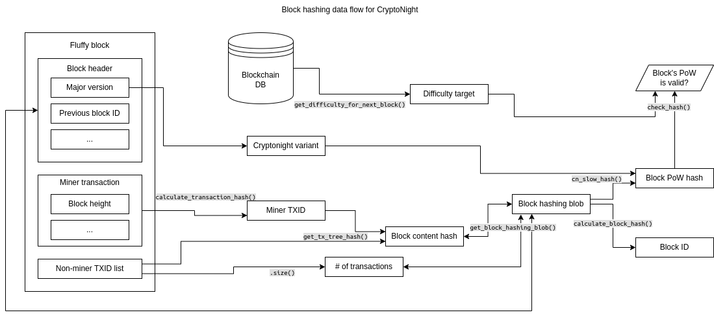
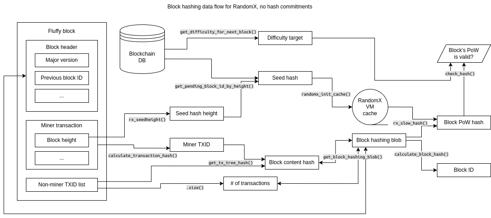
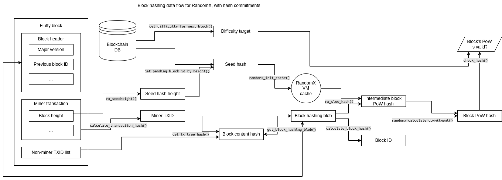
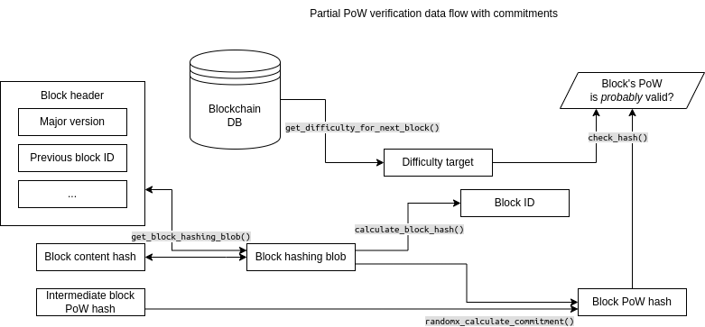

# Block hashing

## Background

In Bitcoin, block IDs and Proof-of-Work (PoW) hashes are calculated the same way, which is why on-chain block IDs always start
with many 0s. However, in Monero, block IDs and PoW hashes are calcuated using different hash functions and slightly different
inputs. This is because the hash functions used for PoW (CryptoNight and RandomX) are much slower to run than other
cryptographic hash functions, specifically Keccak256, which Monero uses for block IDs. By contrast, Bitcoin uses SHA-256 for
both block IDs and PoW. The reason that CryptoNight and RandomX were chosen for PoW in Monero is to protect against
application-specific integrated circuits (ASICs) from dominanting the network hashrate like in Bitcoin. In theory, this
would restore the principle of "1 CPU, 1 vote" outlined in the Satoshi whitepaper, and bring greater decentralization to the
Monero exosystem. This document aims to describe exactly how block IDs and PoW hashes are calculated in the Monero reference
codebase.

## CryptoNight epoch

To be reductive, the underlying design of Cryptonight is to 1) fill a 2MB buffer of memory using a memory-hard function, 2)
perform over a millon random reads on that buffer to permutate some state, and then 3) do a final hash on the state using
a random choice between four independent hash fuctions. There are 4 variants of CryptoNight: v0, v1, v2, and v4. This is the
data flow for how block hashing in the CryptoNight epoch (Monero fork versions v1-v11) is performed:

## RandomX epoch

Like, CryptoNight, RandomX also uses a memory hard function to fill a large space of memory called a "cache". However, this
space is 256MB, not 2MB. It can be further expanded to 2GB to trade memory usage for compute speed. Unlike CryptoNight's cache,
the RandomX cache is computed only once every 2048 blocks, not once per block. Monero uses a "seed" block ID of a previous block
in the chain to fill the memory space. And to make ASICs even harder, RandomX uses random instruction execution as well. This
is the data flow for how block hashing in the RandomX epoch (Monero fork versions v12-present) is performed:

## RandomX, with commitments, epoch

Because RandomX can be slow to run, especially while building the cache (nearly 1/2 a second on my machine), it inadvertantly
can introduce a Denial-of-Service (DoS) vector. For this reason, RandomX hash commitments can be added, so the PoW can be
partially verified using only Blake2B, a much lighter hash function. For simplicity's sake, we can also remove the number of
transactions in the block from the block hashing blob. This is the data flow for how block hashing works with these changes:

The way that the hashes are calculated allows us to do partial PoW verification like so:

A node can be given simply the block header, block content hash, and intermediate PoW hash, and verify that some PoW was done
using only `randomx_calculate_commitment()` (Blake2B undernath). Passing this partial verification requires PoW to done using
Blake2B up to the relevant difficulty. While doing so is much easier than doing the full RandomX PoW, it still requires
significant work. It is very important that we can calculate the block ID from the same information (or a subset thereof)
that we calculate PoW from, since each block header contains the previous block ID. Binding the block headers as such makes
faking intermediate PoW on chains of blocks exponentially harder the longer the chain is.
